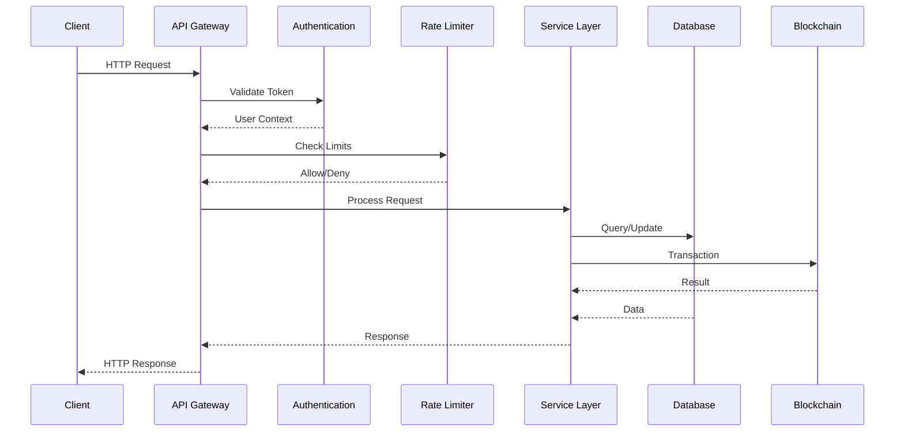

# NexVestXR V2 API Documentation

## Overview

The NexVestXR V2 platform provides a comprehensive REST API and WebSocket interface for managing dual-token real estate investments on XRPL and Flare networks. This API enables developers to integrate with our platform for property tokenization, trading, portfolio management, and compliance operations.

## Base URL

```
Production: https://api.nexvestxr.com/v2
Staging: https://staging-api.nexvestxr.com/v2
Development: http://localhost:3000/api/v2
```

## Authentication

### JWT Authentication

All protected endpoints require a JWT token in the Authorization header:

```bash
Authorization: Bearer <your-jwt-token>
```

### API Key Authentication (Institutional Users)

Institutional users can generate API keys for server-to-server communication:

```bash
X-API-Key: <your-api-key>
```

## Rate Limiting

The API implements intelligent rate limiting based on user tiers and endpoint types:

- **Basic Users**: 100 requests/minute
- **Premium Users**: 500 requests/minute  
- **Institutional Users**: 2000 requests/minute
- **Authentication Endpoints**: 5 attempts/minute
- **Payment Endpoints**: 10 requests/minute
- **Trading Endpoints**: 50 requests/minute

Rate limit headers are included in all responses:
```
X-RateLimit-Limit: 100
X-RateLimit-Remaining: 95
X-RateLimit-Reset: 1640995200
```

## Error Handling

All API endpoints return consistent error responses:

```json
{
  "success": false,
  "error": "Error type",
  "message": "Human readable error message",
  "details": "Detailed error information",
  "timestamp": "2023-12-01T10:30:00.000Z",
  "requestId": "req_123456789"
}
```

### HTTP Status Codes

- `200` - Success
- `201` - Created
- `400` - Bad Request
- `401` - Unauthorized
- `403` - Forbidden
- `404` - Not Found
- `429` - Too Many Requests
- `500` - Internal Server Error
- `503` - Service Unavailable

## API Categories

### 1. Authentication & User Management
- User registration and login
- JWT token management
- API key generation
- Password reset

### 2. Property Management
- Property creation and tokenization
- Property listings and search
- Document management
- Compliance verification

### 3. Dual Token Operations
- XERA token management (XRPL)
- PROPX token management (Flare)
- Cross-chain portfolio views
- Token classification

### 4. Trading & Exchange
- Basic trading operations
- Advanced order types (Stop-loss, OCO, Trailing)
- Margin trading
- Order book and market data

### 5. Payment Processing
- Stripe integration
- Razorpay integration
- Transaction history
- Currency conversion

### 6. UAE Compliance
- RERA verification
- KYC management
- Multi-currency support
- Regional compliance

### 7. Portfolio & Analytics
- Portfolio tracking
- Performance metrics
- Market analytics
- Risk management

### 8. WebSocket Events
- Real-time market data
- Order updates
- Portfolio changes
- Risk alerts

## Request/Response Flow



## Code Examples

### Authentication

```javascript
// Login
const response = await fetch('/api/auth/login', {
  method: 'POST',
  headers: {
    'Content-Type': 'application/json'
  },
  body: JSON.stringify({
    email: 'user@example.com',
    password: 'securepassword'
  })
});

const { token } = await response.json();

// Use token for subsequent requests
const apiResponse = await fetch('/api/properties', {
  headers: {
    'Authorization': `Bearer ${token}`
  }
});
```

### Property Creation

```javascript
const property = await fetch('/api/properties', {
  method: 'POST',
  headers: {
    'Authorization': `Bearer ${token}`,
    'Content-Type': 'application/json'
  },
  body: JSON.stringify({
    name: 'Luxury Apartment Complex',
    location: 'Mumbai',
    totalValue: 500000000,
    propertyType: 'residential',
    expectedROI: 12
  })
});
```

### WebSocket Connection

```javascript
const ws = new WebSocket('wss://api.nexvestxr.com/ws');

// Authenticate
ws.send(JSON.stringify({
  type: 'authenticate',
  token: 'your-jwt-token'
}));

// Subscribe to order book
ws.send(JSON.stringify({
  type: 'subscribe',
  channels: [{
    type: 'orderbook',
    pair: 'XERA/XRP'
  }]
}));
```

## Detailed Endpoint Documentation

---

## 1. Authentication Endpoints

### POST /auth/register

Register a new user account.

**Request:**
```json
{
  "username": "johndoe",
  "email": "john@example.com",
  "password": "securepassword123"
}
```

**Response:**
```json
{
  "success": true,
  "message": "User registered successfully",
  "userId": "user_123456789"
}
```

**Rate Limit:** 5 requests/minute per IP
**Authentication:** Not required

---

### POST /auth/login

Authenticate user and return JWT token.

**Request:**
```json
{
  "email": "john@example.com",
  "password": "securepassword123"
}
```

**Response:**
```json
{
  "success": true,
  "message": "Login successful",
  "token": "eyJhbGciOiJIUzI1NiIsInR5cCI6IkpXVCJ9...",
  "user": {
    "id": "user_123456789",
    "username": "johndoe",
    "email": "john@example.com"
  }
}
```

**Rate Limit:** 5 requests/minute per IP
**Authentication:** Not required

---

### POST /auth/api-key

Generate API key for institutional users.

**Headers:**
```
Authorization: Bearer <jwt-token>
```

**Response:**
```json
{
  "success": true,
  "apiKey": "ak_1234567890abcdef"
}
```

**Rate Limit:** 10 requests/hour
**Authentication:** Required (Institutional plan only)

---

## 2. Property Management Endpoints

### POST /properties

Create a new property for tokenization.

**Headers:**
```
Authorization: Bearer <jwt-token>
Content-Type: application/json
```

**Request:**
```json
{
  "name": "Luxury Apartment Complex",
  "location": "Mumbai, Maharashtra",
  "totalValue": 500000000,
  "propertyType": "residential",
  "expectedROI": 12,
  "documents": [
    {
      "type": "title_deed",
      "url": "https://example.com/doc1.pdf"
    }
  ]
}
```

**Response:**
```json
{
  "success": true,
  "property": {
    "propertyId": "PROP_1640995200_abc123def",
    "name": "Luxury Apartment Complex",
    "location": "Mumbai, Maharashtra",
    "totalValue": 500000000,
    "propertyType": "residential",
    "expectedROI": 12,
    "developer": "user_123456789",
    "status": "pending",
    "createdAt": "2023-12-01T10:30:00.000Z"
  }
}
```

**Rate Limit:** 50 requests/hour
**Authentication:** Required

---

### GET /properties

Get all properties for the authenticated user.

**Headers:**
```
Authorization: Bearer <jwt-token>
```

**Response:**
```json
{
  "success": true,
  "properties": [
    {
      "propertyId": "PROP_1640995200_abc123def",
      "name": "Luxury Apartment Complex",
      "location": "Mumbai, Maharashtra",
      "totalValue": 500000000,
      "status": "active"
    }
  ]
}
```

**Rate Limit:** 100 requests/hour
**Authentication:** Required

---

### GET /properties/:id

Get details of a specific property.

**Headers:**
```
Authorization: Bearer <jwt-token>
```

**Response:**
```json
{
  "success": true,
  "property": {
    "propertyId": "PROP_1640995200_abc123def",
    "name": "Luxury Apartment Complex",
    "location": "Mumbai, Maharashtra",
    "totalValue": 500000000,
    "propertyType": "residential",
    "expectedROI": 12,
    "documents": [...],
    "tokenization": {
      "status": "completed",
      "tokenAddress": "0x1234...5678",
      "totalTokens": 1000000
    }
  }
}
```

**Rate Limit:** 200 requests/hour
**Authentication:** Required

---

### POST /properties/:id/tokenize

Tokenize a property on the blockchain.

**Headers:**
```
Authorization: Bearer <jwt-token>
Content-Type: application/json
```

**Request:**
```json
{
  "tokenCode": "LUXURY001",
  "totalSupply": 1000000
}
```

**Response:**
```json
{
  "success": true,
  "transaction": {
    "transactionId": "txn_abc123def456",
    "tokenAddress": "0x1234567890abcdef",
    "blockchainNetwork": "xrpl"
  },
  "property": {
    "propertyId": "PROP_1640995200_abc123def",
    "tokenizationStatus": "completed"
  }
}
```

**Rate Limit:** 10 requests/hour
**Authentication:** Required

---

## 3. Dual Token Operations

### POST /dual-token/classify-property

Classify property for XERA (XRPL) or PROPX (Flare) tokenization.

**Headers:**
```
Authorization: Bearer <jwt-token>
Content-Type: application/json
```

**Request:**
```json
{
  "totalValue": 100000000,
  "location": "Mumbai",
  "category": "RESIDENTIAL",
  "developer": "TIER1",
  "compliance": {
    "score": 85,
    "documents": ["rera", "approval"]
  }
}
```

**Response:**
```json
{
  "success": true,
  "data": {
    "classification": {
      "recommendedToken": "PROPX",
      "confidence": 0.92,
      "reason": "High-value property in premium location with strong compliance",
      "network": "flare"
    },
    "recommendations": [
      "Eligible for PROPX due to high valuation",
      "Strong compliance score supports premium token",
      "Mumbai location qualifies for institutional investment"
    ]
  }
}
```

**Rate Limit:** 100 requests/hour
**Authentication:** Required

---

### GET /dual-token/classification-criteria

Get property classification criteria for both tokens.

**Response:**
```json
{
  "success": true,
  "data": {
    "propx": {
      "minValue": 50000000,
      "premiumCities": ["Mumbai", "Delhi", "Bangalore"],
      "requiredCompliance": 80,
      "categories": ["RESIDENTIAL", "COMMERCIAL", "LUXURY"]
    },
    "xera": {
      "minValue": 5000000,
      "allCities": true,
      "requiredCompliance": 60,
      "categories": ["RESIDENTIAL", "COMMERCIAL", "MIXED_USE"]
    }
  }
}
```

**Rate Limit:** 200 requests/hour
**Authentication:** Not required

---

### POST /dual-token/xera/create-property

Create XERA property on XRPL network.

**Headers:**
```
Authorization: Bearer <jwt-token>
Content-Type: application/json
```

**Request:**
```json
{
  "name": "City Center Apartments",
  "location": "Pune",
  "valuation": 25000000,
  "category": "RESIDENTIAL",
  "cityCode": "PUN"
}
```

**Response:**
```json
{
  "success": true,
  "data": {
    "propertyId": "XERA_PUN_001",
    "transactionHash": "A1B2C3D4E5F6...",
    "network": "xrpl",
    "cityPool": "PUN",
    "status": "created"
  }
}
```

**Rate Limit:** 20 requests/hour
**Authentication:** Required

---

### POST /dual-token/propx/create-property

Create PROPX property on Flare network.

**Headers:**
```
Authorization: Bearer <jwt-token>
Content-Type: application/json
```

**Request:**
```json
{
  "name": "Prestige Tech Park",
  "address": "Whitefield, Bangalore",
  "projectCode": "PRESTIGE-TECH-002",
  "category": 1,
  "totalTokens": 5000000,
  "pricePerToken": 100,
  "minimumRaise": 250000000,
  "fundingPeriodDays": 90,
  "expectedROI": 15,
  "completionMonths": 36
}
```

**Response:**
```json
{
  "success": true,
  "data": {
    "tokenAddress": "0xabcdef1234567890",
    "transactionHash": "0x9876543210fedcba",
    "network": "flare",
    "fundingStatus": "active",
    "projectCode": "PRESTIGE-TECH-002"
  }
}
```

**Rate Limit:** 10 requests/hour
**Authentication:** Required

---

### GET /dual-token/portfolio/:address

Get combined cross-chain portfolio.

**Headers:**
```
Authorization: Bearer <jwt-token>
```

**Response:**
```json
{
  "success": true,
  "data": {
    "totalValue": "₹156.7 L",
    "xera": {
      "balance": 12500,
      "value": "₹62.3 L",
      "cityPools": ["MUM", "BANG", "DEL"],
      "benefits": {
        "stakingRewards": "8.5% APY",
        "governanceVoting": true,
        "premiumAccess": true
      }
    },
    "propx": {
      "tokens": [
        {
          "projectCode": "PRESTIGE-TECH-002",
          "balance": 1500,
          "value": "₹94.4 L",
          "performance": "+12.3%"
        }
      ]
    },
    "performance": {
      "totalReturn": "+18.7%",
      "annualizedReturn": "14.2%",
      "riskScore": 6.8
    }
  }
}
```

**Rate Limit:** 200 requests/hour
**Authentication:** Required

---

## 4. Trading & Exchange Endpoints

### POST /trade/buy

Execute a buy order for tokens.

**Headers:**
```
Authorization: Bearer <jwt-token>
Content-Type: application/json
```

**Request:**
```json
{
  "tokenCode": "LUXURY001",
  "issuerAddress": "rN7n7otQDd6FczFgLdSqtcsAUxDkw6fzRH",
  "amount": 100,
  "paymentAmount": 100000
}
```

**Response:**
```json
{
  "success": true,
  "transaction": {
    "transactionId": "txn_buy_123456789",
    "type": "buy",
    "tokenCode": "LUXURY001",
    "amount": 100,
    "price": 1000,
    "status": "completed",
    "timestamp": "2023-12-01T10:30:00.000Z"
  }
}
```

**Rate Limit:** 50 requests/minute
**Authentication:** Required

---

### POST /trade/sell

Execute a sell order for tokens.

**Headers:**
```
Authorization: Bearer <jwt-token>
Content-Type: application/json
```

**Request:**
```json
{
  "tokenCode": "LUXURY001",
  "issuerAddress": "rN7n7otQDd6FczFgLdSqtcsAUxDkw6fzRH",
  "amount": 50,
  "receiveAmount": 52000
}
```

**Response:**
```json
{
  "success": true,
  "transaction": {
    "transactionId": "txn_sell_123456789",
    "type": "sell",
    "tokenCode": "LUXURY001",
    "amount": 50,
    "price": 1040,
    "status": "completed",
    "timestamp": "2023-12-01T10:30:00.000Z"
  }
}
```

**Rate Limit:** 50 requests/minute
**Authentication:** Required

---

### POST /trade/limit-order

Create a limit order.

**Headers:**
```
Authorization: Bearer <jwt-token>
Content-Type: application/json
```

**Request:**
```json
{
  "tokenCode": "LUXURY001",
  "issuerAddress": "rN7n7otQDd6FczFgLdSqtcsAUxDkw6fzRH",
  "amount": 200,
  "pricePerToken": 950,
  "type": "buy"
}
```

**Response:**
```json
{
  "success": true,
  "transaction": {
    "orderId": "order_limit_123456789",
    "type": "limit",
    "side": "buy",
    "status": "pending",
    "expiresAt": "2023-12-08T10:30:00.000Z"
  }
}
```

**Rate Limit:** 100 requests/minute
**Authentication:** Required

---

### GET /trade/order-book/:tokenCode/:issuerAddress

Get order book for a token pair.

**Headers:**
```
Authorization: Bearer <jwt-token>
```

**Response:**
```json
{
  "success": true,
  "orderBook": {
    "tokenCode": "LUXURY001",
    "bids": [
      {"price": 1000, "amount": 500, "total": 500000},
      {"price": 995, "amount": 300, "total": 298500}
    ],
    "asks": [
      {"price": 1005, "amount": 200, "total": 201000},
      {"price": 1010, "amount": 400, "total": 404000}
    ],
    "spread": 5,
    "lastPrice": 1002
  }
}
```

**Rate Limit:** 200 requests/minute
**Authentication:** Required

---

### POST /advanced-trade/stop-loss

Create a stop-loss order.

**Headers:**
```
Authorization: Bearer <jwt-token>
Content-Type: application/json
```

**Request:**
```json
{
  "pairId": "LUXURY001/XRP",
  "side": "sell",
  "amount": 100,
  "stopPrice": 900,
  "limitPrice": 890
}
```

**Response:**
```json
{
  "success": true,
  "data": {
    "orderId": "stop_loss_123456789",
    "status": "active",
    "triggerPrice": 900,
    "executionPrice": 890
  }
}
```

**Rate Limit:** 50 requests/minute
**Authentication:** Required

---

### POST /advanced-trade/oco

Create a One-Cancels-Other (OCO) order.

**Headers:**
```
Authorization: Bearer <jwt-token>
Content-Type: application/json
```

**Request:**
```json
{
  "pairId": "LUXURY001/XRP",
  "side": "sell",
  "amount": 100,
  "stopPrice": 900,
  "limitPrice": 890,
  "targetPrice": 1100
}
```

**Response:**
```json
{
  "success": true,
  "data": {
    "ocoOrderId": "oco_123456789",
    "stopLossOrder": "stop_123",
    "takeProfitOrder": "limit_456",
    "status": "active"
  }
}
```

**Rate Limit:** 30 requests/minute
**Authentication:** Required

---

## 5. Payment Processing Endpoints

### POST /payment/stripe/deposit

Create Stripe payment intent for deposit.

**Headers:**
```
Authorization: Bearer <jwt-token>
Content-Type: application/json
```

**Request:**
```json
{
  "amount": 50000,
  "currency": "INR"
}
```

**Response:**
```json
{
  "success": true,
  "clientSecret": "pi_1234567890_secret_abcdef",
  "paymentIntentId": "pi_1234567890abcdef"
}
```

**Rate Limit:** 10 requests/minute
**Authentication:** Required

---

### POST /payment/razorpay/deposit

Create Razorpay order for deposit.

**Headers:**
```
Authorization: Bearer <jwt-token>
Content-Type: application/json
```

**Request:**
```json
{
  "amount": 50000,
  "currency": "INR"
}
```

**Response:**
```json
{
  "success": true,
  "order": {
    "id": "order_1234567890abcdef",
    "amount": 50000,
    "currency": "INR",
    "receipt": "receipt_123"
  }
}
```

**Rate Limit:** 10 requests/minute
**Authentication:** Required

---

### GET /payment/transactions

Get user's transaction history.

**Headers:**
```
Authorization: Bearer <jwt-token>
```

**Query Parameters:**
- `page` (optional): Page number (default: 1)
- `limit` (optional): Results per page (default: 20)
- `type` (optional): Transaction type filter

**Response:**
```json
{
  "success": true,
  "transactions": [
    {
      "id": "tx1",
      "type": "deposit",
      "amount": 50000,
      "currency": "INR",
      "status": "completed",
      "createdAt": "2023-12-01T10:30:00.000Z"
    }
  ],
  "pagination": {
    "page": 1,
    "limit": 20,
    "total": 45,
    "pages": 3
  }
}
```

**Rate Limit:** 100 requests/hour
**Authentication:** Required

---

## 6. UAE Compliance Endpoints

### GET /uae/properties

Get UAE properties with filtering and multi-currency support.

**Query Parameters:**
- `city` (optional): Filter by city
- `zone` (optional): Filter by zone
- `propertyType` (optional): Filter by property type
- `minPrice` (optional): Minimum price filter
- `maxPrice` (optional): Maximum price filter
- `currency` (optional): Currency for price display (default: AED)
- `language` (optional): Language for content (default: en)
- `page` (optional): Page number
- `limit` (optional): Results per page

**Response:**
```json
{
  "success": true,
  "data": {
    "properties": [
      {
        "id": "UAE_001",
        "title": "Luxury Marina Apartment",
        "location": {
          "city": "Dubai",
          "zone": "Dubai Marina",
          "address": "Marina Walk Tower 1"
        },
        "price": 2500000,
        "currency": "AED",
        "propertyType": "apartment",
        "bedrooms": 3,
        "developer": "Emaar Properties"
      }
    ],
    "pagination": {
      "page": 1,
      "limit": 20,
      "total": 150,
      "pages": 8
    }
  }
}
```

**Rate Limit:** 200 requests/hour
**Authentication:** Not required

---

### POST /uae/invest

Invest in a UAE property.

**Headers:**
```
Authorization: Bearer <jwt-token>
Content-Type: application/json
```

**Request:**
```json
{
  "propertyId": "UAE_001",
  "amount": 100000,
  "currency": "AED"
}
```

**Response:**
```json
{
  "success": true,
  "message": "Investment successful",
  "data": {
    "investment": {
      "propertyId": "UAE_001",
      "amount": 100000,
      "currency": "AED",
      "tokens": 40,
      "tokenPrice": 2500,
      "transactionId": "TXN_1640995200_user123"
    },
    "property": {
      "id": "UAE_001",
      "title": "Luxury Marina Apartment",
      "fundingProgress": 65.5
    }
  }
}
```

**Rate Limit:** 20 requests/hour
**Authentication:** Required (KYC verified)

---

### GET /uae/portfolio

Get user's UAE property portfolio.

**Headers:**
```
Authorization: Bearer <jwt-token>
```

**Query Parameters:**
- `currency` (optional): Currency for values (default: AED)
- `language` (optional): Language preference (default: en)

**Response:**
```json
{
  "success": true,
  "data": {
    "portfolio": {
      "totalValue": 850000,
      "currency": "AED",
      "performance": 12.5,
      "properties": [
        {
          "property": {
            "id": "UAE_001",
            "title": "Luxury Marina Apartment",
            "location": "Dubai Marina",
            "image": "https://example.com/image.jpg"
          },
          "investment": {
            "tokens": 40,
            "invested": 100000,
            "currentValue": 115000,
            "currency": "AED",
            "performance": 15.0
          }
        }
      ]
    },
    "summary": {
      "totalInvested": 750000,
      "totalReturns": 100000,
      "dividendsEarned": 25000,
      "propertyCount": 3
    }
  }
}
```

**Rate Limit:** 100 requests/hour
**Authentication:** Required

---

### GET /uae/compliance/rera/:propertyId

Get RERA compliance verification for a property.

**Headers:**
```
Authorization: Bearer <jwt-token>
```

**Response:**
```json
{
  "success": true,
  "data": {
    "propertyId": "UAE_001",
    "rera": {
      "registrationNumber": "RERA-001-2023",
      "status": "active",
      "registered": true,
      "expiryDate": "2025-12-31T23:59:59.000Z",
      "verified": true,
      "lastChecked": "2023-12-01T10:30:00.000Z"
    },
    "compliance": {
      "overall": "compliant",
      "checks": {
        "rera_registered": true,
        "status_active": true,
        "not_expired": true
      }
    }
  }
}
```

**Rate Limit:** 100 requests/hour
**Authentication:** Required

---

### GET /uae/currencies

Get supported currencies and exchange rates.

**Response:**
```json
{
  "success": true,
  "data": {
    "currencies": [
      {
        "code": "AED",
        "name": "UAE Dirham",
        "flag": "🇦🇪",
        "primary": true
      },
      {
        "code": "USD",
        "name": "US Dollar",
        "flag": "🇺🇸",
        "region": "International"
      }
    ],
    "exchangeRates": {
      "AED": 1.0,
      "USD": 0.272,
      "EUR": 0.251
    },
    "baseCurrency": "AED",
    "lastUpdated": "2023-12-01T10:30:00.000Z"
  }
}
```

**Rate Limit:** 200 requests/hour
**Authentication:** Not required

---

## 7. Portfolio & Analytics Endpoints

### GET /portfolio/:userAddress

Get user's portfolio overview.

**Headers:**
```
Authorization: Bearer <jwt-token>
```

**Response:**
```json
{
  "success": true,
  "data": {
    "xrpBalance": 1000,
    "tokenBalances": [
      {
        "currency": "LUXURY001",
        "balance": "500",
        "value": 500000
      }
    ],
    "totalValue": 1500000,
    "performance": {
      "totalReturn": "15.5%",
      "dayChange": "+2.3%",
      "weekChange": "+8.7%"
    }
  }
}
```

**Rate Limit:** 200 requests/hour
**Authentication:** Required

---

### GET /portfolio/orders/open

Get user's open orders.

**Headers:**
```
Authorization: Bearer <jwt-token>
```

**Query Parameters:**
- `userAddress` (optional): User's wallet address
- `pairId` (optional): Trading pair filter

**Response:**
```json
{
  "success": true,
  "data": [
    {
      "id": "order1",
      "side": "buy",
      "type": "limit",
      "amount": 100,
      "price": 1000,
      "filled": 0,
      "remaining": 100,
      "status": "active",
      "createdAt": "2023-12-01T10:30:00.000Z"
    }
  ]
}
```

**Rate Limit:** 100 requests/hour
**Authentication:** Required

---

## 8. WebSocket API

### Connection

Connect to the WebSocket server:

```javascript
const ws = new WebSocket('wss://api.nexvestxr.com/ws');
```

### Authentication

Authenticate your WebSocket connection:

```json
{
  "type": "authenticate",
  "token": "your-jwt-token"
}
```

**Response:**
```json
{
  "type": "authenticated",
  "userId": "user_123456789",
  "timestamp": 1640995200000
}
```

### Subscriptions

Subscribe to real-time data channels:

```json
{
  "type": "subscribe",
  "channels": [
    {
      "type": "orderbook",
      "pair": "LUXURY001/XRP"
    },
    {
      "type": "trades",
      "pair": "LUXURY001/XRP"
    },
    {
      "type": "portfolio"
    },
    {
      "type": "orders"
    }
  ]
}
```

**Response:**
```json
{
  "type": "subscribed",
  "channels": [
    {
      "type": "orderbook",
      "pair": "LUXURY001/XRP"
    }
  ],
  "timestamp": 1640995200000
}
```

### Order Book Updates

```json
{
  "type": "orderbook_update",
  "pair": "LUXURY001/XRP",
  "data": {
    "bids": [
      {"price": 1000, "amount": 500},
      {"price": 995, "amount": 300}
    ],
    "asks": [
      {"price": 1005, "amount": 200},
      {"price": 1010, "amount": 400}
    ]
  },
  "timestamp": 1640995200000
}
```

### Trade Updates

```json
{
  "type": "trade",
  "pair": "LUXURY001/XRP",
  "data": {
    "price": 1002,
    "amount": 50,
    "side": "buy",
    "timestamp": 1640995200000
  }
}
```

### Order Updates

```json
{
  "type": "order_executed",
  "data": {
    "orderId": "order_123456789",
    "status": "filled",
    "filledAmount": 100,
    "averagePrice": 1001
  },
  "timestamp": 1640995200000
}
```

### Portfolio Updates

```json
{
  "type": "portfolio_update",
  "data": {
    "totalValue": 1520000,
    "change": "+20000",
    "changePercent": "+1.33%"
  },
  "timestamp": 1640995200000
}
```

### Risk Alerts

```json
{
  "type": "risk_alert",
  "data": {
    "severity": "medium",
    "message": "Portfolio concentration exceeds 60% in single asset",
    "recommendation": "Consider diversifying holdings"
  },
  "timestamp": 1640995200000
}
```

### Margin Calls

```json
{
  "type": "margin_call",
  "data": {
    "positionId": "pos_123456789",
    "requiredMargin": 50000,
    "currentMargin": 30000,
    "deadline": "2023-12-01T12:00:00.000Z"
  },
  "timestamp": 1640995200000
}
```

## SDKs and Integration Examples

### JavaScript/Node.js

```javascript
class NexVestXRAPI {
  constructor(baseUrl, token) {
    this.baseUrl = baseUrl;
    this.token = token;
  }

  async request(endpoint, options = {}) {
    const url = `${this.baseUrl}${endpoint}`;
    const response = await fetch(url, {
      ...options,
      headers: {
        'Authorization': `Bearer ${this.token}`,
        'Content-Type': 'application/json',
        ...options.headers
      }
    });
    
    if (!response.ok) {
      throw new Error(`API Error: ${response.status}`);
    }
    
    return response.json();
  }

  // Authentication
  async login(email, password) {
    return this.request('/auth/login', {
      method: 'POST',
      body: JSON.stringify({ email, password })
    });
  }

  // Properties
  async createProperty(propertyData) {
    return this.request('/properties', {
      method: 'POST',
      body: JSON.stringify(propertyData)
    });
  }

  async getProperties() {
    return this.request('/properties');
  }

  // Trading
  async buyTokens(tokenCode, issuerAddress, amount, paymentAmount) {
    return this.request('/trade/buy', {
      method: 'POST',
      body: JSON.stringify({
        tokenCode,
        issuerAddress,
        amount,
        paymentAmount
      })
    });
  }

  // WebSocket connection
  connectWebSocket() {
    const ws = new WebSocket(`${this.baseUrl.replace('http', 'ws')}/ws`);
    
    ws.onopen = () => {
      ws.send(JSON.stringify({
        type: 'authenticate',
        token: this.token
      }));
    };

    return ws;
  }
}

// Usage
const api = new NexVestXRAPI('https://api.nexvestxr.com/v2', 'your-token');

// Create property
const property = await api.createProperty({
  name: 'Test Property',
  location: 'Mumbai',
  totalValue: 10000000
});

// Buy tokens
const trade = await api.buyTokens('LUXURY001', 'rN7n7...', 100, 100000);
```

### Python

```python
import requests
import json
import websocket

class NexVestXRAPI:
    def __init__(self, base_url, token):
        self.base_url = base_url
        self.token = token
        self.headers = {
            'Authorization': f'Bearer {token}',
            'Content-Type': 'application/json'
        }

    def request(self, endpoint, method='GET', data=None):
        url = f"{self.base_url}{endpoint}"
        response = requests.request(
            method, 
            url, 
            headers=self.headers,
            json=data
        )
        response.raise_for_status()
        return response.json()

    def login(self, email, password):
        return self.request('/auth/login', 'POST', {
            'email': email,
            'password': password
        })

    def create_property(self, property_data):
        return self.request('/properties', 'POST', property_data)

    def get_properties(self):
        return self.request('/properties')

    def buy_tokens(self, token_code, issuer_address, amount, payment_amount):
        return self.request('/trade/buy', 'POST', {
            'tokenCode': token_code,
            'issuerAddress': issuer_address,
            'amount': amount,
            'paymentAmount': payment_amount
        })

# Usage
api = NexVestXRAPI('https://api.nexvestxr.com/v2', 'your-token')

# Create property
property_data = {
    'name': 'Test Property',
    'location': 'Mumbai', 
    'totalValue': 10000000
}
property = api.create_property(property_data)

# Buy tokens
trade = api.buy_tokens('LUXURY001', 'rN7n7...', 100, 100000)
```

## Testing

### Postman Collection

Import our Postman collection for easy API testing:

```json
{
  "info": {
    "name": "NexVestXR V2 API",
    "schema": "https://schema.getpostman.com/json/collection/v2.1.0/collection.json"
  },
  "auth": {
    "type": "bearer",
    "bearer": [
      {
        "key": "token",
        "value": "{{jwt_token}}",
        "type": "string"
      }
    ]
  },
  "variable": [
    {
      "key": "base_url",
      "value": "https://api.nexvestxr.com/v2"
    }
  ]
}
```

### cURL Examples

```bash
# Login
curl -X POST https://api.nexvestxr.com/v2/auth/login \
  -H "Content-Type: application/json" \
  -d '{"email":"user@example.com","password":"password"}'

# Create Property
curl -X POST https://api.nexvestxr.com/v2/properties \
  -H "Authorization: Bearer YOUR_TOKEN" \
  -H "Content-Type: application/json" \
  -d '{
    "name": "Test Property",
    "location": "Mumbai",
    "totalValue": 10000000,
    "propertyType": "residential"
  }'

# Buy Tokens
curl -X POST https://api.nexvestxr.com/v2/trade/buy \
  -H "Authorization: Bearer YOUR_TOKEN" \
  -H "Content-Type: application/json" \
  -d '{
    "tokenCode": "LUXURY001",
    "issuerAddress": "rN7n7otQDd6FczFgLdSqtcsAUxDkw6fzRH",
    "amount": 100,
    "paymentAmount": 100000
  }'
```

## Support and Resources

- **API Status**: https://status.nexvestxr.com
- **Developer Portal**: https://developers.nexvestxr.com
- **Support Email**: api-support@nexvestxr.com
- **Discord Community**: https://discord.gg/nexvestxr
- **GitHub**: https://github.com/nexvestxr/api-examples

## Changelog

### v2.1.0 (2023-12-01)
- Added UAE compliance endpoints
- Enhanced dual token operations
- Improved WebSocket performance
- Added margin trading support

### v2.0.0 (2023-11-01)
- Complete API redesign
- Added dual token support (XERA/PROPX)
- Enhanced security measures
- WebSocket real-time updates

---

*This documentation is automatically updated with each API release. Last updated: December 1, 2023*