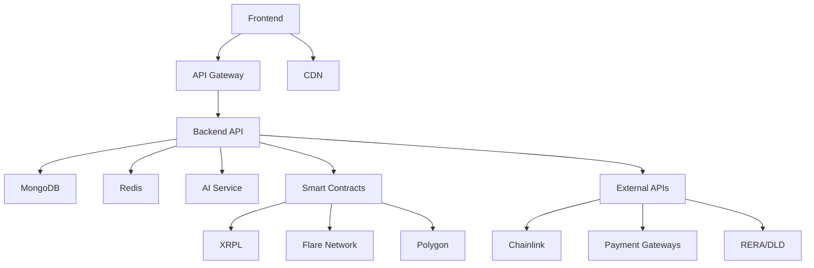

# 🏗️ System Architecture Overview

## NexVestXR V2 Enterprise Architecture

NexVestXR V2 follows a **microservices architecture** designed for scalability, security, and high availability. The platform serves the UAE real estate market with enterprise-grade features and compliance.

### 🏢 **High-Level Architecture**

```
┌─────────────────────────────────────────────────────────────────────────────┐
│                           Frontend Layer                                    │
├─────────────────────┬─────────────────────┬─────────────────────────────────┤
│   Web Application  │   Mobile Apps       │   Admin Dashboard               │
│   React 18 + TS    │   React Native      │   Aldar Properties Theme        │
│   Port: 3001        │   iOS + Android     │   Port: 3003                    │
│   Arabic RTL        │   Biometric Auth    │   Admin Management              │
└─────────┬───────────┴─────────┬───────────┴─────────────┬───────────────────┘
          │                     │                         │
          │                     │                         │
┌─────────▼─────────────────────▼─────────────────────────▼───────────────────┐
│                          API Gateway & Load Balancer                        │
│                     (AWS ALB + CloudFlare WAF)                             │
│               Rate Limiting • SSL Termination • DDoS Protection             │
└─────────────────────────────────┬───────────────────────────────────────────┘
                                  │
┌─────────────────────────────────▼───────────────────────────────────────────┐
│                          Backend Services Layer                             │
├─────────────────────┬─────────────────────┬─────────────────────────────────┤
│   Core API Server   │   AI/ML Service     │   Smart Contracts               │
│   Node.js/Express   │   Python Flask      │   Solidity                      │
│   Port: 3000        │   Port: 5000        │   Multi-Chain                   │
│   PCI DSS Level 1   │   TensorFlow.js     │   XRPL + Flare + Polygon       │
└─────────┬───────────┴─────────┬───────────┴─────────────┬───────────────────┘
          │                     │                         │
          │                     │                         │
┌─────────▼─────────────────────▼─────────────────────────▼───────────────────┐
│                             Data Layer                                      │
├─────────────────────┬─────────────────────┬─────────────────────────────────┤
│     MongoDB         │      Redis          │    External Services            │
│   Primary Database  │  Distributed Cache  │  • Chainlink Oracles           │
│   • User Data       │  • Sessions         │  • XUMM Wallet                 │
│   • Properties      │  • Rate Limiting    │  • Payment Gateways            │
│   • Transactions    │  • Real-time Data   │  • RERA/DLD APIs              │
└─────────────────────┴─────────────────────┴─────────────────────────────────┘
```

### 🔧 **Technology Stack**

| Layer | Technology | Purpose | Scaling Strategy |
|-------|------------|---------|------------------|
| **Frontend** | React 18 + TypeScript | User interface | CDN + Code splitting |
| **Mobile** | React Native 0.79 | Native mobile apps | App store distribution |
| **API Gateway** | AWS ALB + CloudFlare | Traffic routing | Auto-scaling groups |
| **Backend** | Node.js + Express | Business logic | Horizontal pod scaling |
| **AI/ML** | Python + Flask | Analytics & scoring | GPU instances |
| **Database** | MongoDB Atlas | Primary data store | Replica sets + sharding |
| **Cache** | Redis Cluster | Performance layer | Memory-based clustering |
| **Blockchain** | Solidity + Hardhat | Smart contracts | Multi-chain deployment |

### 🌐 **Multi-Chain Architecture**

```
┌─────────────────────────────────────────────────────────────────────────────┐
│                           Blockchain Layer                                  │
├─────────────────────┬─────────────────────┬─────────────────────────────────┤
│   XRPL Network      │   Flare Network     │   Polygon Network               │
│                     │                     │                                 │
│ • XERA Token        │ • PROPX Factory     │ • UAE Compliance               │
│ • Governance        │ • Oracle Services   │ • KYC/AML Contracts           │
│ • Cross-chain       │ • Premium Props     │ • RERA Integration             │
│ • Fast Settlement   │ • Smart Contracts   │ • Regulatory Compliance        │
│                     │                     │                                 │
│ Network ID: 1440002 │ Network ID: 14      │ Network ID: 137                │
│ Gas: XRP            │ Gas: FLR            │ Gas: MATIC                     │
└─────────────────────┴─────────────────────┴─────────────────────────────────┘
```

### 📊 **Data Flow Architecture**

```
┌─────────────────────────────────────────────────────────────────────────────┐
│                              Data Flow                                      │
└─────────────────────────────────────────────────────────────────────────────┘

1. User Authentication
   ┌─────────┐    ┌─────────┐    ┌─────────┐    ┌─────────┐
   │ Client  │───▶│ API GW  │───▶│ Auth    │───▶│ JWT +   │
   │ Request │    │ Rate    │    │ Service │    │ 2FA     │
   └─────────┘    │ Limit   │    └─────────┘    └─────────┘
                  └─────────┘

2. Property Investment Flow
   ┌─────────┐    ┌─────────┐    ┌─────────┐    ┌─────────┐
   │ Invest  │───▶│ Payment │───▶│ Smart   │───▶│ Token   │
   │ Request │    │ Gateway │    │ Contract│    │ Mint    │
   └─────────┘    └─────────┘    └─────────┘    └─────────┘

3. Real-time Trading
   ┌─────────┐    ┌─────────┐    ┌─────────┐    ┌─────────┐
   │ Trade   │───▶│ Order   │───▶│ Match   │───▶│ WebSocket│
   │ Order   │    │ Book    │    │ Engine  │    │ Update  │
   └─────────┘    └─────────┘    └─────────┘    └─────────┘

4. AI Property Analysis
   ┌─────────┐    ┌─────────┐    ┌─────────┐    ┌─────────┐
   │ Property│───▶│ AI/ML   │───▶│ Scoring │───▶│ Risk    │
   │ Data    │    │ Models  │    │ Engine  │    │ Report  │
   └─────────┘    └─────────┘    └─────────┘    └─────────┘
```

### 🔒 **Security Architecture**

```
┌─────────────────────────────────────────────────────────────────────────────┐
│                            Security Layers                                  │
├─────────────────────────────────────────────────────────────────────────────┤
│ Layer 8: Business Logic Security                                           │
│ • PCI DSS Level 1 Compliance    • Regulatory Compliance                   │
│ • Transaction Monitoring        • Fraud Detection                         │
├─────────────────────────────────────────────────────────────────────────────┤
│ Layer 7: Application Security                                              │
│ • Input Validation             • SQL Injection Prevention                 │
│ • XSS Protection              • CSRF Protection                           │
├─────────────────────────────────────────────────────────────────────────────┤
│ Layer 6: Authentication & Authorization                                    │
│ • JWT with Refresh Tokens      • Two-Factor Authentication               │
│ • Role-Based Access Control    • Session Management                      │
├─────────────────────────────────────────────────────────────────────────────┤
│ Layer 5: API Security                                                      │
│ • Rate Limiting (4 algorithms) • API Key Management                      │
│ • Request Signing              • Payload Encryption                      │
├─────────────────────────────────────────────────────────────────────────────┤
│ Layer 4: Transport Security                                                │
│ • TLS 1.3 Encryption          • Certificate Pinning                      │
│ • HSTS Headers                • Security Headers (CSP, etc.)             │
├─────────────────────────────────────────────────────────────────────────────┤
│ Layer 3: Network Security                                                  │
│ • VPC Private Subnets         • Security Groups                          │
│ • WAF Rules                   • DDoS Protection                          │
├─────────────────────────────────────────────────────────────────────────────┤
│ Layer 2: Infrastructure Security                                           │
│ • Container Security          • Secrets Management                       │
│ • Access Logging              • Vulnerability Scanning                   │
├─────────────────────────────────────────────────────────────────────────────┤
│ Layer 1: Smart Contract Security                                           │
│ • Reentrancy Guards           • Multi-Oracle Verification                │
│ • Circuit Breakers            • Emergency Pause Functions                │
└─────────────────────────────────────────────────────────────────────────────┘
```

### 📈 **Scalability Design**

#### **Horizontal Scaling**

```
┌─────────────────────────────────────────────────────────────────────────────┐
│                          Load Distribution                                  │
├─────────────────────────────────────────────────────────────────────────────┤
│                                                                             │
│  CloudFlare CDN (Global)                                                   │
│       │                                                                     │
│       ▼                                                                     │
│  AWS Application Load Balancer                                             │
│       │                                                                     │
│       ▼                                                                     │
│  ┌─────────┐  ┌─────────┐  ┌─────────┐  ┌─────────┐                       │
│  │ ECS     │  │ ECS     │  │ ECS     │  │ ECS     │                       │
│  │ Task 1  │  │ Task 2  │  │ Task 3  │  │ Task N  │                       │
│  │ (API)   │  │ (API)   │  │ (API)   │  │ (API)   │                       │
│  └─────────┘  └─────────┘  └─────────┘  └─────────┘                       │
│                                                                             │
│  Auto Scaling: 2-20 instances based on CPU/Memory/Request metrics          │
└─────────────────────────────────────────────────────────────────────────────┘
```

#### **Database Scaling**

```
┌─────────────────────────────────────────────────────────────────────────────┐
│                         Database Architecture                               │
├─────────────────────────────────────────────────────────────────────────────┤
│                                                                             │
│  MongoDB Atlas Cluster (M40+ instances)                                    │
│                                                                             │
│  ┌─────────────┐    ┌─────────────┐    ┌─────────────┐                    │
│  │   Primary   │    │  Secondary  │    │  Secondary  │                    │
│  │   Replica   │───▶│   Replica   │───▶│   Replica   │                    │
│  │   (Write)   │    │   (Read)    │    │   (Read)    │                    │
│  └─────────────┘    └─────────────┘    └─────────────┘                    │
│                                                                             │
│  Sharding Strategy:                                                         │
│  • Users: Shard by region (UAE, GCC, International)                       │
│  • Properties: Shard by city (Dubai, Abu Dhabi, Sharjah)                  │
│  • Transactions: Shard by date range (monthly)                             │
└─────────────────────────────────────────────────────────────────────────────┘
```

#### **Cache Architecture**

```
┌─────────────────────────────────────────────────────────────────────────────┐
│                           Redis Cluster                                     │
├─────────────────────────────────────────────────────────────────────────────┤
│                                                                             │
│  Redis Cluster (6 nodes, 3 masters + 3 replicas)                          │
│                                                                             │
│  ┌─────────────┐    ┌─────────────┐    ┌─────────────┐                    │
│  │ Master 1    │    │ Master 2    │    │ Master 3    │                    │
│  │ Sessions    │    │ Rate Limits │    │ Market Data │                    │
│  └─────┬───────┘    └─────┬───────┘    └─────┬───────┘                    │
│        │                  │                  │                            │
│  ┌─────▼───────┐    ┌─────▼───────┐    ┌─────▼───────┐                    │
│  │ Replica 1   │    │ Replica 2   │    │ Replica 3   │                    │
│  │ (Backup)    │    │ (Backup)    │    │ (Backup)    │                    │
│  └─────────────┘    └─────────────┘    └─────────────┘                    │
│                                                                             │
│  Data Types:                                                                │
│  • User Sessions (24h TTL)                                                 │
│  • Rate Limiting Counters (1h TTL)                                         │
│  • Real-time Market Data (5min TTL)                                        │
│  • Property Analytics Cache (1h TTL)                                       │
└─────────────────────────────────────────────────────────────────────────────┘
```

### 🔄 **Event-Driven Architecture**

```
┌─────────────────────────────────────────────────────────────────────────────┐
│                           Event Flow                                        │
├─────────────────────────────────────────────────────────────────────────────┤
│                                                                             │
│  Event Producers:                    Event Bus                             │
│  ┌─────────────┐                 ┌─────────────┐                          │
│  │ User Action │────────────────▶│   Redis     │                          │
│  │ • Login     │                 │   Pub/Sub   │                          │
│  │ • Trade     │                 │             │                          │
│  │ • Payment   │                 └─────┬───────┘                          │
│  └─────────────┘                       │                                  │
│                                        │                                  │
│  ┌─────────────┐                       │                                  │
│  │ Smart       │───────────────────────┤                                  │
│  │ Contract    │                       │                                  │
│  │ • Token     │                       │                                  │
│  │ • Transfer  │                       │                                  │
│  └─────────────┘                       │                                  │
│                                        │                                  │
│  Event Consumers:                      │                                  │
│  ┌─────────────┐                 ┌─────▼───────┐                          │
│  │ WebSocket   │◀────────────────│ Event       │                          │
│  │ Real-time   │                 │ Dispatcher  │                          │
│  │ Updates     │                 │             │                          │
│  └─────────────┘                 └─────┬───────┘                          │
│                                        │                                  │
│  ┌─────────────┐                       │                                  │
│  │ Email/SMS   │◀──────────────────────┤                                  │
│  │ Notifications│                       │                                  │
│  └─────────────┘                       │                                  │
│                                        │                                  │
│  ┌─────────────┐                       │                                  │
│  │ Analytics   │◀──────────────────────┘                                  │
│  │ & Reporting │                                                           │
│  └─────────────┘                                                           │
└─────────────────────────────────────────────────────────────────────────────┘
```

### 📊 **Performance Metrics**

| Component | Target | Current | Monitoring |
|-----------|---------|---------|------------|
| **API Response Time** | <200ms | ~150ms | CloudWatch |
| **Database Query Time** | <100ms | ~80ms | MongoDB Atlas |
| **Cache Hit Rate** | >95% | 97% | Redis Metrics |
| **WebSocket Latency** | <50ms | ~30ms | Socket.io Metrics |
| **Mobile App Startup** | <3s | ~2.5s | App Performance |
| **Frontend Load Time** | <2s | ~1.8s | Lighthouse CI |

### 🚀 **High Availability Design**

```
┌─────────────────────────────────────────────────────────────────────────────┐
│                        Multi-Region Deployment                              │
├─────────────────────────────────────────────────────────────────────────────┤
│                                                                             │
│  Primary Region: Middle East (UAE)                                         │
│  ┌─────────────────────────────────────────────────────────────────────┐   │
│  │ Availability Zone A          Availability Zone B                   │   │
│  │ ┌─────────────┐              ┌─────────────┐                       │   │
│  │ │ ECS Cluster │              │ ECS Cluster │                       │   │
│  │ │ RDS Primary │              │ RDS Standby │                       │   │
│  │ │ Redis Master│              │ Redis Slave │                       │   │
│  │ └─────────────┘              └─────────────┘                       │   │
│  └─────────────────────────────────────────────────────────────────────┘   │
│                                                                             │
│  Secondary Region: Asia Pacific (Singapore)                                │
│  ┌─────────────────────────────────────────────────────────────────────┐   │
│  │ Disaster Recovery                                                   │   │
│  │ ┌─────────────┐                                                     │   │
│  │ │ ECS Warm    │                                                     │   │
│  │ │ Standby     │                                                     │   │
│  │ │ RDS Replica │                                                     │   │
│  │ └─────────────┘                                                     │   │
│  └─────────────────────────────────────────────────────────────────────┘   │
│                                                                             │
│  Failover Strategy:                                                         │
│  • RTO (Recovery Time Objective): < 15 minutes                            │
│  • RPO (Recovery Point Objective): < 5 minutes                            │
│  • Automated failover with Route 53 health checks                         │
└─────────────────────────────────────────────────────────────────────────────┘
```

### 🔗 **Service Dependencies**



This architecture ensures:
- **Scalability**: Handle 10,000+ concurrent users
- **Availability**: 99.9% uptime SLA
- **Security**: Enterprise-grade protection
- **Performance**: Sub-200ms API responses
- **Compliance**: PCI DSS Level 1 + UAE regulations