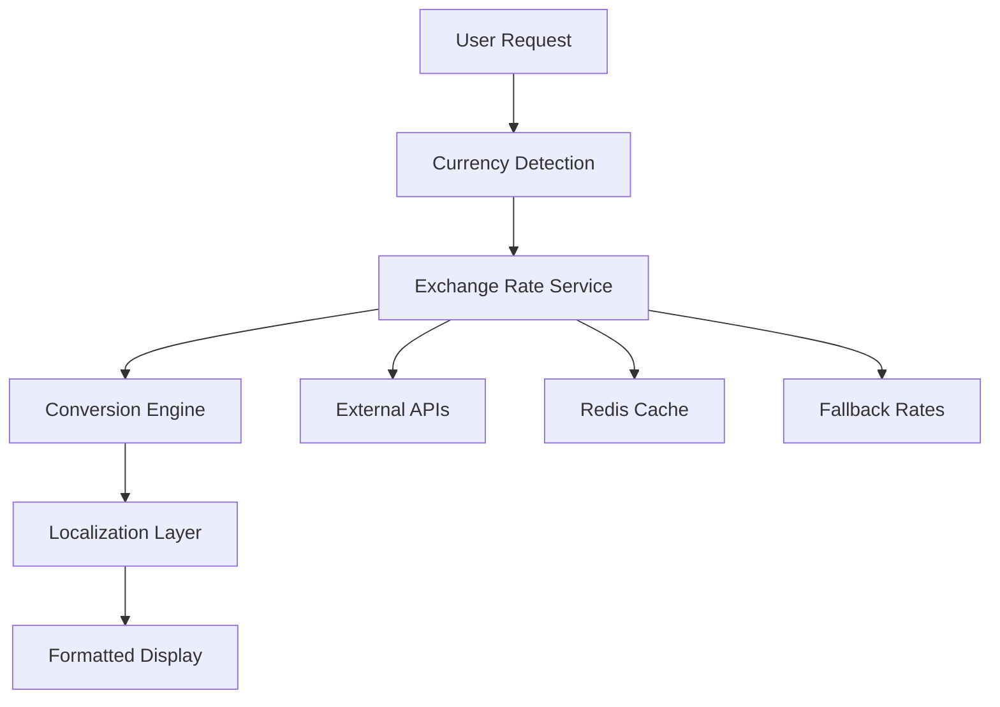

# Multi-Currency System Documentation

The PropXchange UAE platform features a comprehensive multi-currency system designed to serve the diverse UAE and international investor base.

## Overview

Our multi-currency system supports:
- **Primary Currency**: AED (UAE Dirham)
- **GCC Currencies**: SAR, QAR, KWD, OMR, BHD
- **International Currencies**: USD, EUR, GBP, SGD
- **Emerging Markets**: INR

## Architecture



## Key Features

### 1. Automatic Currency Detection
```javascript
// IP-based currency detection
const detectUserCurrency = async (ipAddress) => {
  const location = await geoLocationService.detect(ipAddress);
  return countryToCurrencyMapping[location.countryCode] || 'AED';
};
```

### 2. Real-time Exchange Rates
- **Primary Source**: exchangerate-api.com
- **Update Frequency**: Every 15 minutes
- **Fallback**: Static rates for high availability
- **Cache**: Redis with 1-hour TTL

### 3. Currency Conversion
```javascript
// Example: Convert from USD to AED
const convertedAmount = await currencyService.convertCurrency(
  1000,    // amount
  'USD',   // from currency
  'AED'    // to currency
);
// Result: 3672.00 AED (approximate)
```

### 4. Localized Formatting
Each currency is formatted according to local conventions:

| Currency | Symbol | Format | Example |
|----------|--------|--------|---------|
| AED | د.إ | AED 1,000.00 | د.إ 1,000.00 |
| SAR | ﷼ | SAR 1,000.00 | ﷼ 1,000.00 |
| USD | $ | $1,000.00 | $1,000.00 |
| EUR | € | €1,000.00 | €1,000.00 |

## Investment Amounts by Currency

### AED (Primary)
```javascript
const aedAmounts = [100, 500, 1000, 5000, 10000, 25000];
```

### USD
```javascript
const usdAmounts = [25, 100, 250, 1000, 2500, 7500];
```

### GCC Currencies
```javascript
const gccAmounts = {
  SAR: [100, 400, 1000, 4000, 10000, 25000],
  QAR: [100, 400, 1000, 4000, 10000, 25000],
  KWD: [25, 100, 250, 1000, 2500, 7500]
};
```

## API Endpoints

### Get Current Exchange Rates
```http
GET /api/currency/rates
Authorization: Bearer {token}
```

Response:
```json
{
  "success": true,
  "data": {
    "baseCurrency": "AED",
    "rates": {
      "AED": 1.0,
      "USD": 0.272,
      "EUR": 0.231,
      "SAR": 1.02,
      "QAR": 0.991
    },
    "lastUpdated": "2024-01-15T10:30:00Z"
  }
}
```

### Convert Currency
```http
POST /api/currency/convert
Content-Type: application/json
Authorization: Bearer {token}

{
  "amount": 1000,
  "fromCurrency": "USD",
  "toCurrency": "AED"
}
```

Response:
```json
{
  "success": true,
  "data": {
    "originalAmount": 1000,
    "fromCurrency": "USD",
    "toCurrency": "AED",
    "convertedAmount": 3672.00,
    "exchangeRate": 3.672,
    "formattedAmount": "د.إ 3,672.00"
  }
}
```

## Frontend Integration

### Currency Context Provider
```jsx
import { CurrencyProvider, useCurrency } from './hooks/useCurrency';

function App() {
  return (
    <CurrencyProvider>
      <Router>
        <Routes>
          {/* Your routes */}
        </Routes>
      </Router>
    </CurrencyProvider>
  );
}
```

### Using Currency Hook
```jsx
function PropertyCard({ property }) {
  const { currency, formatCurrency, convertAmount } = useCurrency();
  
  const convertedPrice = convertAmount(
    property.price,
    'AED',
    currency
  );
  
  return (
    <div>
      <h3>{property.title}</h3>
      <p>Price: {formatCurrency(convertedPrice, currency)}</p>
    </div>
  );
}
```

### Currency Selector Component
```jsx
import { CurrencySelector } from './components/CurrencySelector';

function Header() {
  return (
    <header>
      <nav>
        {/* Navigation items */}
        <CurrencySelector />
      </nav>
    </header>
  );
}
```

## Configuration

### Environment Variables
```bash
# Exchange Rate API
EXCHANGE_RATE_API_KEY=your_api_key
EXCHANGE_RATE_API_URL=https://api.exchangerate-api.com/v4/latest

# Redis Configuration
REDIS_URL=redis://localhost:6379
CURRENCY_CACHE_TTL=3600

# Default Settings
PRIMARY_CURRENCY=AED
SUPPORTED_CURRENCIES=AED,USD,EUR,GBP,SAR,QAR,KWD,SGD,INR
```

### Currency Service Configuration
```javascript
// config/currency.js
module.exports = {
  baseCurrency: 'AED',
  supportedCurrencies: ['AED', 'USD', 'EUR', 'GBP', 'SAR', 'QAR', 'KWD'],
  updateInterval: 15 * 60 * 1000, // 15 minutes
  cacheTTL: 3600, // 1 hour
  apiTimeout: 10000, // 10 seconds
  fallbackRates: {
    AED: 1.0,
    USD: 0.272,
    EUR: 0.231,
    GBP: 0.198,
    SAR: 1.02,
    QAR: 0.991,
    KWD: 0.082
  }
};
```

## Error Handling

### Exchange Rate API Failures
```javascript
try {
  const rates = await exchangeRateAPI.getCurrentRates();
  return rates;
} catch (error) {
  logger.warn('Exchange rate API failed, using fallback rates');
  return fallbackRates;
}
```

### Currency Conversion Errors
```javascript
const convertCurrency = async (amount, from, to) => {
  try {
    if (from === to) return amount;
    
    const rates = await getCurrentRates();
    return calculateConversion(amount, from, to, rates);
  } catch (error) {
    logger.error('Currency conversion failed:', error);
    throw new CurrencyConversionError('Unable to convert currency');
  }
};
```

## Testing

### Unit Tests
```javascript
describe('Currency Service', () => {
  test('should convert USD to AED correctly', async () => {
    const result = await currencyService.convertCurrency(100, 'USD', 'AED');
    expect(result).toBeCloseTo(367.2, 1);
  });
  
  test('should format AED currency correctly', () => {
    const formatted = currencyService.formatCurrency(1000, 'AED');
    expect(formatted).toBe('د.إ 1,000.00');
  });
});
```

### Integration Tests
```javascript
describe('Currency API', () => {
  test('GET /api/currency/rates should return current rates', async () => {
    const response = await request(app)
      .get('/api/currency/rates')
      .expect(200);
      
    expect(response.body.data.baseCurrency).toBe('AED');
    expect(response.body.data.rates.AED).toBe(1.0);
  });
});
```

## Monitoring & Analytics

### Key Metrics
- Exchange rate API response times
- Currency conversion accuracy
- User currency preferences
- Conversion error rates

### Alerts
- Exchange rate API failures
- Significant rate changes (>5%)
- High conversion error rates
- Cache performance issues

## Best Practices

1. **Always use the currency service** for conversions
2. **Cache exchange rates** to reduce API calls
3. **Handle API failures gracefully** with fallback rates
4. **Format currencies** according to locale conventions
5. **Test with multiple currencies** during development
6. **Monitor exchange rate accuracy** in production

## Migration Guide

### From Single Currency to Multi-Currency
1. Update database schema to include currency fields
2. Migrate existing amounts to AED base currency
3. Update API responses to include currency information
4. Add currency conversion to frontend components
5. Test thoroughly with different currency combinations

---

For more specific implementation details, see:
- [Exchange Rate Management](./exchange-rates.md)
- [Currency Conversion](./conversion.md)
- [Localization](./localization.md)