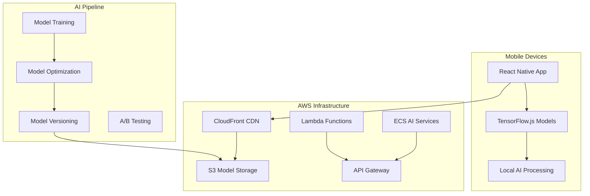

# AWS AI/ML Deployment Guide

This guide covers the deployment of NexVestXR v2's AI/ML features to AWS production environment, including TensorFlow.js model serving, mobile app distribution, and performance optimization.

## 🏗️ AI Architecture on AWS

### Overview



## 📱 Mobile AI Deployment

### 1. Model Bundle Optimization

```bash
# Optimize TensorFlow.js models for mobile
cd mobile/ai-models

# Convert and quantize models
python3 scripts/optimize-models.py \
  --input-dir models/training \
  --output-dir models/mobile \
  --quantization-type int8 \
  --target-platform mobile

# Verify model sizes
ls -lh models/mobile/
# property-classifier.bin    (~2.1MB)
# condition-assessment.bin   (~1.8MB)
# feature-detection.bin      (~3.2MB)
# room-classifier.bin        (~1.6MB)
# price-estimator.bin        (~2.4MB)
```

### 2. Model Serving Strategy

#### Option A: Bundle with App (Recommended)
```javascript
// metro.config.js
module.exports = {
  resolver: {
    assetExts: ['bin', 'json', 'tflite'],
  },
  transformer: {
    assetRegistryPath: ['./src/assets/ai-models'],
  },
};

// Model loading in app
const modelPaths = {
  propertyClassifier: 'bundle://assets/ai-models/property-classifier.json',
  conditionAssessment: 'bundle://assets/ai-models/condition-assessment.json',
  // ... other models
};
```

#### Option B: CDN Delivery
```javascript
// Dynamic model loading from CloudFront
const CDN_BASE_URL = 'https://d1234567890.cloudfront.net/ai-models/v2';

const modelPaths = {
  propertyClassifier: `${CDN_BASE_URL}/property-classifier.json`,
  conditionAssessment: `${CDN_BASE_URL}/condition-assessment.json`,
  // ... other models
};
```

### 3. App Bundle Configuration

```yaml
# .github/workflows/mobile-ai-deploy.yml
name: Mobile AI Deployment

on:
  push:
    branches: [master]
    paths: ['mobile/**', 'ai-models/**']

jobs:
  optimize-models:
    runs-on: ubuntu-latest
    steps:
      - uses: actions/checkout@v3
      
      - name: Setup Python
        uses: actions/setup-python@v4
        with:
          python-version: '3.9'
          
      - name: Install TensorFlow
        run: |
          pip install tensorflow==2.13.0
          pip install tensorflowjs==4.12.0
          
      - name: Optimize Models
        run: |
          cd mobile/ai-models
          python optimize-models.py
          
      - name: Upload to S3
        run: |
          aws s3 sync models/mobile/ s3://nexvestxr-ai-models/v2/ \
            --exclude "*.py" \
            --include "*.json" \
            --include "*.bin"
            
  build-android:
    needs: optimize-models
    runs-on: ubuntu-latest
    steps:
      - name: Build Android APK
        run: |
          cd mobile/android
          ./gradlew assembleRelease
          
      - name: Upload to Play Store
        uses: r0adkll/upload-google-play@v1
        with:
          serviceAccountJsonPlainText: ${{ secrets.GOOGLE_PLAY_SERVICE_ACCOUNT }}
          packageName: com.nexvestxr.mobile
          releaseFiles: android/app/build/outputs/apk/release/app-release.apk
          track: internal
```

## ☁️ AWS Infrastructure Setup

### 1. S3 Configuration for AI Models

```yaml
# cloudformation/ai-infrastructure.yaml
AWSTemplateFormatVersion: '2010-09-09'
Description: 'NexVestXR AI/ML Infrastructure'

Resources:
  AIModelsBucket:
    Type: AWS::S3::Bucket
    Properties:
      BucketName: nexvestxr-ai-models
      VersioningConfiguration:
        Status: Enabled
      PublicAccessBlockConfiguration:
        BlockPublicAcls: true
        BlockPublicPolicy: true
        IgnorePublicAcls: true
        RestrictPublicBuckets: true
      CorsConfiguration:
        CorsRules:
          - AllowedHeaders: ['*']
            AllowedMethods: [GET, HEAD]
            AllowedOrigins: ['*']
            MaxAge: 3600

  AIModelsCloudFront:
    Type: AWS::CloudFront::Distribution
    Properties:
      DistributionConfig:
        Enabled: true
        Comment: 'NexVestXR AI Models CDN'
        DefaultCacheBehavior:
          TargetOriginId: S3-AIModels
          ViewerProtocolPolicy: redirect-to-https
          CachePolicyId: 4135ea2d-6df8-44a3-9df3-4b5a84be39ad # Managed-CachingOptimized
          Compress: true
        Origins:
          - Id: S3-AIModels
            DomainName: !GetAtt AIModelsBucket.RegionalDomainName
            S3OriginConfig:
              OriginAccessIdentity: !Sub 'origin-access-identity/cloudfront/${AIModelsOAI}'
        PriceClass: PriceClass_100
        
  AIModelsOAI:
    Type: AWS::CloudFront::OriginAccessIdentity
    Properties:
      OriginAccessIdentityConfig:
        Comment: 'OAI for AI Models bucket'
```

### 2. ECS Service for AI Processing

```yaml
# AI processing service for heavy computations
AIProcessingService:
  Type: AWS::ECS::Service
  Properties:
    ServiceName: nexvestxr-ai-processing
    Cluster: !Ref ECSCluster
    TaskDefinition: !Ref AIProcessingTaskDefinition
    DesiredCount: 2
    LaunchType: FARGATE
    NetworkConfiguration:
      AwsvpcConfiguration:
        SecurityGroups: [!Ref AIProcessingSecurityGroup]
        Subnets: [!Ref PrivateSubnet1, !Ref PrivateSubnet2]
        AssignPublicIp: DISABLED

AIProcessingTaskDefinition:
  Type: AWS::ECS::TaskDefinition
  Properties:
    Family: nexvestxr-ai-processing
    NetworkMode: awsvpc
    RequiresCompatibilities: [FARGATE]
    Cpu: 2048
    Memory: 4096
    ExecutionRoleArn: !Ref ECSExecutionRole
    TaskRoleArn: !Ref ECSTaskRole
    ContainerDefinitions:
      - Name: ai-processing
        Image: !Sub '${AWS::AccountId}.dkr.ecr.${AWS::Region}.amazonaws.com/nexvestxr-ai:latest'
        PortMappings:
          - ContainerPort: 3000
            Protocol: tcp
        Environment:
          - Name: NODE_ENV
            Value: production
          - Name: AWS_REGION
            Value: !Ref AWS::Region
        LogConfiguration:
          LogDriver: awslogs
          Options:
            awslogs-group: !Ref AIProcessingLogGroup
            awslogs-region: !Ref AWS::Region
            awslogs-stream-prefix: ai-processing
```

### 3. Lambda Functions for Model Management

```javascript
// lambda/model-versioning/index.js
const AWS = require('aws-sdk');
const s3 = new AWS.S3();

exports.handler = async (event) => {
  try {
    const { modelName, version, modelData } = JSON.parse(event.body);
    
    // Upload new model version
    const uploadParams = {
      Bucket: 'nexvestxr-ai-models',
      Key: `${modelName}/v${version}/model.json`,
      Body: JSON.stringify(modelData),
      ContentType: 'application/json',
      Metadata: {
        version: version.toString(),
        timestamp: new Date().toISOString()
      }
    };
    
    await s3.upload(uploadParams).promise();
    
    // Update latest version pointer
    const latestParams = {
      Bucket: 'nexvestxr-ai-models',
      Key: `${modelName}/latest.json`,
      Body: JSON.stringify({ version, timestamp: new Date().toISOString() }),
      ContentType: 'application/json'
    };
    
    await s3.upload(latestParams).promise();
    
    // Invalidate CloudFront cache
    const cloudfront = new AWS.CloudFront();
    await cloudfront.createInvalidation({
      DistributionId: process.env.CLOUDFRONT_DISTRIBUTION_ID,
      InvalidationBatch: {
        Paths: [`/${modelName}/*`],
        CallerReference: `${modelName}-${version}-${Date.now()}`
      }
    }).promise();
    
    return {
      statusCode: 200,
      body: JSON.stringify({
        success: true,
        message: `Model ${modelName} v${version} deployed successfully`
      })
    };
  } catch (error) {
    console.error('Model deployment error:', error);
    return {
      statusCode: 500,
      body: JSON.stringify({ error: error.message })
    };
  }
};
```

### 4. API Gateway for AI Services

```yaml
AIApiGateway:
  Type: AWS::ApiGateway::RestApi
  Properties:
    Name: nexvestxr-ai-api
    Description: 'NexVestXR AI Services API'
    EndpointConfiguration:
      Types: [REGIONAL]

ModelVersioningResource:
  Type: AWS::ApiGateway::Resource
  Properties:
    RestApiId: !Ref AIApiGateway
    ParentId: !GetAtt AIApiGateway.RootResourceId
    PathPart: 'models'

ModelVersioningMethod:
  Type: AWS::ApiGateway::Method
  Properties:
    RestApiId: !Ref AIApiGateway
    ResourceId: !Ref ModelVersioningResource
    HttpMethod: POST
    AuthorizationType: AWS_IAM
    Integration:
      Type: AWS_PROXY
      IntegrationHttpMethod: POST
      Uri: !Sub 'arn:aws:apigateway:${AWS::Region}:lambda:path/2015-03-31/functions/${ModelVersioningFunction.Arn}/invocations'
```

## 🚀 Deployment Pipeline

### 1. Model Training Pipeline

```yaml
# .github/workflows/ai-model-training.yml
name: AI Model Training Pipeline

on:
  schedule:
    - cron: '0 2 * * 0'  # Weekly on Sunday at 2 AM
  workflow_dispatch:

jobs:
  train-models:
    runs-on: ubuntu-latest
    strategy:
      matrix:
        model: [property-classifier, condition-assessment, feature-detection, room-classifier, price-estimator]
    
    steps:
      - uses: actions/checkout@v3
      
      - name: Setup Python Environment
        uses: actions/setup-python@v4
        with:
          python-version: '3.9'
          
      - name: Install Dependencies
        run: |
          pip install -r ai-training/requirements.txt
          
      - name: Download Training Data
        run: |
          aws s3 sync s3://nexvestxr-training-data/ ./data/
        env:
          AWS_ACCESS_KEY_ID: ${{ secrets.AWS_ACCESS_KEY_ID }}
          AWS_SECRET_ACCESS_KEY: ${{ secrets.AWS_SECRET_ACCESS_KEY }}
          
      - name: Train Model
        run: |
          cd ai-training
          python train_model.py \
            --model-type ${{ matrix.model }} \
            --data-path ../data/ \
            --output-path ./models/ \
            --epochs 100 \
            --batch-size 32
            
      - name: Validate Model
        run: |
          cd ai-training
          python validate_model.py \
            --model-path ./models/${{ matrix.model }} \
            --test-data ../data/test/ \
            --min-accuracy 0.85
            
      - name: Convert to TensorFlow.js
        run: |
          tensorflowjs_converter \
            --input_format keras \
            --output_format tfjs_graph_model \
            --quantize_float16 \
            ./models/${{ matrix.model }}.h5 \
            ./models/tfjs/${{ matrix.model }}/
            
      - name: Deploy to S3
        run: |
          MODEL_VERSION=$(date +%Y%m%d_%H%M%S)
          aws s3 sync ./models/tfjs/${{ matrix.model }}/ \
            s3://nexvestxr-ai-models/${{ matrix.model }}/v${MODEL_VERSION}/
          
          # Update latest version
          echo "{\"version\":\"${MODEL_VERSION}\",\"timestamp\":\"$(date -u +%Y-%m-%dT%H:%M:%SZ)\"}" | \
            aws s3 cp - s3://nexvestxr-ai-models/${{ matrix.model }}/latest.json
```

### 2. Mobile App Deployment

```bash
#!/bin/bash
# scripts/deploy-mobile-ai.sh

set -e

echo "🚀 Deploying NexVestXR Mobile with AI..."

# Build environment
export NODE_ENV=production
export AI_MODELS_CDN="https://d1234567890.cloudfront.net"

# Install dependencies
cd mobile
npm ci

# Run tests
npm run test:ai
npm run test:integration

# Build iOS
cd ios
xcodebuild -workspace NexVestXRMobile.xcworkspace \
  -scheme NexVestXRMobile \
  -configuration Release \
  -destination generic/platform=iOS \
  archive -archivePath NexVestXRMobile.xcarchive

# Upload to App Store Connect
xcodebuild -exportArchive \
  -archivePath NexVestXRMobile.xcarchive \
  -exportPath ./build \
  -exportOptionsPlist ExportOptions.plist

# Build Android
cd ../android
./gradlew assembleRelease

# Upload to Google Play Console
bundletool build-apks \
  --bundle=app/build/outputs/bundle/release/app-release.aab \
  --output=app-release.apks \
  --ks=../keystores/release.keystore \
  --ks-pass=pass:$KEYSTORE_PASSWORD \
  --ks-key-alias=$KEY_ALIAS \
  --key-pass=pass:$KEY_PASSWORD

echo "✅ Mobile deployment complete!"
```

### 3. AI Service Monitoring

```yaml
# cloudformation/ai-monitoring.yaml
AIModelPerformanceAlarm:
  Type: AWS::CloudWatch::Alarm
  Properties:
    AlarmName: 'AI-Model-Performance-Degradation'
    AlarmDescription: 'Monitor AI model performance metrics'
    MetricName: 'ModelAccuracy'
    Namespace: 'NexVestXR/AI'
    Statistic: Average
    Period: 300
    EvaluationPeriods: 2
    Threshold: 0.85
    ComparisonOperator: LessThanThreshold
    AlarmActions:
      - !Ref AIAlarmsTopic

AIMemoryUsageAlarm:
  Type: AWS::CloudWatch::Alarm
  Properties:
    AlarmName: 'AI-Service-Memory-Usage'
    AlarmDescription: 'Monitor memory usage of AI processing service'
    MetricName: 'MemoryUtilization'
    Namespace: 'AWS/ECS'
    Statistic: Average
    Period: 300
    EvaluationPeriods: 2
    Threshold: 80
    ComparisonOperator: GreaterThanThreshold
    Dimensions:
      - Name: ServiceName
        Value: nexvestxr-ai-processing
    AlarmActions:
      - !Ref AIAlarmsTopic
```

## 📊 Performance Optimization

### 1. Model Compression

```python
# scripts/optimize-models.py
import tensorflow as tf
import tensorflowjs as tfjs

def optimize_model(model_path, output_path):
    # Load the trained model
    model = tf.keras.models.load_model(model_path)
    
    # Apply quantization
    converter = tf.lite.TFLiteConverter.from_keras_model(model)
    converter.optimizations = [tf.lite.Optimize.DEFAULT]
    converter.target_spec.supported_types = [tf.float16]
    
    # Convert to TensorFlow Lite
    tflite_model = converter.convert()
    
    # Convert to TensorFlow.js with quantization
    tfjs.converters.save_keras_model(
        model,
        output_path,
        quantization_bytes=2,  # 16-bit quantization
        skip_op_check=True,
        strip_debug_ops=True
    )
    
    print(f"Model optimized and saved to {output_path}")

if __name__ == "__main__":
    models = [
        'property-classifier',
        'condition-assessment',
        'feature-detection',
        'room-classifier',
        'price-estimator'
    ]
    
    for model_name in models:
        optimize_model(
            f'models/training/{model_name}.h5',
            f'models/mobile/{model_name}'
        )
```

### 2. CDN Cache Configuration

```javascript
// cloudfront-cache-behavior.js
const cacheConfigurations = {
  aiModels: {
    pathPattern: '/ai-models/*',
    cacheBehavior: {
      viewerProtocolPolicy: 'redirect-to-https',
      compress: true,
      cachePolicyId: 'customAICachePolicy',
      ttl: {
        defaultTTL: 86400,    // 24 hours
        maxTTL: 31536000,     // 1 year
        minTTL: 3600          // 1 hour
      }
    }
  },
  modelVersions: {
    pathPattern: '/ai-models/*/latest.json',
    cacheBehavior: {
      viewerProtocolPolicy: 'redirect-to-https',
      compress: true,
      ttl: {
        defaultTTL: 300,      // 5 minutes
        maxTTL: 3600,         // 1 hour
        minTTL: 0             // No minimum
      }
    }
  }
};
```

### 3. Auto-Scaling Configuration

```yaml
AIProcessingAutoScaling:
  Type: AWS::ApplicationAutoScaling::ScalableTarget
  Properties:
    ServiceNamespace: ecs
    ResourceId: !Sub 'service/${ECSCluster}/${AIProcessingService.Name}'
    ScalableDimension: ecs:service:DesiredCount
    MinCapacity: 1
    MaxCapacity: 10

AIProcessingScalingPolicy:
  Type: AWS::ApplicationAutoScaling::ScalingPolicy
  Properties:
    PolicyName: AIProcessingCPUScaling
    PolicyType: TargetTrackingScaling
    ScalingTargetId: !Ref AIProcessingAutoScaling
    TargetTrackingScalingPolicyConfiguration:
      TargetValue: 70.0
      PredefinedMetricSpecification:
        PredefinedMetricType: ECSServiceAverageCPUUtilization
      ScaleOutCooldown: 300
      ScaleInCooldown: 300
```

## 🔒 Security Considerations

### 1. Model Security

```javascript
// Model integrity verification
class ModelSecurityManager {
  async verifyModelIntegrity(modelUrl, expectedHash) {
    const response = await fetch(modelUrl);
    const modelData = await response.arrayBuffer();
    
    const hashBuffer = await crypto.subtle.digest('SHA-256', modelData);
    const hashArray = Array.from(new Uint8Array(hashBuffer));
    const hashHex = hashArray.map(b => b.toString(16).padStart(2, '0')).join('');
    
    if (hashHex !== expectedHash) {
      throw new Error('Model integrity check failed');
    }
    
    return modelData;
  }
  
  async loadSecureModel(modelName, version) {
    const manifestUrl = `${CDN_BASE_URL}/${modelName}/v${version}/manifest.json`;
    const manifest = await (await fetch(manifestUrl)).json();
    
    await this.verifyModelIntegrity(
      manifest.modelUrl, 
      manifest.sha256Hash
    );
    
    return tf.loadLayersModel(manifest.modelUrl);
  }
}
```

### 2. Data Privacy

```javascript
// Privacy-preserving image processing
class PrivacyManager {
  static stripExifData(imageData) {
    // Remove EXIF metadata that might contain location/device info
    const canvas = document.createElement('canvas');
    const ctx = canvas.getContext('2d');
    
    canvas.width = imageData.width;
    canvas.height = imageData.height;
    ctx.drawImage(imageData, 0, 0);
    
    return canvas.toDataURL('image/jpeg', 0.9);
  }
  
  static anonymizeImageData(tensor) {
    // Apply noise or blur to potentially identifying features
    return tf.tidy(() => {
      const noise = tf.randomNormal(tensor.shape, 0, 0.01);
      return tensor.add(noise);
    });
  }
}
```

## 📈 Monitoring & Analytics

### 1. AI Performance Metrics

```javascript
// CloudWatch custom metrics
class AIMetricsLogger {
  constructor() {
    this.cloudWatch = new AWS.CloudWatch({
      region: process.env.AWS_REGION
    });
  }
  
  async logModelPerformance(modelName, metrics) {
    const params = {
      Namespace: 'NexVestXR/AI',
      MetricData: [
        {
          MetricName: 'ModelAccuracy',
          Dimensions: [
            {
              Name: 'ModelName',
              Value: modelName
            }
          ],
          Value: metrics.accuracy,
          Unit: 'Percent'
        },
        {
          MetricName: 'PredictionLatency',
          Dimensions: [
            {
              Name: 'ModelName',
              Value: modelName
            }
          ],
          Value: metrics.latency,
          Unit: 'Milliseconds'
        },
        {
          MetricName: 'MemoryUsage',
          Dimensions: [
            {
              Name: 'ModelName',
              Value: modelName
            }
          ],
          Value: metrics.memoryUsage,
          Unit: 'Bytes'
        }
      ]
    };
    
    await this.cloudWatch.putMetricData(params).promise();
  }
}
```

### 2. A/B Testing Framework

```javascript
// Model A/B testing
class ModelABTesting {
  constructor() {
    this.experiments = new Map();
  }
  
  async getModelVersion(modelName, userId) {
    const experiment = this.experiments.get(modelName);
    if (!experiment) {
      return 'latest';
    }
    
    // Hash user ID to determine variant
    const hash = await this.hashUserId(userId);
    const bucket = hash % 100;
    
    if (bucket < experiment.splitPercentage) {
      return experiment.variantA;
    } else {
      return experiment.variantB;
    }
  }
  
  async logExperimentMetric(modelName, version, metric, value) {
    // Log to analytics service for experiment analysis
    await this.analyticsService.track({
      event: 'ai_model_performance',
      properties: {
        model_name: modelName,
        model_version: version,
        metric_name: metric,
        metric_value: value,
        timestamp: new Date().toISOString()
      }
    });
  }
}
```

## 🔄 Continuous Deployment

### 1. Blue-Green Deployment

```bash
#!/bin/bash
# scripts/blue-green-ai-deploy.sh

BLUE_CLUSTER="nexvestxr-ai-blue"
GREEN_CLUSTER="nexvestxr-ai-green"
LOAD_BALANCER_ARN="arn:aws:elasticloadbalancing:..."

# Deploy to green environment
echo "🔄 Deploying to green environment..."
aws ecs update-service \
  --cluster $GREEN_CLUSTER \
  --service nexvestxr-ai-processing \
  --task-definition nexvestxr-ai-processing:LATEST

# Wait for deployment to complete
aws ecs wait services-stable \
  --cluster $GREEN_CLUSTER \
  --services nexvestxr-ai-processing

# Run health checks
echo "🩺 Running health checks..."
./scripts/health-check.sh $GREEN_CLUSTER

if [ $? -eq 0 ]; then
  echo "✅ Health checks passed, switching traffic..."
  
  # Switch load balancer target
  aws elbv2 modify-target-group \
    --target-group-arn $TARGET_GROUP_ARN \
    --health-check-path /health/ai
  
  echo "🎉 Deployment complete!"
else
  echo "❌ Health checks failed, rolling back..."
  exit 1
fi
```

### 2. Rollback Strategy

```javascript
// Automated rollback on performance degradation
class AIDeploymentManager {
  async monitorDeployment(modelName, newVersion) {
    const monitoringInterval = setInterval(async () => {
      const metrics = await this.getModelMetrics(modelName, newVersion);
      
      if (metrics.errorRate > 0.05 || metrics.avgLatency > 2000) {
        console.warn(`Performance degradation detected for ${modelName} v${newVersion}`);
        await this.rollbackModel(modelName);
        clearInterval(monitoringInterval);
      }
    }, 30000); // Check every 30 seconds
    
    // Stop monitoring after 1 hour
    setTimeout(() => clearInterval(monitoringInterval), 3600000);
  }
  
  async rollbackModel(modelName) {
    const previousVersion = await this.getPreviousVersion(modelName);
    
    // Update latest.json to point to previous version
    await s3.upload({
      Bucket: 'nexvestxr-ai-models',
      Key: `${modelName}/latest.json`,
      Body: JSON.stringify({
        version: previousVersion,
        timestamp: new Date().toISOString(),
        rollback: true
      })
    }).promise();
    
    // Invalidate CDN cache
    await this.invalidateCache(`/${modelName}/*`);
    
    console.log(`Rolled back ${modelName} to version ${previousVersion}`);
  }
}
```

## 📋 Deployment Checklist

### Pre-Deployment
- [ ] Models trained and validated (accuracy > 85%)
- [ ] Models optimized for mobile (size < 5MB each)
- [ ] Security scanning completed
- [ ] Load testing passed
- [ ] A/B testing configuration ready

### Deployment
- [ ] Models uploaded to S3 with versioning
- [ ] CloudFront cache invalidated
- [ ] ECS services updated
- [ ] Health checks passing
- [ ] Monitoring alerts configured

### Post-Deployment
- [ ] Performance metrics within SLA
- [ ] Error rates < 1%
- [ ] User feedback positive
- [ ] Rollback plan validated
- [ ] Documentation updated

---

*This deployment guide ensures reliable, scalable, and secure deployment of AI/ML features in NexVestXR v2's production environment on AWS.*