# 🏢 NexVestXR V2 - UAE Real Estate Tokenization Platform


**🎉 PRODUCTION READY** - Complete enterprise-grade platform with UAE Aldar Properties integration


## 🚀 Platform Overview

<div align="center">


*Enterprise-grade real estate tokenization platform*

</div>

---

## 📊 Key Metrics Dashboard

<table>
  <tr>
    <td align="center">
      <h3>💰 Market Opportunity</h3>
      <h2 style="color: #00A651">$120B</h2>
      <p>UAE Real Estate Market</p>
    </td>
    <td align="center">
      <h3>🎯 Year 1 Target</h3>
      <h2 style="color: #0066CC">AED 500M</h2>
      <p>Total Value Locked</p>
    </td>
    <td align="center">
      <h3>🔒 Security Grade</h3>
      <h2 style="color: #FF6B35">PCI DSS L1</h2>
      <p>Enterprise Compliance</p>
    </td>
  </tr>
</table>

---

## 🏗️ Architecture Components

```mermaid
graph TB
    A[👤 Investors] --> B[🌐 Web Platform]
    A --> C[📱 Mobile Apps]
    B --> D[🔒 Security Layer]
    C --> D
    D --> E[⚡ Backend API]
    E --> F[🗄️ Database]
    E --> G[📊 Redis Cache]
    E --> H[⛓️ Blockchain Layer]
    H --> I[🔵 Polygon]
    H --> J[🔥 Flare Network]
    H --> K[💧 XRPL]
    E --> L[🏢 UAE Integration]
    L --> M[🏛️ Aldar Properties]
    L --> N[📋 RERA/DLD]
```



---

## 🛡️ Security Framework



### Multi-Layer Authentication System

- **JWT Tokens** with refresh mechanism
- **Two-Factor Authentication** (TOTP)
- **Session Management** with concurrent limits
- **Biometric Authentication** for mobile

```javascript
// Example: Secure authentication flow
const authResult = await authenticate({
  username: "investor@example.com",
  password: "securePassword",
  twoFactorCode: "123456"
});
```



### PCI DSS Level 1 Compliance

- **AES-256-GCM Encryption** for sensitive data
- **Tokenization Vault** for payment methods
- **Real-time Fraud Detection**
- **Compliance Monitoring**

```javascript
// Example: Secure payment processing
const encryptedPayment = await encryptPaymentData({
  cardNumber: "4111-1111-1111-1111",
  amount: 25000, // AED
  currency: "AED"
});
```



### Intelligent Rate Limiting

- **4 Algorithms**: Fixed Window, Sliding Window, Token Bucket, Leaky Bucket
- **Redis Distributed** across multiple servers
- **Adaptive Limits** based on system load
- **Threat Detection** and automatic blocking

```javascript
// Example: Rate limiting configuration
const rateLimits = {
  login: { maxRequests: 5, windowMs: 900000 },
  trading: { capacity: 10, refillRate: 1 },
  api: { maxRequests: 100, windowMs: 60000 }
};
```



---

## 🇦🇪 UAE Market Integration

### 🏢 Aldar Properties Partnership


**TIER 1 Developer** - Premium partnership with 1.5% platform fee


<div style="display: flex; justify-content: space-between; margin: 20px 0;">
  <div style="background: linear-gradient(135deg, #000000, #333333); color: white; padding: 20px; border-radius: 10px; width: 48%;">
    <h4>🏝️ Premium Locations</h4>
    <ul>
      <li>Saadiyat Island</li>
      <li>Al Reem Island</li>
      <li>Yas Island</li>
      <li>Corniche</li>
    </ul>
  </div>
  <div style="background: linear-gradient(135deg, #0066CC, #0080FF); color: white; padding: 20px; border-radius: 10px; width: 48%;">
    <h4>💰 Investment Tiers</h4>
    <ul>
      <li>Retail: 25K-500K AED</li>
      <li>Premium: 500K-2M AED</li>
      <li>Institutional: 2M+ AED</li>
    </ul>
  </div>
</div>

### 📈 Investment Calculator


**Interactive Calculator** - Try different investment amounts


| Investment Amount (AED) | Property Type | Expected Returns | Staking Tier |
|------------------------|---------------|------------------|--------------|
| 25,000 | Villa Share | 8-12% APY | Bronze |
| 100,000 | Apartment | 10-14% APY | Silver |
| 500,000 | Commercial | 12-16% APY | Gold |
| 2,000,000 | Premium Mixed | 14-18% APY | Platinum |

---

## 📱 Platform Features

### 🎨 User Interface Showcase

<div style="display: grid; grid-template-columns: 1fr 1fr; gap: 20px; margin: 20px 0;">
  <div>
    <h4>🌐 Web Platform</h4>
    <div style="background: #f5f5f5; padding: 15px; border-radius: 8px;">
      <ul>
        <li>✅ Advanced Trading Interface</li>
        <li>✅ Portfolio Management</li>
        <li>✅ Real-time Analytics</li>
        <li>✅ Multi-currency Support</li>
      </ul>
    </div>
  </div>
  <div>
    <h4>📱 Mobile Apps</h4>
    <div style="background: #e8f5e8; padding: 15px; border-radius: 8px;">
      <ul>
        <li>✅ Native iOS/Android</li>
        <li>✅ Biometric Authentication</li>
        <li>✅ Arabic RTL Support</li>
        <li>✅ Offline Capabilities</li>
      </ul>
    </div>
  </div>
</div>

### 🔄 Trading Engine


---

## 🛠️ Technical Implementation

### 📦 Technology Stack

<div style="display: flex; flex-wrap: wrap; gap: 10px; margin: 20px 0;">
  <span style="background: #61DAFB; color: black; padding: 8px 15px; border-radius: 20px;">⚛️ React 18</span>
  <span style="background: #339933; color: white; padding: 8px 15px; border-radius: 20px;">🟢 Node.js</span>
  <span style="background: #47A248; color: white; padding: 8px 15px; border-radius: 20px;">🍃 MongoDB</span>
  <span style="background: #DC382D; color: white; padding: 8px 15px; border-radius: 20px;">📱 React Native</span>
  <span style="background: #363636; color: white; padding: 8px 15px; border-radius: 20px;">⚡ Solidity</span>
  <span style="background: #FF6B35; color: white; padding: 8px 15px; border-radius: 20px;">🔗 XRPL</span>
</div>

### 🏗️ Development Progress


**100% Complete** - All components production-ready


<div style="margin: 20px 0;">

**Frontend Development**
<div style="background: #e8f5e8; height: 20px; border-radius: 10px; position: relative;">
  <div style="background: #00A651; height: 100%; width: 100%; border-radius: 10px;"></div>
  <span style="position: absolute; top: 0; left: 50%; transform: translateX(-50%); line-height: 20px; color: white; font-weight: bold;">100%</span>
</div>

**Backend Development**
<div style="background: #e8f5e8; height: 20px; border-radius: 10px; position: relative; margin-top: 10px;">
  <div style="background: #00A651; height: 100%; width: 100%; border-radius: 10px;"></div>
  <span style="position: absolute; top: 0; left: 50%; transform: translateX(-50%); line-height: 20px; color: white; font-weight: bold;">100%</span>
</div>

**Smart Contracts**
<div style="background: #e8f5e8; height: 20px; border-radius: 10px; position: relative; margin-top: 10px;">
  <div style="background: #00A651; height: 100%; width: 100%; border-radius: 10px;"></div>
  <span style="position: absolute; top: 0; left: 50%; transform: translateX(-50%); line-height: 20px; color: white; font-weight: bold;">100%</span>
</div>

**Security Implementation**
<div style="background: #e8f5e8; height: 20px; border-radius: 10px; position: relative; margin-top: 10px;">
  <div style="background: #00A651; height: 100%; width: 100%; border-radius: 10px;"></div>
  <span style="position: absolute; top: 0; left: 50%; transform: translateX(-50%); line-height: 20px; color: white; font-weight: bold;">100%</span>
</div>

</div>

---

## 🚀 Deployment Roadmap

### 📅 5-Week Launch Timeline


### 🎯 Success Metrics

<div style="display: grid; grid-template-columns: repeat(auto-fit, minmax(200px, 1fr)); gap: 15px; margin: 20px 0;">
  <div style="background: linear-gradient(135deg, #00A651, #32CD32); color: white; padding: 20px; border-radius: 10px; text-align: center;">
    <h4>📈 TVL Target</h4>
    <h2>AED 500M</h2>
    <p>Year 1 Goal</p>
  </div>
  <div style="background: linear-gradient(135deg, #0066CC, #4A90E2); color: white; padding: 20px; border-radius: 10px; text-align: center;">
    <h4>👥 Users</h4>
    <h2>10,000+</h2>
    <p>Active Investors</p>
  </div>
  <div style="background: linear-gradient(135deg, #FF6B35, #FF8C42); color: white; padding: 20px; border-radius: 10px; text-align: center;">
    <h4>🏘️ Properties</h4>
    <h2>100+</h2>
    <p>Tokenized Assets</p>
  </div>
  <div style="background: linear-gradient(135deg, #8B5CF6, #A855F7); color: white; padding: 20px; border-radius: 10px; text-align: center;">
    <h4>💰 Revenue</h4>
    <h2>AED 12.5M</h2>
    <p>Annual Target</p>
  </div>
</div>

---

## 📞 Quick Actions

<div style="display: flex; gap: 10px; margin: 20px 0;">
  <a href="./enterprise-security-implementation.md" style="background: #00A651; color: white; padding: 10px 20px; border-radius: 5px; text-decoration: none;">🔒 Security Guide</a>
  <a href="./uae-implementation.md" style="background: #0066CC; color: white; padding: 10px 20px; border-radius: 5px; text-decoration: none;">🇦🇪 UAE Integration</a>
  <a href="./aldar-integration.md" style="background: #000000; color: white; padding: 10px 20px; border-radius: 5px; text-decoration: none;">🏢 Aldar Properties</a>
  <a href="./api-documentation.md" style="background: #FF6B35; color: white; padding: 10px 20px; border-radius: 5px; text-decoration: none;">📚 API Docs</a>
</div>

---


**💡 Need Help?** Check out our [comprehensive documentation](./README.md) or contact our technical team for support.


<div align="center" style="margin-top: 40px; padding: 20px; background: #f8f9fa; border-radius: 10px;">

### 🎉 Ready for Production Launch

**NexVestXR V2 is production-ready with enterprise-grade security, complete UAE integration, and comprehensive documentation.**

[🚀 Start Deployment](./deployment/README.md) | [📊 View Metrics](./business/README.md) | [🔒 Security Details](./enterprise-security-implementation.md)

</div>