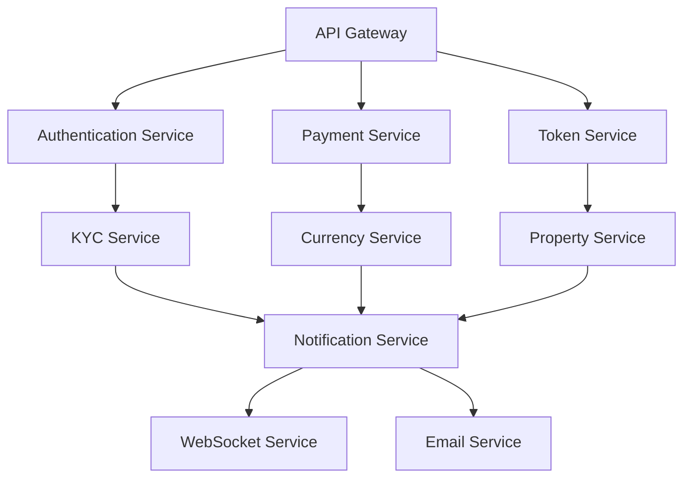

# Platform Services Overview

The NexVestXR V2 platform is built on a comprehensive microservices architecture that powers the dual-token real estate investment ecosystem. This section provides detailed documentation for all core platform services that enable secure, scalable, and compliant property tokenization across UAE and Indian markets.

## 🏗️ Service Architecture

### Core Service Categories

#### **Authentication & Security Services**
- **Authentication Service**: JWT-based authentication with 2FA support
- **Authorization Service**: Role-based access control (RBAC) 
- **Session Management**: Secure session handling with Redis
- **KYC/AML Service**: Multi-level identity verification

#### **Financial Services**
- **Payment Processing**: Multi-gateway payment integration (Stripe, Razorpay, MoonPay)
- **Currency Exchange**: Real-time AED/USD/EUR conversion service
- **Settlement Service**: Cross-chain transaction settlement
- **Escrow Service**: Secure fund holding during property transactions

#### **Token & Investment Services**
- **Dual Token Management**: XERA and PROPX token operations
- **Property Tokenization**: ERC1155 property token creation
- **Investment Processing**: Property investment workflow management
- **Staking Service**: Multi-tier staking rewards system

#### **Trading & Exchange Services**
- **Order Management**: Professional trading order processing
- **Market Making**: Liquidity provision for property tokens
- **Price Discovery**: Real-time property valuation
- **Portfolio Management**: Investment portfolio tracking

#### **Communication Services**
- **Notification Service**: Multi-channel notification delivery
- **WebSocket Service**: Real-time updates to clients
- **Email Service**: Transactional and marketing emails
- **SMS Service**: International SMS delivery

#### **Compliance & Regulatory Services**
- **RERA Integration**: Dubai real estate regulatory compliance
- **DLD Integration**: Dubai Land Department property registration
- **Tax Reporting**: Investment tax calculation and reporting  
- **Audit Trail**: Comprehensive transaction logging

## 🔧 Service Integration

### Inter-Service Communication

### Data Flow Architecture
- **Event-Driven**: Services communicate via event streams
- **API-First**: RESTful APIs with OpenAPI specifications
- **Real-Time**: WebSocket connections for live updates
- **Resilient**: Circuit breakers and retry mechanisms

## 📊 Service Characteristics

### Performance Standards
- **Response Time**: < 200ms for API calls
- **Throughput**: > 1000 requests/second per service
- **Availability**: 99.9% uptime SLA
- **Scalability**: Horizontal scaling with Docker/Kubernetes

### Security Features
- **Encryption**: AES-256 encryption for sensitive data
- **Rate Limiting**: Intelligent rate limiting with Redis
- **Input Validation**: Comprehensive request sanitization
- **Audit Logging**: Complete security event tracking

### Monitoring & Observability
- **Health Checks**: Automated service health monitoring
- **Metrics**: Prometheus metrics collection
- **Logging**: Centralized logging with ELK stack
- **Tracing**: Distributed tracing with Jaeger

## 🌍 Multi-Region Architecture

### UAE Market Services
- **Primary Region**: Middle East (Bahrain)
- **Currency**: AED-focused with multi-currency support
- **Compliance**: RERA/DLD regulatory integration
- **Language**: Arabic/English dual language support

### Indian Market Services  
- **Primary Region**: Asia Pacific (Mumbai)
- **Currency**: INR-focused with USD bridge
- **Compliance**: SEBI-aligned regulatory framework
- **Language**: English with regional language support

## 🔄 Service Lifecycle Management

### Development Workflow
1. **Service Design**: API-first design with OpenAPI
2. **Implementation**: TypeScript/Node.js with testing
3. **Testing**: Unit, integration, and end-to-end testing
4. **Deployment**: Docker containers with CI/CD
5. **Monitoring**: Real-time monitoring and alerting

### Version Management
- **Semantic Versioning**: v1.0.0 format
- **Backward Compatibility**: API versioning support
- **Rolling Deployments**: Zero-downtime updates
- **Rollback Capability**: Automated rollback on failures

## 📈 Business Logic Integration

### Investment Tiers
- **Retail**: AED 25K - 500K (Standard KYC)
- **Premium**: AED 500K - 2M (Enhanced KYC)
- **Institutional**: AED 2M+ (Comprehensive KYC)

### Property Categories
- **XERA Properties**: City pools, diversified investments
- **PROPX Properties**: Individual premium properties
- **Staking Rewards**: Multi-tier reward structure

### Developer Integration
- **Tier 1 Developers**: EMAAR, ALDAR, MERAAS (1.5% fees)
- **Tier 2 Developers**: DAMAC, SOBHA (2.5% fees)
- **Verification Process**: Automated developer onboarding

## 🚀 Getting Started

### Service Documentation Structure
Each service documentation includes:

1. **Service Overview**: Purpose and capabilities
2. **API Reference**: Complete endpoint documentation
3. **Integration Guide**: Step-by-step integration
4. **Configuration**: Environment and deployment settings
5. **Monitoring**: Health checks and metrics
6. **Troubleshooting**: Common issues and solutions

### Quick Links
- [Authentication Service](authentication.md) - User authentication and authorization
- [Payment Processing](payment-processing.md) - Multi-gateway payment handling
- [Dual Token Management](dual-token-management.md) - XERA/PROPX token operations
- [Property Management](property-management.md) - Property tokenization workflows
- [Trading & Exchange](trading-exchange.md) - Professional trading features
- [Notification Services](notifications.md) - Multi-channel communications

---

*Platform Services - Comprehensive service architecture for NexVestXR V2 dual-token platform*