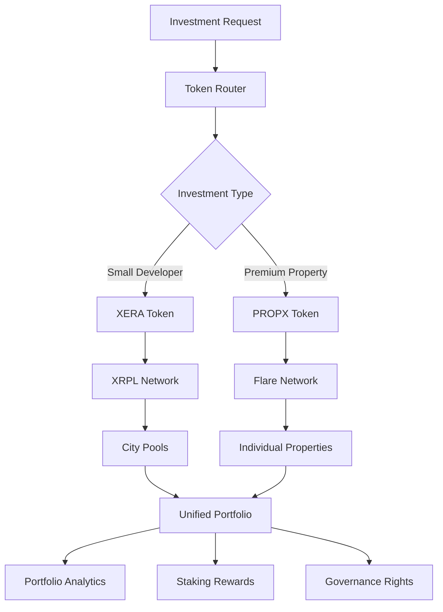

# Dual Token Management Service

The Dual Token Management Service orchestrates the complex interactions between XERA (XRPL) and PROPX (Flare Network) tokens, enabling seamless cross-chain operations, unified portfolio management, and sophisticated investment strategies.

## 🎯 Service Overview

### Core Capabilities
- **Cross-Chain Token Operations**: Seamless XERA/PROPX token management
- **Unified Portfolio Tracking**: Real-time multi-token portfolio analytics
- **Investment Strategy Engine**: Automated investment routing and optimization
- **Staking Management**: Multi-tier staking rewards across both tokens
- **Bridge Operations**: Cross-chain token transfers and conversions
- **Governance Coordination**: Unified voting power across both networks

### Token Architecture


## 🏗️ Architecture Components

### Token Classification System
```javascript
const tokenClassification = {
  // XERA Token Properties
  xera: {
    network: "XRPL",
    type: "governance_utility",
    use_cases: [
      "city_pool_investments",
      "platform_governance", 
      "staking_rewards",
      "fee_discounts",
      "cross_chain_bridge"
    ],
    minimum_investment: {
      AED: 25000,
      USD: 6800,
      INR: 50000
    },
    target_properties: {
      value_range: "50L - 5Cr INR / 100K - 5M AED",
      developer_type: "small_to_medium",
      diversification: "city_pools"
    }
  },
  
  // PROPX Token Properties
  propx: {
    network: "Flare",
    type: "asset_backed",
    use_cases: [
      "individual_property_ownership",
      "premium_investments",
      "institutional_trading",
      "yield_generation",
      "liquidity_provision"
    ],
    minimum_investment: {
      AED: 500000,
      USD: 136000,
      INR: 5000000
    },
    target_properties: {
      value_range: "5Cr+ INR / 5M+ AED",
      developer_type: "tier1_premium",
      diversification: "individual_assets"
    }
  }
};
```

### Investment Routing Engine
```javascript
const investmentRouter = {
  // Routing Logic
  routeInvestment: async (investmentRequest) => {
    const {
      amount,
      currency,
      property_id,
      user_profile,
      investment_type
    } = investmentRequest;
    
    // Convert to base currency for comparison
    const usdAmount = await convertToUSD(amount, currency);
    
    // Determine routing based on multiple factors
    const routing = {
      token_type: null,
      reason: "",
      benefits: [],
      requirements: []
    };
    
    // Property-based routing
    const property = await getPropertyDetails(property_id);
    
    if (property.value >= 5000000 && property.developer.tier === "tier1") {
      routing.token_type = "PROPX";
      routing.reason = "Premium property with Tier 1 developer";
      routing.benefits = [
        "Individual property ownership",
        "Higher yield potential",
        "Institutional features"
      ];
    } else if (usdAmount >= 136000 && user_profile.tier === "institutional") {
      routing.token_type = "PROPX";
      routing.reason = "Institutional investor with high investment amount";
      routing.benefits = [
        "Bulk trading capabilities",
        "OTC desk access",
        "Custom agreements"
      ];
    } else {
      routing.token_type = "XERA";
      routing.reason = "City pool diversification strategy";
      routing.benefits = [
        "Diversified city exposure",
        "Lower minimum investment",
        "Governance participation",
        "Staking rewards"
      ];
    }
    
    // Add cross-benefits if user holds both tokens
    if (await userHoldsBothTokens(user_profile.user_id)) {
      routing.benefits.push("Cross-token fee discounts");
      routing.benefits.push("Enhanced governance voting power");
    }
    
    return routing;
  }
};
```

## 💰 Token Operations

### XERA Token Management
```javascript
const xeraOperations = {
  // City Pool Management
  cityPools: {
    mumbai: {
      multiplier: 1.2,
      minimum_stake: 1000,
      current_apy: 8.5,
      total_value_locked: "₹245Cr"
    },
    bangalore: {
      multiplier: 1.3,
      minimum_stake: 1000,
      current_apy: 9.2,
      total_value_locked: "₹356Cr"
    },
    delhi: {
      multiplier: 1.4,
      minimum_stake: 1500,
      current_apy: 10.1,
      total_value_locked: "₹489Cr"
    },
    // UAE Pools
    dubai: {
      multiplier: 1.3,
      minimum_stake: 1500,
      current_apy: 9.8,
      total_value_locked: "AED 125M"
    },
    abu_dhabi: {
      multiplier: 1.25,
      minimum_stake: 1200,
      current_apy: 9.2,
      total_value_locked: "AED 89M"
    }
  },
  
  // Staking Operations
  staking: {
    calculateRewards: async (stakerAddress, poolId) => {
      const stakerInfo = await getStakerInfo(stakerAddress, poolId);
      const poolInfo = await getPoolInfo(poolId);
      
      const timeStaked = Date.now() - stakerInfo.stakeTime;
      const baseReward = (stakerInfo.amount * poolInfo.apy * timeStaked) / (365 * 24 * 60 * 60 * 1000);
      const multipliedReward = baseReward * poolInfo.multiplier;
      
      return {
        base_reward: baseReward,
        multiplied_reward: multipliedReward,
        pool_bonus: multipliedReward - baseReward,
        time_staked_days: timeStaked / (24 * 60 * 60 * 1000),
        apy: poolInfo.apy
      };
    },
    
    processStaking: async (stakeRequest) => {
      const { user_id, pool_id, amount, duration } = stakeRequest;
      
      // Validate minimum stake
      const pool = xeraOperations.cityPools[pool_id];
      if (amount < pool.minimum_stake) {
        throw new Error(`Minimum stake for ${pool_id} is ${pool.minimum_stake} XERA`);
      }
      
      // Create staking transaction
      const stakingTx = await createXRPLTransaction({
        account: user_id,
        destination: pool.staking_address,
        amount: amount,
        memos: [{
          data: JSON.stringify({
            action: "stake",
            pool: pool_id,
            duration: duration
          })
        }]
      });
      
      return stakingTx;
    }
  }
};
```

### PROPX Token Management
```javascript
const propxOperations = {
  // Property Token Factory
  tokenFactory: {
    createPropertyToken: async (propertyData) => {
      const {
        property_id,
        total_value,
        token_supply,
        developer_id,
        compliance_docs
      } = propertyData;
      
      // Validate property eligibility
      if (total_value < 5000000) {
        throw new Error("Property value below PROPX threshold");
      }
      
      // Deploy new PROPX token contract
      const tokenContract = await deployPROPXContract({
        name: `PROPX-${property_id}`,
        symbol: `PX${property_id.substring(0, 6)}`,
        totalSupply: token_supply,
        propertyValue: total_value,
        developerId: developer_id,
        complianceDocs: compliance_docs
      });
      
      return {
        contract_address: tokenContract.address,
        token_name: tokenContract.name,
        token_symbol: tokenContract.symbol,
        total_supply: token_supply,
        property_value: total_value,
        price_per_token: total_value / token_supply
      };
    },
    
    // Token Trading Operations
    tradingOperations: {
      createBuyOrder: async (orderData) => {
        const { user_id, token_address, quantity, price, order_type } = orderData;
        
        const order = {
          id: generateOrderId(),
          user_id: user_id,
          token_address: token_address,
          side: "buy",
          quantity: quantity,
          price: price,
          order_type: order_type, // market, limit, stop
          status: "pending",
          created_at: new Date(),
          expires_at: order_type === "market" ? null : new Date(Date.now() + 24*60*60*1000)
        };
        
        // Execute order matching
        const matchResult = await matchOrder(order);
        
        return {
          order: order,
          matched: matchResult.matched,
          filled_quantity: matchResult.filled_quantity,
          remaining_quantity: matchResult.remaining_quantity
        };
      }
    }
  }
};
```

## 🌉 Cross-Chain Bridge Operations

### Bridge Architecture
```javascript
const crossChainBridge = {
  // Supported Bridge Operations
  operations: {
    xera_to_propx: {
      ratio: "1:0.1", // 1 XERA = 0.1 PROPX
      minimum_amount: 10000,
      fee: "0.5%",
      processing_time: "5-10 minutes"
    },
    
    propx_to_xera: {
      ratio: "1:10", // 1 PROPX = 10 XERA
      minimum_amount: 100,
      fee: "0.5%",
      processing_time: "5-10 minutes"
    },
    
    cross_chain_staking: {
      description: "Stake XERA to earn PROPX rewards",
      minimum_xera: 50000,
      propx_reward_rate: "2% annually",
      lock_period: "90 days"
    }
  },
  
  // Bridge Process Implementation
  initiateBridge: async (bridgeRequest) => {
    const {
      from_token,
      to_token,
      amount,
      user_address,
      destination_address
    } = bridgeRequest;
    
    // Validate bridge operation
    const operation = crossChainBridge.operations[`${from_token}_to_${to_token}`];
    if (!operation) {
      throw new Error("Bridge operation not supported");
    }
    
    if (amount < operation.minimum_amount) {
      throw new Error(`Minimum bridge amount is ${operation.minimum_amount} ${from_token.toUpperCase()}`);
    }
    
    // Calculate conversion
    const [fromRatio, toRatio] = operation.ratio.split(':').map(Number);
    const convertedAmount = (amount * toRatio) / fromRatio;
    const fee = amount * parseFloat(operation.fee) / 100;
    
    // Create bridge transaction
    const bridgeId = generateBridgeId();
    
    // Lock tokens on source chain
    const lockTx = await lockTokensOnSource({
      token: from_token,
      amount: amount,
      user_address: user_address,
      bridge_id: bridgeId
    });
    
    // Mint tokens on destination chain
    const mintTx = await mintTokensOnDestination({
      token: to_token,
      amount: convertedAmount - fee,
      destination_address: destination_address,
      bridge_id: bridgeId
    });
    
    return {
      bridge_id: bridgeId,
      source_transaction: lockTx.hash,
      destination_transaction: mintTx.hash,
      original_amount: amount,
      converted_amount: convertedAmount,
      fee: fee,
      estimated_completion: new Date(Date.now() + 10*60*1000)
    };
  }
};
```

## 📊 Portfolio Management

### Unified Portfolio Service
```javascript
const portfolioService = {
  // Portfolio Aggregation
  getUserPortfolio: async (userId) => {
    // Fetch XERA holdings
    const xeraHoldings = await getXeraHoldings(userId);
    const xeraStaking = await getXeraStakingPositions(userId);
    
    // Fetch PROPX holdings
    const propxHoldings = await getPropxHoldings(userId);
    const propxStaking = await getPropxStakingPositions(userId);
    
    // Calculate total portfolio value
    const totalValue = {
      xera: {
        liquid: xeraHoldings.total_value,
        staked: xeraStaking.total_value,
        rewards_pending: xeraStaking.pending_rewards
      },
      propx: {
        liquid: propxHoldings.total_value,
        staked: propxStaking.total_value,
        rewards_pending: propxStaking.pending_rewards
      }
    };
    
    const portfolioBreakdown = {
      total_value_usd: totalValue.xera.liquid + totalValue.xera.staked + 
                       totalValue.propx.liquid + totalValue.propx.staked,
      allocation: {
        xera_percentage: ((totalValue.xera.liquid + totalValue.xera.staked) / 
                         portfolioBreakdown.total_value_usd) * 100,
        propx_percentage: ((totalValue.propx.liquid + totalValue.propx.staked) / 
                          portfolioBreakdown.total_value_usd) * 100
      },
      diversification_score: calculateDiversificationScore(xeraHoldings, propxHoldings),
      risk_level: calculateRiskLevel(xeraHoldings, propxHoldings),
      yield_projection: calculateYieldProjection(xeraStaking, propxStaking)
    };
    
    return portfolioBreakdown;
  },
  
  // Performance Analytics
  performanceAnalytics: {
    calculateReturns: async (userId, timeframe) => {
      const currentPortfolio = await portfolioService.getUserPortfolio(userId);
      const historicalPortfolio = await getHistoricalPortfolio(userId, timeframe);
      
      return {
        absolute_return: currentPortfolio.total_value_usd - historicalPortfolio.total_value_usd,
        percentage_return: ((currentPortfolio.total_value_usd - historicalPortfolio.total_value_usd) / 
                           historicalPortfolio.total_value_usd) * 100,
        xera_contribution: calculateTokenContribution(currentPortfolio.xera, historicalPortfolio.xera),
        propx_contribution: calculateTokenContribution(currentPortfolio.propx, historicalPortfolio.propx),
        benchmark_comparison: await compareToBenchmark(currentPortfolio, timeframe)
      };
    }
  }
};
```

### Smart Investment Recommendations
```javascript
const investmentRecommendations = {
  // AI-Powered Recommendations
  generateRecommendations: async (userId) => {
    const userProfile = await getUserProfile(userId);
    const currentPortfolio = await portfolioService.getUserPortfolio(userId);
    const marketData = await getMarketData();
    
    const recommendations = [];
    
    // Diversification Analysis
    if (currentPortfolio.allocation.xera_percentage > 80) {
      recommendations.push({
        type: "rebalancing",
        priority: "high",
        action: "increase_propx_allocation",
        reason: "Portfolio heavily weighted towards XERA",
        suggested_allocation: {
          xera: 60,
          propx: 40
        },
        expected_benefit: "Improved risk-adjusted returns"
      });
    }
    
    // Yield Optimization
    const availableStaking = await getAvailableStakingOpportunities();
    const bestYield = availableStaking.sort((a, b) => b.apy - a.apy)[0];
    
    if (currentPortfolio.xera.liquid > bestYield.minimum_stake) {
      recommendations.push({
        type: "yield_optimization",
        priority: "medium",
        action: "stake_in_high_yield_pool",
        pool: bestYield.pool_name,
        apy: bestYield.apy,
        minimum_stake: bestYield.minimum_stake,
        expected_monthly_yield: (currentPortfolio.xera.liquid * bestYield.apy) / 12
      });
    }
    
    // Market Opportunities
    const marketOpportunities = await identifyMarketOpportunities(userProfile.risk_tolerance);
    recommendations.push(...marketOpportunities);
    
    return recommendations;
  }
};
```

## 🏛️ Governance Integration

### Unified Governance System
```javascript
const governanceSystem = {
  // Cross-Chain Voting Power
  calculateVotingPower: async (userId) => {
    const xeraBalance = await getXeraBalance(userId);
    const xeraStaked = await getXeraStakedAmount(userId);
    const propxBalance = await getPropxBalance(userId);
    
    // XERA voting power (1:1 ratio)
    const xeraVotingPower = xeraBalance + (xeraStaked * 1.5); // Staked tokens get 1.5x voting power
    
    // PROPX voting power (10:1 ratio to XERA equivalent)
    const propxVotingPower = propxBalance * 10;
    
    const totalVotingPower = xeraVotingPower + propxVotingPower;
    
    return {
      total_voting_power: totalVotingPower,
      xera_contribution: xeraVotingPower,
      propx_contribution: propxVotingPower,
      voting_tier: determineVotingTier(totalVotingPower),
      governance_benefits: getGovernanceBenefits(totalVotingPower)
    };
  },
  
  // Proposal System
  proposalSystem: {
    createProposal: async (proposalData) => {
      const {
        creator_id,
        title,
        description,
        proposal_type,
        execution_data,
        voting_period
      } = proposalData;
      
      // Validate proposal creator has sufficient voting power
      const creatorVotingPower = await governanceSystem.calculateVotingPower(creator_id);
      const minimumPowerRequired = getMinimumProposalPower(proposal_type);
      
      if (creatorVotingPower.total_voting_power < minimumPowerRequired) {
        throw new Error("Insufficient voting power to create proposal");
      }
      
      const proposal = {
        id: generateProposalId(),
        creator_id: creator_id,
        title: title,
        description: description,
        type: proposal_type,
        execution_data: execution_data,
        status: "active",
        created_at: new Date(),
        voting_ends_at: new Date(Date.now() + voting_period * 24 * 60 * 60 * 1000),
        votes: {
          for: 0,
          against: 0,
          abstain: 0
        },
        quorum_required: getQuorumRequirement(proposal_type)
      };
      
      // Store proposal on both chains
      await storeProposalOnXRPL(proposal);
      await storeProposalOnFlare(proposal);
      
      return proposal;
    }
  }
};
```

## 📈 Analytics & Reporting

### Token Analytics
```javascript
const tokenAnalytics = {
  // Real-time Metrics
  realTimeMetrics: {
    xera: {
      total_supply: "1,000,000,000",
      circulating_supply: "750,000,000",
      market_cap_usd: "45,000,000",
      trading_volume_24h: "2,500,000",
      staking_ratio: "35%",
      price_change_24h: "+2.3%"
    },
    
    propx: {
      total_properties: 156,
      total_value_locked: "USD 120,000,000",
      average_yield: "8.7%",
      occupancy_rate: "94%",
      trading_volume_24h: "1,800,000",
      price_appreciation_30d: "+5.1%"
    }
  },
  
  // Performance Tracking
  performanceTracking: {
    generateReport: async (timeframe, metrics) => {
      const data = await aggregateTokenData(timeframe);
      
      return {
        timeframe: timeframe,
        xera_performance: {
          price_performance: data.xera.price_change,
          staking_yield: data.xera.average_staking_yield,
          governance_participation: data.xera.governance_participation_rate,
          city_pool_performance: data.xera.city_pool_returns
        },
        propx_performance: {
          property_appreciation: data.propx.property_value_change,
          rental_yield: data.propx.rental_yield,
          occupancy_trends: data.propx.occupancy_trends,
          trading_liquidity: data.propx.trading_volume_trends
        },
        cross_chain_metrics: {
          bridge_volume: data.bridge.total_volume,
          bridge_frequency: data.bridge.transaction_count,
          arbitrage_opportunities: data.bridge.arbitrage_instances
        }
      };
    }
  }
};
```

## 🔧 Configuration & Deployment

### Service Configuration
```bash
# Token Configuration
XERA_CONTRACT_ADDRESS=0x1234...
PROPX_FACTORY_ADDRESS=0x5678...

# Network Configuration
XRPL_NETWORK=mainnet
XRPL_SERVER=wss://xrplcluster.com
FLARE_NETWORK_RPC=https://flare-api.flare.network/ext/bc/C/rpc

# Bridge Configuration
BRIDGE_FEE_PERCENTAGE=0.5
MINIMUM_BRIDGE_AMOUNT_XERA=10000
MINIMUM_BRIDGE_AMOUNT_PROPX=100

# Staking Configuration
XERA_STAKING_CONTRACT=0xabcd...
PROPX_STAKING_CONTRACT=0xefgh...
STAKING_REWARD_DISTRIBUTION_FREQUENCY=daily

# Governance Configuration
PROPOSAL_MINIMUM_VOTING_POWER=100000
QUORUM_PERCENTAGE=10
VOTING_PERIOD_DAYS=7
```

### API Endpoints
```javascript
// Token Management Endpoints
const tokenEndpoints = {
  // GET /api/tokens/portfolio/:userId
  getPortfolio: "Retrieve unified token portfolio",
  
  // POST /api/tokens/bridge
  initiateBridge: "Start cross-chain token bridge operation",
  
  // POST /api/tokens/stake
  stakeTokens: "Stake tokens in city pools or property staking",
  
  // GET /api/tokens/rewards/:userId
  getRewards: "Calculate and retrieve staking rewards",
  
  // POST /api/governance/propose
  createProposal: "Create governance proposal",
  
  // POST /api/governance/vote
  submitVote: "Submit vote on governance proposal",
  
  // GET /api/analytics/performance
  getPerformanceAnalytics: "Retrieve token performance analytics"
};
```

---

*Dual Token Management Service - Sophisticated cross-chain token operations for NexVestXR V2 platform*