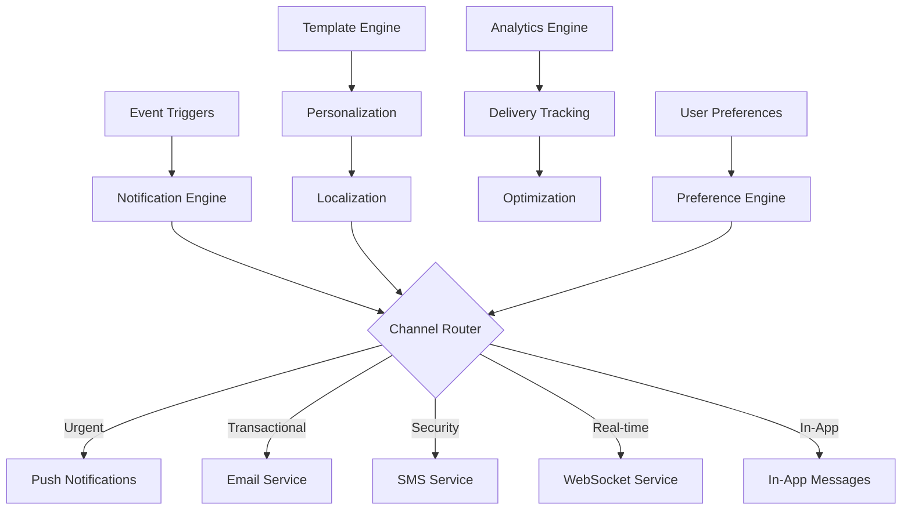

# Notification Services

The Notification Services provide comprehensive multi-channel communication infrastructure for the NexVestXR V2 platform, enabling real-time updates, personalized messaging, and seamless user engagement across web, mobile, and external channels.

## 📢 Service Overview

### Core Capabilities
- **Multi-Channel Delivery**: Email, SMS, push notifications, in-app messages
- **Real-Time Communication**: WebSocket-based live updates
- **Personalization Engine**: AI-driven content customization
- **Event-Driven Architecture**: Automated trigger-based notifications
- **Template Management**: Dynamic template system with localization
- **Delivery Analytics**: Comprehensive tracking and optimization
- **Compliance Integration**: Regulatory and privacy-compliant messaging

### Communication Architecture


## 🏗️ Notification Infrastructure

### Event-Driven Notification System
```javascript
const notificationSystem = {
  // Event Categories
  eventCategories: {
    investment: {
      events: [
        "investment_completed",
        "investment_failed", 
        "dividend_received",
        "property_milestone",
        "portfolio_update"
      ],
      priority: "high",
      channels: ["push", "email", "in_app"]
    },
    
    trading: {
      events: [
        "order_filled",
        "order_cancelled",
        "price_alert",
        "market_update",
        "liquidity_change"
      ],
      priority: "medium",
      channels: ["push", "in_app", "email"]
    },
    
    security: {
      events: [
        "login_attempt",
        "password_changed",
        "2fa_enabled",
        "suspicious_activity",
        "device_added"
      ],
      priority: "critical",
      channels: ["sms", "email", "push"]
    },
    
    property: {
      events: [
        "property_approved",
        "construction_update",
        "rental_income",
        "maintenance_notice",
        "valuation_update"
      ],
      priority: "medium",
      channels: ["email", "in_app", "push"]
    },
    
    compliance: {
      events: [
        "kyc_approved",
        "kyc_rejected",
        "document_required",
        "regulatory_update",
        "tax_document_ready"
      ],
      priority: "high",
      channels: ["email", "sms", "in_app"]
    }
  },
  
  // Notification Processing
  processNotification: async (eventData) => {
    const {
      event_type,
      user_id,
      data,
      metadata,
      urgency
    } = eventData;
    
    // Get user preferences
    const userPreferences = await getUserNotificationPreferences(user_id);
    const userProfile = await getUserProfile(user_id);
    
    // Determine notification configuration
    const eventConfig = notificationSystem.eventCategories[getEventCategory(event_type)];
    const enabledChannels = filterChannelsByPreference(eventConfig.channels, userPreferences);
    
    // Create notification object
    const notification = {
      id: generateNotificationId(),
      user_id: user_id,
      event_type: event_type,
      title: await generateTitle(event_type, data, userProfile.language),
      message: await generateMessage(event_type, data, userProfile.language),
      data: data,
      urgency: urgency || eventConfig.priority,
      channels: enabledChannels,
      personalization: await generatePersonalization(user_id, event_type),
      created_at: new Date(),
      status: "pending"
    };
    
    // Queue for delivery
    await queueNotification(notification);
    
    return notification;
  }
};
```

### Channel Management
```javascript
const channelManagement = {
  // Push Notifications
  pushNotifications: {
    platforms: {
      ios: {
        service: "apns",
        certificate: process.env.APNS_CERTIFICATE,
        sandbox: process.env.NODE_ENV !== "production"
      },
      android: {
        service: "fcm",
        server_key: process.env.FCM_SERVER_KEY,
        sender_id: process.env.FCM_SENDER_ID
      },
      web: {
        service: "web_push",
        vapid_keys: {
          public: process.env.VAPID_PUBLIC_KEY,
          private: process.env.VAPID_PRIVATE_KEY
        }
      }
    },
    
    sendPushNotification: async (notification, deviceTokens) => {
      const pushPayload = {
        title: notification.title,
        body: notification.message,
        data: {
          notification_id: notification.id,
          event_type: notification.event_type,
          action_url: notification.data.action_url,
          custom_data: notification.data
        },
        badge: await getUnreadNotificationCount(notification.user_id),
        sound: notification.urgency === "critical" ? "urgent.wav" : "default",
        priority: notification.urgency === "critical" ? "high" : "normal"
      };
      
      const results = [];
      
      for (const token of deviceTokens) {
        const platform = token.platform;
        const result = await sendToPlatform(platform, token.token, pushPayload);
        
        results.push({
          token: token.token,
          platform: platform,
          status: result.success ? "delivered" : "failed",
          error: result.error || null,
          message_id: result.message_id
        });
        
        // Handle invalid tokens
        if (result.error === "InvalidRegistration") {
          await removeDeviceToken(token.token);
        }
      }
      
      return results;
    }
  },
  
  // Email Service
  emailService: {
    providers: {
      primary: "sendgrid",
      backup: "ses",
      transactional: "postmark"
    },
    
    sendEmail: async (notification, emailData) => {
      const emailPayload = {
        to: emailData.email,
        from: {
          email: "notifications@nexvestxr.com",
          name: "NexVestXR"
        },
        subject: notification.title,
        template_id: await getEmailTemplate(notification.event_type),
        dynamic_template_data: {
          user_name: emailData.name,
          notification_title: notification.title,
          notification_message: notification.message,
          action_button: notification.data.action_button,
          action_url: notification.data.action_url,
          unsubscribe_url: generateUnsubscribeUrl(notification.user_id),
          ...notification.data
        },
        categories: [notification.event_type, "notification"],
        custom_args: {
          notification_id: notification.id,
          user_id: notification.user_id,
          event_type: notification.event_type
        }
      };
      
      // Language-specific templates
      if (emailData.language && emailData.language !== 'en') {
        emailPayload.template_id = await getLocalizedEmailTemplate(
          notification.event_type, 
          emailData.language
        );
      }
      
      const result = await sendWithProvider('primary', emailPayload);
      
      if (!result.success && result.error !== "rate_limit") {
        // Fallback to backup provider
        const fallbackResult = await sendWithProvider('backup', emailPayload);
        return fallbackResult;
      }
      
      return result;
    }
  },
  
  // SMS Service
  smsService: {
    providers: {
      global: "twilio",
      india: "msg91",
      uae: "sms_country"
    },
    
    sendSMS: async (notification, phoneData) => {
      const provider = getProviderByCountry(phoneData.country_code);
      
      const smsPayload = {
        to: phoneData.phone_number,
        from: getFromNumber(phoneData.country_code),
        body: truncateForSMS(notification.message, 160),
        webhook_url: `${process.env.API_URL}/webhooks/sms/delivery`
      };
      
      // Add country-specific formatting
      if (phoneData.country_code === 'AE') {
        smsPayload.body = `NexVestXR: ${smsPayload.body}`;
      }
      
      const result = await sendWithSMSProvider(provider, smsPayload);
      
      return {
        message_id: result.message_id,
        status: result.status,
        cost: result.cost,
        provider: provider
      };
    }
  },
  
  // WebSocket Service
  webSocketService: {
    sendRealTimeNotification: async (notification, socketId) => {
      const wsPayload = {
        type: "notification",
        notification_id: notification.id,
        event_type: notification.event_type,
        title: notification.title,
        message: notification.message,
        data: notification.data,
        timestamp: new Date(),
        urgency: notification.urgency
      };
      
      // Send to specific user's active connections
      const userConnections = await getUserWebSocketConnections(notification.user_id);
      const deliveryResults = [];
      
      for (const connection of userConnections) {
        try {
          connection.send(JSON.stringify(wsPayload));
          deliveryResults.push({
            connection_id: connection.id,
            status: "delivered"
          });
        } catch (error) {
          deliveryResults.push({
            connection_id: connection.id,
            status: "failed",
            error: error.message
          });
        }
      }
      
      return deliveryResults;
    }
  }
};
```

## 🎨 Template Management

### Dynamic Template System
```javascript
const templateManagement = {
  // Template Repository
  templates: {
    email: {
      investment_completed: {
        en: {
          subject: "Investment Successful - {{property_name}}",
          template_id: "investment_success_en",
          variables: ["user_name", "property_name", "investment_amount", "token_count"]
        },
        ar: {
          subject: "تم الاستثمار بنجاح - {{property_name}}",
          template_id: "investment_success_ar",
          variables: ["user_name", "property_name", "investment_amount", "token_count"]
        }
      },
      
      dividend_received: {
        en: {
          subject: "Dividend Payment Received - {{amount}}",
          template_id: "dividend_payment_en",
          variables: ["user_name", "property_name", "dividend_amount", "yield_rate"]
        },
        ar: {
          subject: "تم استلام أرباح الأسهم - {{amount}}",
          template_id: "dividend_payment_ar", 
          variables: ["user_name", "property_name", "dividend_amount", "yield_rate"]
        }
      }
    },
    
    push: {
      price_alert: {
        en: {
          title: "Price Alert",
          body: "{{token_name}} has {{direction}} {{percentage}}%",
          action: "view_portfolio"
        },
        ar: {
          title: "تنبيه السعر",
          body: "{{token_name}} {{direction}} {{percentage}}%",
          action: "view_portfolio"
        }
      },
      
      order_filled: {
        en: {
          title: "Order Executed",
          body: "Your {{order_type}} order for {{quantity}} tokens has been filled",
          action: "view_orders"
        },
        ar: {
          title: "تم تنفيذ الطلب",
          body: "تم تنفيذ طلب {{order_type}} الخاص بك لـ {{quantity}} رموز مميزة",
          action: "view_orders"
        }
      }
    },
    
    sms: {
      security_alert: {
        en: "Security Alert: {{alert_type}} detected on your NexVestXR account. If this wasn't you, contact support immediately.",
        ar: "تنبيه أمني: تم اكتشاف {{alert_type}} في حساب NexVestXR الخاص بك. إذا لم تكن أنت، اتصل بالدعم فورًا."
      },
      
      otp_code: {
        en: "Your NexVestXR verification code is: {{otp_code}}. Valid for 5 minutes.",
        ar: "رمز التحقق الخاص بك في NexVestXR هو: {{otp_code}}. صالح لمدة 5 دقائق."
      }
    }
  },
  
  // Template Rendering
  renderTemplate: async (templateType, notificationType, language, variables) => {
    const template = templateManagement.templates[templateType][notificationType][language];
    
    if (!template) {
      // Fallback to English if language not available
      template = templateManagement.templates[templateType][notificationType]['en'];
    }
    
    // Replace variables in template
    let renderedContent = template.body || template;
    let renderedSubject = template.subject || '';
    
    for (const [key, value] of Object.entries(variables)) {
      const placeholder = `{{${key}}}`;
      renderedContent = renderedContent.replace(new RegExp(placeholder, 'g'), value);
      renderedSubject = renderedSubject.replace(new RegExp(placeholder, 'g'), value);
    }
    
    return {
      subject: renderedSubject,
      body: renderedContent,
      template_id: template.template_id,
      action: template.action
    };
  }
};
```

### Personalization Engine
```javascript
const personalizationEngine = {
  // User Behavior Analysis
  analyzeUserBehavior: async (userId) => {
    const userActivity = await getUserActivity(userId);
    const investmentHistory = await getInvestmentHistory(userId);
    const preferences = await getUserPreferences(userId);
    
    return {
      engagement_level: calculateEngagementLevel(userActivity),
      investment_pattern: analyzeInvestmentPattern(investmentHistory),
      preferred_content: identifyPreferredContent(userActivity),
      optimal_timing: calculateOptimalTiming(userActivity),
      communication_frequency: calculateOptimalFrequency(preferences, userActivity)
    };
  },
  
  // Content Personalization
  personalizeContent: async (notification, userProfile) => {
    const behavior = await personalizationEngine.analyzeUserBehavior(userProfile.user_id);
    
    // Adjust messaging tone based on user sophistication
    if (userProfile.investor_tier === 'institutional') {
      notification.tone = 'professional';
      notification.detail_level = 'comprehensive';
    } else if (userProfile.investor_tier === 'premium') {
      notification.tone = 'informed';
      notification.detail_level = 'detailed';
    } else {
      notification.tone = 'friendly';
      notification.detail_level = 'simplified';
    }
    
    // Add personalized recommendations
    if (notification.event_type === 'investment_completed') {
      const recommendations = await generateInvestmentRecommendations(userProfile.user_id);
      notification.data.recommendations = recommendations;
    }
    
    // Adjust timing based on user behavior
    if (behavior.optimal_timing) {
      notification.scheduled_time = behavior.optimal_timing;
    }
    
    return notification;
  }
};
```

## 📊 Analytics & Optimization

### Delivery Analytics
```javascript
const deliveryAnalytics = {
  // Performance Tracking
  trackDeliveryMetrics: async (timeframe) => {
    const notifications = await getNotifications(timeframe);
    
    const metrics = {
      total_sent: notifications.length,
      delivery_rates: {
        email: calculateDeliveryRate(notifications, 'email'),
        sms: calculateDeliveryRate(notifications, 'sms'),
        push: calculateDeliveryRate(notifications, 'push'),
        websocket: calculateDeliveryRate(notifications, 'websocket')
      },
      engagement_rates: {
        open_rate: calculateOpenRate(notifications),
        click_rate: calculateClickRate(notifications),
        conversion_rate: calculateConversionRate(notifications)
      },
      response_times: {
        average_delivery_time: calculateAverageDeliveryTime(notifications),
        p95_delivery_time: calculateP95DeliveryTime(notifications)
      },
      cost_analysis: {
        total_cost: calculateTotalCost(notifications),
        cost_per_channel: calculateCostPerChannel(notifications),
        cost_per_engagement: calculateCostPerEngagement(notifications)
      }
    };
    
    return metrics;
  },
  
  // A/B Testing
  conductABTest: async (testConfig) => {
    const {
      notification_type,
      variants,
      test_duration,
      success_metric,
      sample_size
    } = testConfig;
    
    const testUsers = await selectTestUsers(sample_size);
    const results = {};
    
    // Split users into groups
    for (let i = 0; i < variants.length; i++) {
      const variant = variants[i];
      const userGroup = testUsers.slice(
        i * (sample_size / variants.length),
        (i + 1) * (sample_size / variants.length)
      );
      
      // Send variant to user group
      const variantResults = await sendNotificationVariant(variant, userGroup);
      
      results[variant.name] = {
        users_sent: userGroup.length,
        delivery_rate: variantResults.delivery_rate,
        engagement_rate: variantResults.engagement_rate,
        conversion_rate: variantResults.conversion_rate,
        success_metric_value: variantResults[success_metric]
      };
    }
    
    // Statistical analysis
    const winner = determineStatisticalWinner(results, success_metric);
    
    return {
      test_results: results,
      winner: winner,
      confidence_level: winner.confidence,
      recommendation: winner.recommendation
    };
  }
};
```

### Optimization Engine
```javascript
const optimizationEngine = {
  // Send Time Optimization
  optimizeSendTimes: async (userId) => {
    const userActivity = await getUserActivityPattern(userId);
    const timeZone = await getUserTimeZone(userId);
    
    // Analyze engagement patterns
    const engagementByHour = analyzeEngagementByHour(userActivity);
    const engagementByDay = analyzeEngagementByDay(userActivity);
    
    // Calculate optimal send times
    const optimalTimes = {
      urgent: findPeakEngagementTime(engagementByHour, 'immediate'),
      transactional: findPeakEngagementTime(engagementByHour, 'within_1_hour'),
      marketing: findOptimalMarketingTime(engagementByHour, engagementByDay),
      weekly_digest: findOptimalWeeklyTime(engagementByDay)
    };
    
    return {
      optimal_times: optimalTimes,
      timezone: timeZone,
      confidence_score: calculateOptimizationConfidence(userActivity)
    };
  },
  
  // Frequency Optimization
  optimizeFrequency: async (userId) => {
    const notificationHistory = await getUserNotificationHistory(userId);
    const engagementHistory = await getUserEngagementHistory(userId);
    
    // Calculate engagement decay
    const engagementDecay = calculateEngagementDecay(notificationHistory, engagementHistory);
    
    // Determine optimal frequency per category
    const optimalFrequency = {
      investment_updates: calculateOptimalFrequency('investment', engagementDecay),
      market_updates: calculateOptimalFrequency('market', engagementDecay),
      security_alerts: 'immediate', // Always immediate
      promotional: calculateOptimalFrequency('promotional', engagementDecay)
    };
    
    return optimalFrequency;
  }
};
```

## 🔐 Privacy & Compliance

### Privacy Controls
```javascript
const privacyControls = {
  // User Consent Management
  consentManagement: {
    recordConsent: async (userId, consentData) => {
      const consent = {
        user_id: userId,
        marketing_emails: consentData.marketing_emails,
        promotional_sms: consentData.promotional_sms,
        push_notifications: consentData.push_notifications,
        third_party_sharing: consentData.third_party_sharing,
        analytics_tracking: consentData.analytics_tracking,
        consent_date: new Date(),
        ip_address: consentData.ip_address,
        user_agent: consentData.user_agent
      };
      
      await storeConsent(consent);
      await updateNotificationPreferences(userId, consent);
      
      return consent;
    },
    
    processDataRequest: async (userId, requestType) => {
      switch (requestType) {
        case 'export':
          return await exportUserNotificationData(userId);
        case 'delete':
          return await deleteUserNotificationData(userId);
        case 'rectify':
          return await rectifyUserNotificationData(userId);
        default:
          throw new Error('Invalid data request type');
      }
    }
  },
  
  // GDPR Compliance
  gdprCompliance: {
    anonymizeData: async (userId) => {
      // Anonymize notification history
      await anonymizeNotificationHistory(userId);
      
      // Remove personal identifiers
      await removePersonalIdentifiers(userId);
      
      // Update template variables
      await updateTemplateVariables(userId, 'ANONYMIZED_USER');
      
      return { status: 'anonymized', date: new Date() };
    },
    
    handleRightToBeDeleted: async (userId) => {
      // Verify deletion request
      const verification = await verifyDeletionRequest(userId);
      
      if (verification.valid) {
        await deleteAllUserNotificationData(userId);
        await removeFromAllChannels(userId);
        await logDeletionEvent(userId);
        
        return { status: 'deleted', date: new Date() };
      }
      
      throw new Error('Deletion request verification failed');
    }
  }
};
```

## 🔧 Configuration & API

### Service Configuration
```bash
# Notification Service Configuration
NOTIFICATION_QUEUE_SIZE=10000
MAX_RETRY_ATTEMPTS=3
RETRY_DELAY_MS=5000

# Email Configuration
SENDGRID_API_KEY=your_sendgrid_key
SES_ACCESS_KEY=your_ses_key
SES_SECRET_KEY=your_ses_secret

# SMS Configuration
TWILIO_ACCOUNT_SID=your_twilio_sid
TWILIO_AUTH_TOKEN=your_twilio_token
MSG91_AUTH_KEY=your_msg91_key

# Push Notification Configuration
FCM_SERVER_KEY=your_fcm_key
APNS_CERTIFICATE=your_apns_cert
VAPID_PUBLIC_KEY=your_vapid_public
VAPID_PRIVATE_KEY=your_vapid_private

# WebSocket Configuration
WEBSOCKET_PORT=8080
WEBSOCKET_HEARTBEAT_INTERVAL=30000
```

### Notification API Endpoints
```javascript
const notificationAPIEndpoints = {
  // Notification Management
  "POST /api/notifications/send": "Send notification to user",
  "GET /api/notifications/user/:userId": "Get user notifications",
  "PUT /api/notifications/:notificationId/read": "Mark notification as read",
  "DELETE /api/notifications/:notificationId": "Delete notification",
  
  // Preferences
  "GET /api/notifications/preferences/:userId": "Get notification preferences",
  "PUT /api/notifications/preferences/:userId": "Update preferences",
  "POST /api/notifications/subscribe": "Subscribe to push notifications",
  "POST /api/notifications/unsubscribe": "Unsubscribe from notifications",
  
  // Templates
  "GET /api/notifications/templates": "Get available templates",
  "POST /api/notifications/templates": "Create custom template",
  "PUT /api/notifications/templates/:templateId": "Update template",
  
  // Analytics
  "GET /api/notifications/analytics/delivery": "Get delivery analytics",
  "GET /api/notifications/analytics/engagement": "Get engagement metrics",
  "POST /api/notifications/ab-test": "Create A/B test",
  
  // Device Management
  "POST /api/notifications/devices/register": "Register device for push",
  "DELETE /api/notifications/devices/:deviceId": "Remove device"
};
```

---

*Notification Services - Comprehensive multi-channel communication infrastructure for NexVestXR V2 platform*