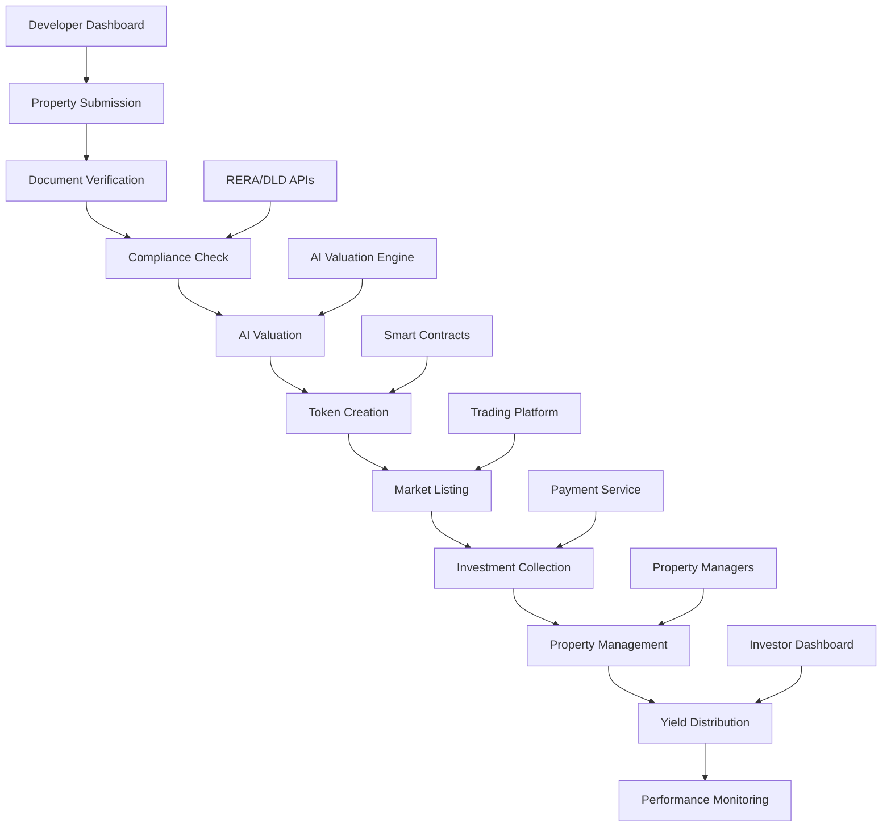

# Property Management Service

The Property Management Service handles the complete lifecycle of real estate assets on the NexVestXR V2 platform, from initial property onboarding and tokenization to ongoing management, valuation, and investor relations.

## 🏢 Service Overview

### Core Capabilities
- **Property Onboarding**: Comprehensive property registration and verification
- **Tokenization Engine**: ERC1155 token creation for individual properties
- **Valuation Service**: AI-powered property valuation and market analysis
- **Document Management**: Secure storage and verification of property documents
- **Compliance Integration**: RERA/DLD regulatory compliance automation
- **Yield Management**: Rental income distribution and reinvestment
- **Maintenance Coordination**: Property upkeep and improvement tracking

### Property Lifecycle


## 🏗️ Architecture Components

### Property Classification System
```javascript
const propertyClassification = {
  // Property Categories
  categories: {
    residential: {
      subcategories: ["apartment", "villa", "townhouse", "penthouse"],
      minimum_value: {
        AED: 500000,
        INR: 5000000,
        USD: 136000
      },
      tokenization_type: "fractional",
      target_investors: ["retail", "premium"]
    },
    
    commercial: {
      subcategories: ["office", "retail", "warehouse", "mixed_use"],
      minimum_value: {
        AED: 2000000,
        INR: 20000000,
        USD: 544000
      },
      tokenization_type: "fractional",
      target_investors: ["premium", "institutional"]
    },
    
    hospitality: {
      subcategories: ["hotel", "serviced_apartment", "resort"],
      minimum_value: {
        AED: 5000000,
        INR: 50000000,
        USD: 1360000
      },
      tokenization_type: "individual",
      target_investors: ["institutional"]
    }
  },
  
  // Developer Tiers
  developerTiers: {
    tier1: {
      developers: ["EMAAR", "ALDAR", "MERAAS", "GODREJ", "PRESTIGE"],
      platform_fee: 1.5,
      approval_time: "24 hours",
      features: ["priority_listing", "enhanced_marketing", "institutional_access"]
    },
    
    tier2: {
      developers: ["DAMAC", "SOBHA", "BRIGADE", "DLF"],
      platform_fee: 2.5,
      approval_time: "48 hours",
      features: ["standard_listing", "basic_marketing"]
    },
    
    emerging: {
      developers: ["verified_small_developers"],
      platform_fee: 3.5,
      approval_time: "72 hours",
      features: ["basic_listing"]
    }
  }
};
```

### Property Onboarding Workflow
```javascript
const propertyOnboarding = {
  // Submission Process
  submitProperty: async (propertyData) => {
    const {
      developer_id,
      property_details,
      financial_projections,
      legal_documents,
      compliance_certificates
    } = propertyData;
    
    // Validate developer credentials
    const developer = await validateDeveloper(developer_id);
    if (!developer.verified) {
      throw new Error("Developer not verified for platform");
    }
    
    // Create property record
    const property = {
      id: generatePropertyId(),
      developer_id: developer_id,
      status: "submitted",
      submission_date: new Date(),
      details: property_details,
      financials: financial_projections,
      documents: legal_documents,
      compliance: compliance_certificates,
      verification_status: {
        documents: "pending",
        compliance: "pending",
        valuation: "pending",
        legal: "pending"
      }
    };
    
    // Initiate verification workflow
    await initiateDocumentVerification(property.id);
    await initiateComplianceCheck(property.id);
    await schedulePropertyInspection(property.id);
    
    return property;
  },
  
  // Document Verification
  verifyDocuments: async (propertyId) => {
    const property = await getProperty(propertyId);
    const verificationResults = {};
    
    // Verify title deed
    const titleDeedVerification = await verifyTitleDeed(property.documents.title_deed);
    verificationResults.title_deed = titleDeedVerification.status;
    
    // Verify building permits
    const permitVerification = await verifyBuildingPermits(property.documents.permits);
    verificationResults.permits = permitVerification.status;
    
    // Verify NOC certificates
    const nocVerification = await verifyNOCCertificates(property.documents.noc);
    verificationResults.noc = nocVerification.status;
    
    // Verify financial statements
    const financialVerification = await verifyFinancialStatements(property.financials);
    verificationResults.financials = financialVerification.status;
    
    // Update property status
    await updatePropertyVerification(propertyId, verificationResults);
    
    return verificationResults;
  }
};
```

## 💰 Property Valuation Engine

### AI-Powered Valuation
```javascript
const valuationEngine = {
  // Valuation Models
  models: {
    location_model: {
      factors: ["proximity_to_metro", "school_districts", "commercial_centers", "infrastructure"],
      weight: 0.4,
      accuracy: "94%"
    },
    
    property_model: {
      factors: ["size", "age", "amenities", "condition", "view", "parking"],
      weight: 0.3,
      accuracy: "91%"
    },
    
    market_model: {
      factors: ["comparable_sales", "rental_yields", "market_trends", "supply_demand"],
      weight: 0.2,
      accuracy: "89%"
    },
    
    developer_model: {
      factors: ["brand_value", "track_record", "quality_rating", "delivery_history"],
      weight: 0.1,
      accuracy: "87%"
    }
  },
  
  // Valuation Process
  performValuation: async (propertyId) => {
    const property = await getPropertyDetails(propertyId);
    const marketData = await getMarketData(property.location);
    const comparables = await getComparableProperties(property);
    
    // Location-based valuation
    const locationScore = await calculateLocationScore(property.location);
    const locationValue = locationScore.score * valuationEngine.models.location_model.weight;
    
    // Property-specific valuation
    const propertyScore = await calculatePropertyScore(property);
    const propertyValue = propertyScore.score * valuationEngine.models.property_model.weight;
    
    // Market-based valuation
    const marketScore = await calculateMarketScore(comparables, marketData);
    const marketValue = marketScore.score * valuationEngine.models.market_model.weight;
    
    // Developer-based valuation
    const developerScore = await calculateDeveloperScore(property.developer_id);
    const developerValue = developerScore.score * valuationEngine.models.developer_model.weight;
    
    // Final valuation
    const totalScore = locationValue + propertyValue + marketValue + developerValue;
    const estimatedValue = totalScore * property.base_price;
    
    const valuation = {
      property_id: propertyId,
      estimated_value: estimatedValue,
      confidence_level: calculateConfidenceLevel(totalScore),
      breakdown: {
        location_contribution: locationValue,
        property_contribution: propertyValue,
        market_contribution: marketValue,
        developer_contribution: developerValue
      },
      comparable_analysis: comparables,
      valuation_date: new Date(),
      next_valuation: new Date(Date.now() + 90 * 24 * 60 * 60 * 1000) // 90 days
    };
    
    // Store valuation history
    await storeValuationHistory(propertyId, valuation);
    
    return valuation;
  }
};
```

### Market Analysis Integration
```javascript
const marketAnalysis = {
  // Real Estate Market Data
  getMarketTrends: async (location, timeframe) => {
    const marketData = await fetchMarketData(location, timeframe);
    
    return {
      price_trends: {
        current_avg_price: marketData.avg_price,
        price_change_1m: marketData.price_change.month,
        price_change_3m: marketData.price_change.quarter,
        price_change_1y: marketData.price_change.year,
        forecast_6m: await forecastPrices(marketData, 6),
        forecast_12m: await forecastPrices(marketData, 12)
      },
      
      rental_yields: {
        current_yield: marketData.rental_yield,
        yield_trend: marketData.yield_trend,
        occupancy_rate: marketData.occupancy_rate,
        rental_growth: marketData.rental_growth
      },
      
      supply_demand: {
        new_supply: marketData.new_projects,
        absorption_rate: marketData.absorption_rate,
        inventory_months: marketData.inventory_duration,
        demand_score: calculateDemandScore(marketData)
      },
      
      investment_indicators: {
        cap_rate: marketData.cap_rate,
        cash_on_cash_return: marketData.cash_return,
        total_return_forecast: marketData.total_return,
        risk_score: calculateRiskScore(marketData)
      }
    };
  }
};
```

## 🏗️ Tokenization Engine

### Token Creation Process
```javascript
const tokenizationEngine = {
  // Token Structure Configuration
  tokenStructure: {
    erc1155: {
      standard: "ERC1155",
      benefits: ["fractional_ownership", "batch_operations", "lower_gas_costs"],
      use_cases: ["multiple_property_types", "different_investment_tiers"]
    },
    
    metadata_schema: {
      property_id: "unique_identifier",
      property_type: "residential|commercial|hospitality",
      location: "city_area_address",
      total_value: "property_valuation_usd",
      token_supply: "total_tokens_issued",
      price_per_token: "value_per_individual_token",
      yield_projection: "expected_annual_yield_percentage",
      developer_info: "developer_details_and_tier",
      compliance_docs: "regulatory_documentation_hashes"
    }
  },
  
  // Token Creation Implementation
  createPropertyTokens: async (tokenizationRequest) => {
    const {
      property_id,
      total_value,
      token_supply,
      price_per_token,
      investor_tiers,
      yield_structure
    } = tokenizationRequest;
    
    // Validate property eligibility
    const property = await getProperty(property_id);
    if (property.verification_status.documents !== "approved") {
      throw new Error("Property documents not fully verified");
    }
    
    // Determine token distribution
    const tokenDistribution = {
      retail_allocation: Math.floor(token_supply * 0.6), // 60% for retail
      premium_allocation: Math.floor(token_supply * 0.3), // 30% for premium
      institutional_allocation: Math.floor(token_supply * 0.1) // 10% for institutional
    };
    
    // Create smart contract
    const tokenContract = await deployPropertyTokenContract({
      name: `NexVest-${property.name}`,
      symbol: `NVX${property_id.substring(0, 6)}`,
      uri: `https://api.nexvestxr.com/metadata/{id}`,
      property_metadata: {
        property_id: property_id,
        total_value: total_value,
        token_supply: token_supply,
        price_per_token: price_per_token,
        valuation_date: new Date(),
        developer: property.developer_id,
        location: property.location
      }
    });
    
    // Create token tiers
    const tokenTiers = await createTokenTiers({
      contract_address: tokenContract.address,
      retail: {
        token_id: 1,
        supply: tokenDistribution.retail_allocation,
        min_purchase: 1,
        max_purchase: 1000,
        price: price_per_token
      },
      premium: {
        token_id: 2,
        supply: tokenDistribution.premium_allocation,
        min_purchase: 100,
        max_purchase: 5000,
        price: price_per_token * 0.95, // 5% discount
        yield_bonus: 0.5 // 0.5% additional yield
      },
      institutional: {
        token_id: 3,
        supply: tokenDistribution.institutional_allocation,
        min_purchase: 1000,
        max_purchase: tokenDistribution.institutional_allocation,
        price: price_per_token * 0.9, // 10% discount
        yield_bonus: 1.0 // 1% additional yield
      }
    });
    
    return {
      contract_address: tokenContract.address,
      property_id: property_id,
      token_tiers: tokenTiers,
      total_supply: token_supply,
      distribution: tokenDistribution,
      launch_date: new Date(),
      funding_target: total_value,
      funding_deadline: new Date(Date.now() + 90 * 24 * 60 * 60 * 1000)
    };
  }
};
```

## 🏢 Property Management Operations

### Ongoing Property Management
```javascript
const propertyOperations = {
  // Rental Management
  rentalManagement: {
    collectRent: async (propertyId, period) => {
      const property = await getProperty(propertyId);
      const rentalIncome = await calculateRentalIncome(propertyId, period);
      
      const distribution = {
        gross_rental_income: rentalIncome.gross,
        operating_expenses: rentalIncome.expenses,
        net_rental_income: rentalIncome.net,
        platform_fee: rentalIncome.net * 0.025, // 2.5% platform fee
        investor_distribution: rentalIncome.net * 0.975,
        distribution_per_token: (rentalIncome.net * 0.975) / property.token_supply
      };
      
      // Distribute to token holders
      await distributeRentalIncome(propertyId, distribution);
      
      return distribution;
    },
    
    // Maintenance Management
    manageMaintenance: async (propertyId, maintenanceRequest) => {
      const {
        type, // "routine", "emergency", "improvement"
        description,
        estimated_cost,
        priority,
        vendor_quotes
      } = maintenanceRequest;
      
      const maintenanceRecord = {
        id: generateMaintenanceId(),
        property_id: propertyId,
        type: type,
        description: description,
        estimated_cost: estimated_cost,
        actual_cost: null,
        priority: priority,
        status: "pending_approval",
        quotes: vendor_quotes,
        created_date: new Date(),
        completion_date: null
      };
      
      // Check if investor approval required (for costs > threshold)
      if (estimated_cost > getMaintenanceThreshold(propertyId)) {
        await createMaintenanceVote(propertyId, maintenanceRecord);
      } else {
        await approveMaintenance(maintenanceRecord.id);
      }
      
      return maintenanceRecord;
    }
  },
  
  // Performance Monitoring
  performanceMonitoring: {
    generatePropertyReport: async (propertyId, reportType) => {
      const property = await getProperty(propertyId);
      const financialData = await getPropertyFinancials(propertyId);
      const marketData = await getMarketComparison(propertyId);
      
      const report = {
        property_id: propertyId,
        report_type: reportType,
        reporting_period: getCurrentPeriod(),
        
        financial_performance: {
          rental_income: financialData.rental_income,
          operating_expenses: financialData.expenses,
          net_operating_income: financialData.noi,
          cap_rate: financialData.noi / property.current_value,
          cash_on_cash_return: financialData.cash_return,
          total_return: financialData.total_return
        },
        
        operational_performance: {
          occupancy_rate: financialData.occupancy_rate,
          average_rent_psf: financialData.rent_psf,
          tenant_retention: financialData.retention_rate,
          maintenance_costs: financialData.maintenance_costs,
          property_condition_score: await getPropertyConditionScore(propertyId)
        },
        
        market_comparison: {
          vs_market_average: marketData.vs_average,
          vs_comparable_properties: marketData.vs_comparables,
          market_rank: marketData.rank,
          value_appreciation: marketData.appreciation
        },
        
        investor_metrics: {
          token_holders: await getTokenHolderCount(propertyId),
          average_holding_period: await getAverageHoldingPeriod(propertyId),
          trading_volume: await getTradingVolume(propertyId),
          investor_satisfaction: await getInvestorSatisfaction(propertyId)
        }
      };
      
      return report;
    }
  }
};
```

## 📄 Document Management System

### Secure Document Storage
```javascript
const documentManagement = {
  // Document Categories
  documentTypes: {
    legal_documents: [
      "title_deed",
      "sale_agreement", 
      "building_permits",
      "noc_certificates",
      "environmental_clearance"
    ],
    
    financial_documents: [
      "property_valuation",
      "income_statements",
      "rental_agreements",
      "insurance_policies",
      "tax_documents"
    ],
    
    compliance_documents: [
      "rera_registration",
      "dld_registration",
      "fire_safety_certificate",
      "structural_safety_certificate",
      "completion_certificate"
    ]
  },
  
  // Document Storage Implementation
  storeDocument: async (documentData) => {
    const {
      property_id,
      document_type,
      document_file,
      metadata,
      access_level
    } = documentData;
    
    // Encrypt sensitive documents
    const encryptedDocument = await encryptDocument(document_file);
    
    // Generate document hash for integrity
    const documentHash = generateDocumentHash(document_file);
    
    // Store on IPFS for decentralized access
    const ipfsHash = await storeOnIPFS(encryptedDocument);
    
    // Create document record
    const documentRecord = {
      id: generateDocumentId(),
      property_id: property_id,
      document_type: document_type,
      document_hash: documentHash,
      ipfs_hash: ipfsHash,
      metadata: metadata,
      access_level: access_level,
      upload_date: new Date(),
      uploaded_by: metadata.uploaded_by,
      verification_status: "pending",
      encryption_key_id: encryptedDocument.key_id
    };
    
    // Store record in database
    await storeDocumentRecord(documentRecord);
    
    // Initiate verification process
    await initiateDocumentVerification(documentRecord.id);
    
    return documentRecord;
  },
  
  // Document Verification
  verifyDocument: async (documentId) => {
    const document = await getDocument(documentId);
    
    // Retrieve and decrypt document
    const decryptedDocument = await retrieveAndDecryptDocument(document);
    
    // Perform document verification based on type
    const verification = await performDocumentVerification(document.document_type, decryptedDocument);
    
    // Update verification status
    await updateDocumentVerification(documentId, verification);
    
    return verification;
  }
};
```

## 🔄 Compliance Integration

### RERA/DLD Integration
```javascript
const complianceIntegration = {
  // RERA Integration (Dubai)
  reraIntegration: {
    registerProperty: async (propertyData) => {
      const reraPayload = {
        developer_id: propertyData.developer_id,
        project_name: propertyData.name,
        location: propertyData.location,
        project_type: propertyData.type,
        total_area: propertyData.area,
        estimated_completion: propertyData.completion_date,
        sales_permits: propertyData.permits,
        escrow_account: propertyData.escrow_details
      };
      
      const reraResponse = await submitToRERA(reraPayload);
      
      return {
        rera_registration_number: reraResponse.registration_number,
        registration_date: reraResponse.date,
        status: reraResponse.status,
        validity: reraResponse.validity_period,
        compliance_requirements: reraResponse.requirements
      };
    },
    
    updatePropertyStatus: async (propertyId, statusUpdate) => {
      const property = await getProperty(propertyId);
      
      const updatePayload = {
        rera_number: property.rera_registration,
        status: statusUpdate.status,
        completion_percentage: statusUpdate.completion,
        sales_update: statusUpdate.sales_data,
        financial_update: statusUpdate.financials
      };
      
      await updateRERAStatus(updatePayload);
      
      return updatePayload;
    }
  },
  
  // DLD Integration (Dubai Land Department)
  dldIntegration: {
    registerOwnership: async (propertyId, ownershipData) => {
      const property = await getProperty(propertyId);
      
      const dldPayload = {
        property_id: propertyId,
        title_deed_number: property.title_deed,
        ownership_structure: ownershipData.structure,
        token_holders: ownershipData.token_holders,
        ownership_percentages: ownershipData.percentages,
        transaction_value: ownershipData.value
      };
      
      const dldResponse = await submitToDLD(dldPayload);
      
      return {
        dld_registration_number: dldResponse.registration_number,
        title_deed_update: dldResponse.title_deed_status,
        ownership_certificate: dldResponse.certificate,
        registration_fees: dldResponse.fees
      };
    }
  }
};
```

## 📊 Analytics & Reporting

### Property Analytics Dashboard
```javascript
const propertyAnalytics = {
  // Performance Metrics
  performanceMetrics: {
    calculateROI: async (propertyId, timeframe) => {
      const property = await getProperty(propertyId);
      const financialHistory = await getFinancialHistory(propertyId, timeframe);
      
      const roi = {
        capital_appreciation: calculateCapitalAppreciation(financialHistory),
        rental_yield: calculateRentalYield(financialHistory),
        total_return: calculateTotalReturn(financialHistory),
        annualized_return: calculateAnnualizedReturn(financialHistory, timeframe),
        risk_adjusted_return: calculateRiskAdjustedReturn(financialHistory),
        benchmark_comparison: await compareToBenchmark(financialHistory)
      };
      
      return roi;
    },
    
    generateInvestorReport: async (propertyId) => {
      const property = await getProperty(propertyId);
      const tokenHolders = await getTokenHolders(propertyId);
      
      const report = {
        property_overview: {
          name: property.name,
          location: property.location,
          type: property.type,
          total_value: property.current_value,
          token_supply: property.token_supply,
          tokens_sold: property.tokens_sold
        },
        
        financial_summary: {
          gross_rental_income: await getGrossRentalIncome(propertyId),
          net_operating_income: await getNetOperatingIncome(propertyId),
          distributions_paid: await getDistributionsPaid(propertyId),
          yield_to_date: await getYieldToDate(propertyId)
        },
        
        investor_breakdown: {
          total_investors: tokenHolders.length,
          average_investment: calculateAverageInvestment(tokenHolders),
          largest_holder_percentage: getLargestHolderPercentage(tokenHolders),
          geographic_distribution: getGeographicDistribution(tokenHolders)
        },
        
        market_performance: {
          vs_market_index: await compareToMarketIndex(propertyId),
          vs_comparable_properties: await compareToComparables(propertyId),
          liquidity_metrics: await getLiquidityMetrics(propertyId)
        }
      };
      
      return report;
    }
  }
};
```

## 🔧 Configuration & API

### Service Configuration
```bash
# Property Management Configuration
PROPERTY_MIN_VALUE_AED=500000
PROPERTY_MIN_VALUE_INR=5000000
TOKENIZATION_FEE_PERCENTAGE=2.5
MAINTENANCE_APPROVAL_THRESHOLD=50000

# Compliance Configuration
RERA_API_ENDPOINT=https://api.rera.dubai.gov.ae
DLD_API_ENDPOINT=https://api.dld.dubai.gov.ae
COMPLIANCE_CHECK_INTERVAL=daily

# Valuation Configuration
AI_VALUATION_CONFIDENCE_THRESHOLD=0.85
VALUATION_UPDATE_FREQUENCY=quarterly
MARKET_DATA_SOURCES=multiple_apis

# Document Storage
IPFS_NODE_ENDPOINT=https://ipfs.nexvestxr.com
DOCUMENT_ENCRYPTION_ALGORITHM=AES-256-GCM
DOCUMENT_RETENTION_PERIOD=10_years
```

### API Endpoints
```javascript
// Property Management API
const propertyAPIEndpoints = {
  // POST /api/properties/submit
  submitProperty: "Submit new property for tokenization",
  
  // GET /api/properties/:propertyId/valuation
  getValuation: "Retrieve AI-powered property valuation",
  
  // POST /api/properties/:propertyId/tokenize
  tokenizeProperty: "Create property tokens",
  
  // GET /api/properties/:propertyId/performance
  getPerformance: "Retrieve property performance metrics",
  
  // POST /api/properties/:propertyId/maintenance
  submitMaintenance: "Submit maintenance request",
  
  // GET /api/properties/:propertyId/documents
  getDocuments: "Retrieve property documents",
  
  // POST /api/properties/:propertyId/compliance
  updateCompliance: "Update compliance status"
};
```

---

*Property Management Service - Comprehensive real estate asset management for NexVestXR V2 platform*