# 🏗️ Visual Architecture Guide


**Interactive Architecture Overview** - Explore NexVestXR V2's enterprise-grade architecture with visual diagrams and interactive elements


---

## 🌐 System Architecture Overview

```mermaid
graph TB
    subgraph "👥 User Layer"
        U1[🌐 Web App<br/>React 18 + TypeScript]
        U2[📱 Mobile Apps<br/>React Native iOS/Android]
        U3[🔧 Admin Dashboard<br/>Platform Management]
    end
    
    subgraph "🛡️ Security Layer"
        S1[🔒 Authentication<br/>JWT + 2FA]
        S2[⚡ Rate Limiting<br/>4 Algorithms + Redis]
        S3[🛡️ CSP Headers<br/>XSS Protection]
        S4[💳 PCI DSS L1<br/>Payment Security]
    end
    
    subgraph "🔧 Backend Services"
        B1[⚙️ API Gateway<br/>Express.js + Security]
        B2[🗄️ Database<br/>MongoDB + Encryption]
        B3[📊 Cache Layer<br/>Redis Cluster]
        B4[🤖 AI/ML Service<br/>Python + Flask]
    end
    
    subgraph "⛓️ Blockchain Layer"
        BC1[🔵 Polygon<br/>UAE Smart Contracts]
        BC2[🔥 Flare Network<br/>Price Oracles]
        BC3[💧 XRPL<br/>XERA Token Bridge]
    end
    
    subgraph "🏢 UAE Integration"
        UAE1[🏛️ Aldar Properties<br/>TIER 1 Developer]
        UAE2[📋 RERA/DLD<br/>Regulatory Compliance]
        UAE3[💱 Multi-Currency<br/>AED Primary]
    end
    
    U1 --> S1
    U2 --> S1
    U3 --> S1
    S1 --> S2
    S2 --> S3
    S3 --> S4
    S4 --> B1
    B1 --> B2
    B1 --> B3
    B1 --> B4
    B1 --> BC1
    B1 --> BC2
    B1 --> BC3
    B1 --> UAE1
    B1 --> UAE2
    B1 --> UAE3
    
    style U1 fill:#61DAFB,stroke:#333,stroke-width:2px,color:#000
    style U2 fill:#DC382D,stroke:#333,stroke-width:2px,color:#fff
    style U3 fill:#FF6B35,stroke:#333,stroke-width:2px,color:#fff
    style S1 fill:#00A651,stroke:#333,stroke-width:2px,color:#fff
    style S2 fill:#0066CC,stroke:#333,stroke-width:2px,color:#fff
    style S3 fill:#8B5CF6,stroke:#333,stroke-width:2px,color:#fff
    style S4 fill:#FF1744,stroke:#333,stroke-width:2px,color:#fff
    style B1 fill:#339933,stroke:#333,stroke-width:2px,color:#fff
    style B2 fill:#47A248,stroke:#333,stroke-width:2px,color:#fff
    style B3 fill:#DC382D,stroke:#333,stroke-width:2px,color:#fff
    style B4 fill:#FFD700,stroke:#333,stroke-width:2px,color:#000
    style BC1 fill:#8247E5,stroke:#333,stroke-width:2px,color:#fff
    style BC2 fill:#FF4500,stroke:#333,stroke-width:2px,color:#fff
    style BC3 fill:#00AAE7,stroke:#333,stroke-width:2px,color:#fff
    style UAE1 fill:#000000,stroke:#333,stroke-width:2px,color:#fff
    style UAE2 fill:#C8102E,stroke:#333,stroke-width:2px,color:#fff
    style UAE3 fill:#00732F,stroke:#333,stroke-width:2px,color:#fff
```



---

## 🔒 Security Architecture Deep Dive

### Multi-Layer Security Framework

```mermaid
graph LR
    subgraph "🌐 Request Flow"
        R[📥 Incoming Request]
    end
    
    subgraph "🛡️ Security Layers"
        L1[🔐 Rate Limiting<br/>4 Algorithms]
        L2[🛡️ Input Validation<br/>SQL/XSS Prevention]
        L3[🔑 Authentication<br/>JWT + 2FA]
        L4[🎯 Authorization<br/>Role-based Access]
        L5[🔒 Data Encryption<br/>AES-256-GCM]
    end
    
    subgraph "⚙️ Business Logic"
        BL[✅ Secure Processing]
    end
    
    R --> L1
    L1 --> L2
    L2 --> L3
    L3 --> L4
    L4 --> L5
    L5 --> BL
    
    style R fill:#E3F2FD,stroke:#1976D2,stroke-width:2px
    style L1 fill:#FFEBEE,stroke:#D32F2F,stroke-width:2px
    style L2 fill:#FFF3E0,stroke:#F57C00,stroke-width:2px
    style L3 fill:#E8F5E8,stroke:#388E3C,stroke-width:2px
    style L4 fill:#F3E5F5,stroke:#7B1FA2,stroke-width:2px
    style L5 fill:#E1F5FE,stroke:#0277BD,stroke-width:2px
    style BL fill:#E8F5E8,stroke:#2E7D32,stroke-width:3px
```

<div style="position: relative; margin: 30px 0;">



</div>

### 🔐 Security Components Breakdown



### Intelligent Rate Limiting System

<div style="background: linear-gradient(135deg, #FFEBEE, #FFCDD2); padding: 20px; border-radius: 10px; margin: 15px 0;">

#### 🔄 **4 Rate Limiting Algorithms**

<table style="width: 100%; border-collapse: collapse; margin-top: 15px;">
<tr style="background: #D32F2F; color: white;">
<th style="padding: 10px; border: 1px solid #ddd;">Algorithm</th>
<th style="padding: 10px; border: 1px solid #ddd;">Use Case</th>
<th style="padding: 10px; border: 1px solid #ddd;">Benefits</th>
</tr>
<tr>
<td style="padding: 10px; border: 1px solid #ddd;"><strong>Fixed Window</strong></td>
<td style="padding: 10px; border: 1px solid #ddd;">Login attempts</td>
<td style="padding: 10px; border: 1px solid #ddd;">Simple, predictable limits</td>
</tr>
<tr style="background: #FFEBEE;">
<td style="padding: 10px; border: 1px solid #ddd;"><strong>Sliding Window</strong></td>
<td style="padding: 10px; border: 1px solid #ddd;">API requests</td>
<td style="padding: 10px; border: 1px solid #ddd;">Smooth rate distribution</td>
</tr>
<tr>
<td style="padding: 10px; border: 1px solid #ddd;"><strong>Token Bucket</strong></td>
<td style="padding: 10px; border: 1px solid #ddd;">Payment processing</td>
<td style="padding: 10px; border: 1px solid #ddd;">Allows bursts</td>
</tr>
<tr style="background: #FFEBEE;">
<td style="padding: 10px; border: 1px solid #ddd;"><strong>Leaky Bucket</strong></td>
<td style="padding: 10px; border: 1px solid #ddd;">WebSocket connections</td>
<td style="padding: 10px; border: 1px solid #ddd;">Steady flow control</td>
</tr>
</table>

</div>

#### 📊 **Rate Limiting Flow**





### Advanced Authentication System

<div style="background: linear-gradient(135deg, #E8F5E8, #C8E6C8); padding: 20px; border-radius: 10px; margin: 15px 0;">

#### 🔐 **Multi-Factor Authentication Flow**

```mermaid
graph TD
    A[👤 User Login] --> B{📧 Email/Password Valid?}
    B -->|No| C[❌ Authentication Failed]
    B -->|Yes| D{🔑 2FA Required?}
    D -->|No| E[✅ Access Granted]
    D -->|Yes| F[📱 2FA Code Required]
    F --> G{🔢 Code Valid?}
    G -->|No| H[❌ 2FA Failed]
    G -->|Yes| I[🎫 JWT Token Issued]
    I --> J[✅ Access Granted]
    
    style A fill:#E3F2FD,stroke:#1976D2
    style E fill:#E8F5E8,stroke:#388E3C
    style J fill:#E8F5E8,stroke:#388E3C
    style C fill:#FFEBEE,stroke:#D32F2F
    style H fill:#FFEBEE,stroke:#D32F2F
```



#### 🎫 **JWT Token Structure**

```json
{
  "header": {
    "alg": "HS256",
    "typ": "JWT"
  },
  "payload": {
    "userId": "user123",
    "role": "investor",
    "permissions": ["trade", "view_portfolio"],
    "sessionId": "session456",
    "exp": 1640995200,
    "iat": 1640991600
  },
  "signature": "..."
}
```

</div>

#### 🔄 **Session Management**

- **Concurrent Sessions**: Maximum 5 per user
- **Session Timeout**: 1 hour inactivity
- **Token Refresh**: Automatic renewal
- **Device Tracking**: IP and user agent validation




### PCI DSS Level 1 Compliance

<div style="background: linear-gradient(135deg, #E1F5FE, #B3E5FC); padding: 20px; border-radius: 10px; margin: 15px 0;">

#### 🔒 **Payment Data Flow**

```mermaid
graph LR
    subgraph "📱 Client Side"
        CC[💳 Credit Card Data]
    end
    
    subgraph "🛡️ Security Layer"
        E[🔐 AES-256-GCM<br/>Encryption]
        T[🎫 Tokenization<br/>Vault]
    end
    
    subgraph "💾 Storage"
        DB[(🗄️ Encrypted<br/>Database)]
        TV[(🎫 Token<br/>Vault)]
    end
    
    subgraph "💸 Payment Gateway"
        PG[💳 Stripe/Razorpay<br/>Processing]
    end
    
    CC --> E
    E --> T
    T --> TV
    T --> DB
    E --> PG
    
    style CC fill:#FFCDD2,stroke:#D32F2F
    style E fill:#C8E6C8,stroke:#388E3C
    style T fill:#DCEDC1,stroke:#689F38
    style DB fill:#E1F5FE,stroke:#0277BD
    style TV fill:#F3E5F5,stroke:#7B1FA2
    style PG fill:#FFF3E0,stroke:#F57C00
```



#### 🔐 **Encryption Standards**

| Component | Algorithm | Key Size | Usage |
|-----------|-----------|----------|-------|
| **Card Numbers** | AES-256-GCM | 256-bit | Field-level encryption |
| **CVV Codes** | Temporary only | N/A | Never stored |
| **Bank Accounts** | AES-256-GCM | 256-bit | Tokenized storage |
| **Personal Data** | AES-256-CBC | 256-bit | Database encryption |

</div>

#### 🎯 **Compliance Checklist**

- [x] **PCI DSS 1**: Firewall configuration
- [x] **PCI DSS 2**: Default passwords changed
- [x] **PCI DSS 3**: Cardholder data protection
- [x] **PCI DSS 4**: Encrypted transmission
- [x] **PCI DSS 5**: Antivirus software
- [x] **PCI DSS 6**: Secure applications
- [x] **PCI DSS 7**: Access restrictions
- [x] **PCI DSS 8**: Unique user IDs
- [x] **PCI DSS 9**: Physical access restrictions
- [x] **PCI DSS 10**: Network monitoring
- [x] **PCI DSS 11**: Security testing
- [x] **PCI DSS 12**: Security policies




---

## ⛓️ Blockchain Architecture

### 🌐 Multi-Chain Integration

```mermaid
graph TB
    subgraph "🔵 Polygon Mainnet"
        P1[🏢 UAE Property Tokens<br/>ERC1155 Standard]
        P2[⚖️ Compliance Contracts<br/>RERA/DLD Integration]
        P3[🔒 Security Guards<br/>Reentrancy Protection]
    end
    
    subgraph "🔥 Flare Network"
        F1[🔮 Price Oracles<br/>FTSO Integration]
        F2[📊 Market Data<br/>Real-time Feeds]
        F3[🔄 Cross-chain Bridge<br/>Asset Transfers]
    end
    
    subgraph "💧 XRPL EVM Sidechain"
        X1[🪙 XERA Token<br/>Governance + Utility]
        X2[💱 DEX Integration<br/>Liquidity Pools]
        X3[🌊 Cross-border<br/>Payments]
    end
    
    subgraph "🔗 Bridge Layer"
        B1[🌉 Polygon ↔ Flare]
        B2[🌉 Flare ↔ XRPL]
        B3[🌉 XRPL ↔ Polygon]
    end
    
    P1 --> B1
    F1 --> B1
    F2 --> B2
    X1 --> B2
    X2 --> B3
    P2 --> B3
    
    style P1 fill:#8247E5,stroke:#333,stroke-width:2px,color:#fff
    style P2 fill:#8247E5,stroke:#333,stroke-width:2px,color:#fff
    style P3 fill:#8247E5,stroke:#333,stroke-width:2px,color:#fff
    style F1 fill:#FF4500,stroke:#333,stroke-width:2px,color:#fff
    style F2 fill:#FF4500,stroke:#333,stroke-width:2px,color:#fff
    style F3 fill:#FF4500,stroke:#333,stroke-width:2px,color:#fff
    style X1 fill:#00AAE7,stroke:#333,stroke-width:2px,color:#fff
    style X2 fill:#00AAE7,stroke:#333,stroke-width:2px,color:#fff
    style X3 fill:#00AAE7,stroke:#333,stroke-width:2px,color:#fff
    style B1 fill:#FFD700,stroke:#333,stroke-width:2px,color:#000
    style B2 fill:#FFD700,stroke:#333,stroke-width:2px,color:#000
    style B3 fill:#FFD700,stroke:#333,stroke-width:2px,color:#000
```

<div style="position: relative; margin: 30px 0;">



</div>

### 🔐 Smart Contract Security



### Advanced Reentrancy Protection

<div style="background: linear-gradient(135deg, #F3E5F5, #E1BEE7); padding: 20px; border-radius: 10px; margin: 15px 0;">

#### 🔒 **Protection Mechanisms**

```solidity
// Enhanced Reentrancy Guard Implementation
modifier nonReentrantAdvanced() {
    require(_status != _ENTERED, "ReentrancyGuard: reentrant call");
    require(_status != _LOCKED, "ReentrancyGuard: function locked");
    require(_lockCounter == 0, "ReentrancyGuard: nested call detected");
    
    _status = _ENTERED;
    _lockCounter++;
    _;
    _lockCounter--;
    if (_lockCounter == 0) {
        _status = _NOT_ENTERED;
    }
}
```

#### 🎯 **Protection Levels**

| Guard Type | Protection Level | Use Case |
|------------|------------------|----------|
| **Basic** | Single function | Standard transfers |
| **Function-Specific** | Per-function locks | Complex operations |
| **Advanced** | Cross-function | Critical state changes |
| **Emergency** | Global lock | Security incidents |

</div>

#### 🔄 **Reentrancy Attack Prevention Flow**





### Multi-Oracle Price Feeds

<div style="background: linear-gradient(135deg, #FFF3E0, #FFE0B2); padding: 20px; border-radius: 10px; margin: 15px 0;">

#### 🔗 **Oracle Network Architecture**

```mermaid
graph TD
    subgraph "📊 Price Sources"
        CL[🔗 Chainlink<br/>Price Feeds]
        FT[🔥 Flare FTSO<br/>Time Series Oracle]
        API[📡 External APIs<br/>Market Data]
    end
    
    subgraph "🔮 Oracle Manager"
        OM[⚖️ Multi-Oracle<br/>Manager Contract]
        VA[✅ Price<br/>Validation]
        CB[🔴 Circuit<br/>Breaker]
    end
    
    subgraph "📈 Price Output"
        TWAP[📊 Time-Weighted<br/>Average Price]
        WA[⚖️ Weighted<br/>Average]
        FP[💰 Final<br/>Price]
    end
    
    CL --> OM
    FT --> OM
    API --> OM
    OM --> VA
    VA --> CB
    CB --> TWAP
    TWAP --> WA
    WA --> FP
    
    style CL fill:#375BD2,stroke:#333,stroke-width:2px,color:#fff
    style FT fill:#FF4500,stroke:#333,stroke-width:2px,color:#fff
    style API fill:#00BCD4,stroke:#333,stroke-width:2px,color:#fff
    style OM fill:#9C27B0,stroke:#333,stroke-width:2px,color:#fff
    style VA fill:#4CAF50,stroke:#333,stroke-width:2px,color:#fff
    style CB fill:#F44336,stroke:#333,stroke-width:2px,color:#fff
    style TWAP fill:#FF9800,stroke:#333,stroke-width:2px,color:#fff
    style WA fill:#795548,stroke:#333,stroke-width:2px,color:#fff
    style FP fill:#607D8B,stroke:#333,stroke-width:2px,color:#fff
```



#### ⚡ **Circuit Breaker Logic**

```javascript
// Price deviation monitoring
function checkPriceDeviation(uint256 newPrice) internal {
    uint256 oldPrice = lastValidPrice;
    uint256 deviation = calculateDeviation(oldPrice, newPrice);
    
    if (deviation > CIRCUIT_BREAKER_THRESHOLD) {
        circuitBreakerTriggered = true;
        emit CircuitBreakerTriggered(oldPrice, newPrice, deviation);
        revert("Price deviation too high");
    }
}
```

</div>

#### 🎯 **Oracle Security Features**

- **Minimum 3 Oracles**: Required for price consensus
- **Deviation Checks**: Maximum 10% price deviation
- **Staleness Protection**: 24-hour maximum age
- **Circuit Breakers**: Automatic trading halts
- **Weighted Averages**: Trust-based price calculation




---

## 🏢 UAE Integration Architecture

### 🇦🇪 Complete UAE Ecosystem

```mermaid
graph TB
    subgraph "🏛️ Regulatory Layer"
        RERA[📋 RERA<br/>Property Registration]
        DLD[🏢 DLD<br/>Dubai Land Department]
        ADRA[🏛️ ADRA<br/>Abu Dhabi Regulatory]
        CBUAE[🏦 CBUAE<br/>Central Bank UAE]
    end
    
    subgraph "🏢 Developer Ecosystem"
        ALDAR[🏢 Aldar Properties<br/>TIER 1 Developer]
        EMAAR[🏗️ EMAAR<br/>Premium Partner]
        MERAAS[🌆 MERAAS<br/>Mixed-Use Projects]
        DAMAC[🏙️ DAMAC<br/>Luxury Properties]
    end
    
    subgraph "💱 Currency System"
        AED[💰 AED Primary<br/>Native Currency]
        USD[💵 USD<br/>Cross-border]
        EUR[💶 EUR<br/>European Investors]
        GCC[🏛️ GCC Currencies<br/>Regional Integration]
    end
    
    subgraph "📍 Geographic Zones"
        DUBAI[🏙️ Dubai<br/>Downtown, Marina, JBR]
        ABU[🏛️ Abu Dhabi<br/>Saadiyat, Al Reem]
        SHAR[🌊 Sharjah<br/>Al Majaz, Al Khan]
    end
    
    RERA --> ALDAR
    DLD --> EMAAR
    ADRA --> MERAAS
    CBUAE --> AED
    
    ALDAR --> DUBAI
    EMAAR --> DUBAI
    MERAAS --> ABU
    DAMAC --> SHAR
    
    AED --> USD
    USD --> EUR
    EUR --> GCC
    
    style RERA fill:#C8102E,stroke:#333,stroke-width:2px,color:#fff
    style DLD fill:#C8102E,stroke:#333,stroke-width:2px,color:#fff
    style ADRA fill:#C8102E,stroke:#333,stroke-width:2px,color:#fff
    style CBUAE fill:#C8102E,stroke:#333,stroke-width:2px,color:#fff
    style ALDAR fill:#000000,stroke:#333,stroke-width:2px,color:#fff
    style EMAAR fill:#DAA520,stroke:#333,stroke-width:2px,color:#000
    style MERAAS fill:#4169E1,stroke:#333,stroke-width:2px,color:#fff
    style DAMAC fill:#DC143C,stroke:#333,stroke-width:2px,color:#fff
```



### 🏢 Aldar Properties Integration Deep Dive



### Complete Aldar Branding

<div style="background: linear-gradient(135deg, #000000, #333333); color: white; padding: 20px; border-radius: 10px; margin: 15px 0;">

#### 🎨 **Brand Color Palette**

<div style="display: flex; justify-content: space-between; margin: 15px 0;">
  <div style="background: #000000; width: 80px; height: 60px; border-radius: 5px; display: flex; align-items: center; justify-content: center; color: white; font-size: 12px;">Black<br/>#000000</div>
  <div style="background: #0066CC; width: 80px; height: 60px; border-radius: 5px; display: flex; align-items: center; justify-content: center; color: white; font-size: 12px;">Blue<br/>#0066CC</div>
  <div style="background: #00A651; width: 80px; height: 60px; border-radius: 5px; display: flex; align-items: center; justify-content: center; color: white; font-size: 12px;">Green<br/>#00A651</div>
  <div style="background: #FF6B35; width: 80px; height: 60px; border-radius: 5px; display: flex; align-items: center; justify-content: center; color: white; font-size: 12px;">Orange<br/>#FF6B35</div>
</div>

#### 🔤 **Typography System**

| Language | Primary Font | Weight | Usage |
|----------|-------------|--------|-------|
| **English** | Poppins | 400-700 | Headings, UI Elements |
| **Arabic** | Almarai | 400-700 | Arabic Content |
| **Secondary** | Inter | 300-600 | Body Text |

</div>

#### 🏠 **Premium Properties Showcase**

<div style="display: grid; grid-template-columns: repeat(auto-fit, minmax(300px, 1fr)); gap: 20px; margin: 20px 0;">

<div style="background: white; border: 2px solid #000000; border-radius: 10px; padding: 15px;">
<h4 style="color: #000000; margin: 0 0 10px 0;">🏝️ Saadiyat Island Villas</h4>
<div style="color: #0066CC; font-size: 18px; font-weight: bold;">AED 2.4M</div>
<div style="color: #00A651; font-size: 14px;">Expected Return: 12.5%</div>
<div style="color: #666; font-size: 12px; margin-top: 5px;">Premium beachfront location</div>
</div>

<div style="background: white; border: 2px solid #000000; border-radius: 10px; padding: 15px;">
<h4 style="color: #000000; margin: 0 0 10px 0;">🏢 Al Reem Island Tower</h4>
<div style="color: #0066CC; font-size: 18px; font-weight: bold;">AED 890K</div>
<div style="color: #00A651; font-size: 14px;">Expected Return: 10.8%</div>
<div style="color: #666; font-size: 12px; margin-top: 5px;">Modern urban living</div>
</div>

</div>




### AED-Based Investment Structure

<div style="background: linear-gradient(135deg, #E8F5E8, #C8E6C8); padding: 20px; border-radius: 10px; margin: 15px 0;">

#### 💼 **Investment Tier Breakdown**

<div style="display: grid; grid-template-columns: repeat(auto-fit, minmax(250px, 1fr)); gap: 15px; margin: 20px 0;">

<div style="background: white; border-left: 5px solid #00A651; padding: 15px; border-radius: 0 5px 5px 0;">
<h4 style="color: #00A651; margin: 0 0 10px 0;">🥉 Retail Tier</h4>
<div><strong>Range:</strong> 25,000 - 500,000 AED</div>
<div><strong>KYC:</strong> Standard</div>
<div><strong>Features:</strong></div>
<ul style="margin: 5px 0; padding-left: 20px;">
<li>Property token ownership</li>
<li>Dividend distribution</li>
<li>Secondary trading</li>
</ul>
</div>

<div style="background: white; border-left: 5px solid #0066CC; padding: 15px; border-radius: 0 5px 5px 0;">
<h4 style="color: #0066CC; margin: 0 0 10px 0;">🥈 Premium Tier</h4>
<div><strong>Range:</strong> 500,000 - 2,000,000 AED</div>
<div><strong>KYC:</strong> Enhanced</div>
<div><strong>Features:</strong></div>
<ul style="margin: 5px 0; padding-left: 20px;">
<li>Staking rewards</li>
<li>Priority property access</li>
<li>Advanced analytics</li>
</ul>
</div>

<div style="background: white; border-left: 5px solid #FF6B35; padding: 15px; border-radius: 0 5px 5px 0;">
<h4 style="color: #FF6B35; margin: 0 0 10px 0;">🥇 Institutional Tier</h4>
<div><strong>Range:</strong> 2,000,000+ AED</div>
<div><strong>KYC:</strong> Comprehensive</div>
<div><strong>Features:</strong></div>
<ul style="margin: 5px 0; padding-left: 20px;">
<li>Bulk trading</li>
<li>OTC desk access</li>
<li>Custom agreements</li>
</ul>
</div>

</div>

#### 📊 **Staking Rewards Structure**

| Tier | XERA Amount | APY | Volume Bonus | Fee Discount |
|------|-------------|-----|--------------|--------------|
| Bronze | 1K+ | 6% | 0.05% | 10% |
| Silver | 5K+ | 8% | 0.075% | 15% |
| Gold | 25K+ | 10% | 0.1% | 20% |
| Platinum | 100K+ | 12% | 0.15% | 25% |
| Diamond | 500K+ | 15% | 0.2% | 35% |

</div>




### Regulatory Integration

<div style="background: linear-gradient(135deg, #FFEBEE, #FFCDD2); padding: 20px; border-radius: 10px; margin: 15px 0;">

#### 📋 **Regulatory Framework**

```mermaid
graph TB
    subgraph "🏛️ UAE Regulatory Bodies"
        RERA[📋 RERA<br/>Real Estate Regulatory Agency]
        DLD[🏢 DLD<br/>Dubai Land Department]
        ADRA[🏛️ ADRA<br/>Abu Dhabi Regulatory Authority]
        CBUAE[🏦 CBUAE<br/>Central Bank UAE]
    end
    
    subgraph "✅ Compliance Processes"
        PR[🏠 Property<br/>Registration]
        DD[📄 Due Diligence<br/>Verification]
        KYC[🔍 KYC/AML<br/>Procedures]
        REP[📊 Regulatory<br/>Reporting]
    end
    
    subgraph "🔒 Data Security"
        ENC[🔐 Data<br/>Encryption]
        AUD[📝 Audit<br/>Trails]
        ACC[🎯 Access<br/>Controls]
    end
    
    RERA --> PR
    DLD --> DD
    ADRA --> KYC
    CBUAE --> REP
    
    PR --> ENC
    DD --> AUD
    KYC --> ACC
    REP --> ENC
    
    style RERA fill:#C8102E,stroke:#333,stroke-width:2px,color:#fff
    style DLD fill:#C8102E,stroke:#333,stroke-width:2px,color:#fff
    style ADRA fill:#C8102E,stroke:#333,stroke-width:2px,color:#fff
    style CBUAE fill:#C8102E,stroke:#333,stroke-width:2px,color:#fff
```



#### 🔍 **KYC/AML Levels**

| Level | Requirements | Investment Limit | Processing Time |
|-------|-------------|------------------|-----------------|
| **Standard** | Basic ID, Address | 500K AED | 24-48 hours |
| **Enhanced** | Income proof, Source of funds | 2M AED | 3-5 days |
| **Comprehensive** | Full financial audit | Unlimited | 7-14 days |

</div>

#### 📊 **Compliance Dashboard**

<div style="display: grid; grid-template-columns: repeat(auto-fit, minmax(200px, 1fr)); gap: 15px; margin: 20px 0;">

<div style="background: white; border: 2px solid #00A651; border-radius: 5px; padding: 15px; text-align: center;">
<div style="color: #00A651; font-size: 24px; font-weight: bold;">100%</div>
<div style="color: #666; font-size: 14px;">RERA Compliance</div>
</div>

<div style="background: white; border: 2px solid #0066CC; border-radius: 5px; padding: 15px; text-align: center;">
<div style="color: #0066CC; font-size: 24px; font-weight: bold;">100%</div>
<div style="color: #666; font-size: 14px;">DLD Integration</div>
</div>

<div style="background: white; border: 2px solid #FF6B35; border-radius: 5px; padding: 15px; text-align: center;">
<div style="color: #FF6B35; font-size: 24px; font-weight: bold;">100%</div>
<div style="color: #666; font-size: 14px;">KYC/AML Ready</div>
</div>

</div>




---

## 📊 Performance & Monitoring

### 🎯 Real-Time Dashboard

<div style="background: linear-gradient(135deg, #F3E5F5, #E1BEE7); padding: 20px; border-radius: 10px; margin: 20px 0;">

#### 📈 **System Performance Metrics**

<div style="display: grid; grid-template-columns: repeat(auto-fit, minmax(200px, 1fr)); gap: 15px; margin: 20px 0;">

<div style="background: white; border-radius: 8px; padding: 15px; text-align: center; box-shadow: 0 2px 4px rgba(0,0,0,0.1);">
<div style="color: #00A651; font-size: 28px; font-weight: bold;">99.9%</div>
<div style="color: #666; font-size: 14px;">System Uptime</div>
<div style="background: #E8F5E8; width: 100%; height: 4px; border-radius: 2px; margin-top: 8px;">
<div style="background: #00A651; width: 99.9%; height: 100%; border-radius: 2px;"></div>
</div>
</div>

<div style="background: white; border-radius: 8px; padding: 15px; text-align: center; box-shadow: 0 2px 4px rgba(0,0,0,0.1);">
<div style="color: #0066CC; font-size: 28px; font-weight: bold;">180ms</div>
<div style="color: #666; font-size: 14px;">API Response Time</div>
<div style="background: #E3F2FD; width: 100%; height: 4px; border-radius: 2px; margin-top: 8px;">
<div style="background: #0066CC; width: 90%; height: 100%; border-radius: 2px;"></div>
</div>
</div>

<div style="background: white; border-radius: 8px; padding: 15px; text-align: center; box-shadow: 0 2px 4px rgba(0,0,0,0.1);">
<div style="color: #FF6B35; font-size: 28px; font-weight: bold;">2.1s</div>
<div style="color: #666; font-size: 14px;">Page Load Time</div>
<div style="background: #FFF3E0; width: 100%; height: 4px; border-radius: 2px; margin-top: 8px;">
<div style="background: #FF6B35; width: 85%; height: 100%; border-radius: 2px;"></div>
</div>
</div>

<div style="background: white; border-radius: 8px; padding: 15px; text-align: center; box-shadow: 0 2px 4px rgba(0,0,0,0.1);">
<div style="color: #8B5CF6; font-size: 28px; font-weight: bold;">0</div>
<div style="color: #666; font-size: 14px;">Security Incidents</div>
<div style="background: #F3E5F5; width: 100%; height: 4px; border-radius: 2px; margin-top: 8px;">
<div style="background: #8B5CF6; width: 100%; height: 100%; border-radius: 2px;"></div>
</div>
</div>

</div>

</div>

### 📊 Business Metrics Dashboard

<div style="display: grid; grid-template-columns: repeat(auto-fit, minmax(250px, 1fr)); gap: 20px; margin: 20px 0;">

<div style="background: linear-gradient(135deg, #00A651, #32CD32); color: white; padding: 20px; border-radius: 10px; text-align: center;">
<h4 style="margin: 0 0 10px 0;">💰 Total Value Locked</h4>
<div style="font-size: 32px; font-weight: bold;">AED 500M</div>
<div style="font-size: 14px; opacity: 0.9;">Year 1 Target</div>
</div>

<div style="background: linear-gradient(135deg, #0066CC, #4A90E2); color: white; padding: 20px; border-radius: 10px; text-align: center;">
<h4 style="margin: 0 0 10px 0;">👥 Active Users</h4>
<div style="font-size: 32px; font-weight: bold;">10,000+</div>
<div style="font-size: 14px; opacity: 0.9;">Global Investors</div>
</div>

<div style="background: linear-gradient(135deg, #FF6B35, #FF8C42); color: white; padding: 20px; border-radius: 10px; text-align: center;">
<h4 style="margin: 0 0 10px 0;">🏘️ Properties</h4>
<div style="font-size: 32px; font-weight: bold;">100+</div>
<div style="font-size: 14px; opacity: 0.9;">Tokenized Assets</div>
</div>

<div style="background: linear-gradient(135deg, #8B5CF6, #A855F7); color: white; padding: 20px; border-radius: 10px; text-align: center;">
<h4 style="margin: 0 0 10px 0;">📈 Monthly Volume</h4>
<div style="font-size: 32px; font-weight: bold;">AED 50M</div>
<div style="font-size: 14px; opacity: 0.9;">Trading Activity</div>
</div>

</div>

---

## 🚀 Quick Navigation

<div align="center" style="margin: 40px 0;">

<div style="display: grid; grid-template-columns: repeat(auto-fit, minmax(200px, 1fr)); gap: 15px;">

<a href="./enterprise-security-implementation.md" style="background: linear-gradient(135deg, #00A651, #32CD32); color: white; padding: 20px; border-radius: 10px; text-decoration: none; text-align: center; display: block;">
<div style="font-size: 24px; margin-bottom: 5px;">🔒</div>
<div style="font-weight: bold;">Security Guide</div>
</a>

<a href="./interactive-deployment-guide.md" style="background: linear-gradient(135deg, #0066CC, #4A90E2); color: white; padding: 20px; border-radius: 10px; text-decoration: none; text-align: center; display: block;">
<div style="font-size: 24px; margin-bottom: 5px;">🚀</div>
<div style="font-weight: bold;">Deployment</div>
</a>

<a href="./aldar-integration.md" style="background: linear-gradient(135deg, #000000, #333333); color: white; padding: 20px; border-radius: 10px; text-decoration: none; text-align: center; display: block;">
<div style="font-size: 24px; margin-bottom: 5px;">🏢</div>
<div style="font-weight: bold;">Aldar Integration</div>
</a>

<a href="./api-documentation.md" style="background: linear-gradient(135deg, #FF6B35, #FF8C42); color: white; padding: 20px; border-radius: 10px; text-decoration: none; text-align: center; display: block;">
<div style="font-size: 24px; margin-bottom: 5px;">📚</div>
<div style="font-weight: bold;">API Docs</div>
</a>

</div>

</div>

---


**🎉 Architecture Complete!** NexVestXR V2 features enterprise-grade architecture with comprehensive security, multi-chain integration, and complete UAE market readiness.
