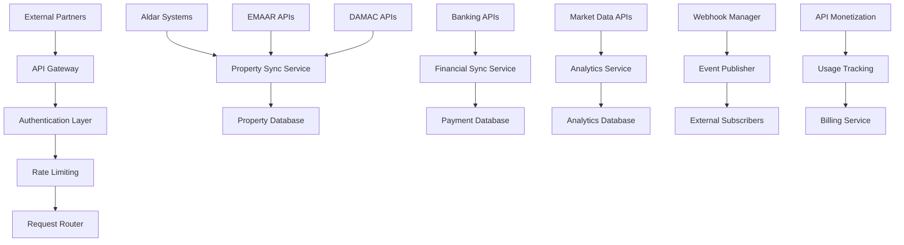

# API Integration Services

The API Integration Services enable seamless connectivity between NexVestXR V2 and external platforms, providing both inbound APIs for third-party consumption and outbound integrations with property listing systems, developer platforms, and financial services.

## 🔗 Service Overview

### Core Capabilities
- **Public API Gateway**: Secure APIs for third-party platform integration
- **Property Listing Integration**: Direct integration with Aldar, EMAAR, and other developer systems
- **Financial Data Sync**: Real-time integration with banks and payment providers
- **Market Data Integration**: External real estate data feeds and analytics
- **Developer Partner APIs**: White-label solutions for property developers
- **Webhook Management**: Event-driven integrations with external systems
- **API Monetization**: Usage-based billing and rate limiting for external consumers

### Integration Architecture


## 🏗️ Outbound Integrations

### Property Listing Integrations
```javascript
const propertyIntegrations = {
  // Aldar Properties Integration
  aldarIntegration: {
    apiEndpoint: "https://api.aldar.ae/properties",
    authentication: "oauth2",
    dataFormat: "json",
    syncFrequency: "real_time",
    webhookSupport: true,
    
    // Available Endpoints
    endpoints: {
      getProperties: "GET /v1/properties",
      getPropertyDetails: "GET /v1/properties/{id}",
      getAvailableUnits: "GET /v1/properties/{id}/units",
      getPricing: "GET /v1/properties/{id}/pricing",
      getProjectStatus: "GET /v1/projects/{id}/status",
      getInventory: "GET /v1/inventory/available"
    },
    
    // Integration Implementation
    syncAldarProperties: async () => {
      try {
        const accessToken = await getAldarAccessToken();
        const properties = await fetch(`${aldarIntegration.apiEndpoint}/v1/properties`, {
          headers: {
            'Authorization': `Bearer ${accessToken}`,
            'Content-Type': 'application/json',
            'X-API-Version': '1.0'
          }
        });
        
        const propertyData = await properties.json();
        
        for (const property of propertyData.properties) {
          // Transform Aldar data format to NexVestXR format
          const transformedProperty = await transformAldarProperty(property);
          
          // Check if property meets tokenization criteria
          const eligibility = await checkTokenizationEligibility(transformedProperty);
          
          if (eligibility.eligible) {
            // Create or update property in our system
            await upsertProperty(transformedProperty);
            
            // Determine token routing (XERA vs PROPX)
            const routing = await determineTokenRouting(transformedProperty);
            
            // Queue for tokenization if approved
            if (property.status === 'approved') {
              await queueForTokenization(transformedProperty.id, routing.token_type);
            }
          }
        }
        
        return {
          synced: propertyData.properties.length,
          eligible: propertyData.properties.filter(p => p.eligible).length,
          queued: propertyData.properties.filter(p => p.status === 'approved').length
        };
        
      } catch (error) {
        console.error('Aldar sync failed:', error);
        await logIntegrationError('aldar', error);
        throw error;
      }
    }
  },
  
  // EMAAR Properties Integration
  emaarIntegration: {
    apiEndpoint: "https://api.emaar.ae/realestate",
    authentication: "api_key",
    dataFormat: "json",
    syncFrequency: "hourly",
    webhookSupport: false,
    
    syncEmaarProperties: async () => {
      const apiKey = process.env.EMAAR_API_KEY;
      const projects = await fetch(`${emaarIntegration.apiEndpoint}/v2/projects`, {
        headers: {
          'X-API-Key': apiKey,
          'Accept': 'application/json'
        }
      });
      
      const projectData = await projects.json();
      
      // Process EMAAR data with automatic PROPX routing for premium properties
      for (const project of projectData.projects) {
        if (project.value >= 5000000 && project.location.zone === 'premium') {
          const transformedProject = await transformEmaarProject(project);
          await createPROPXToken(transformedProject);
        }
      }
      
      return projectData;
    }
  },
  
  // DAMAC Properties Integration
  damacIntegration: {
    apiEndpoint: "https://damacproperties.com/api",
    authentication: "bearer_token",
    dataFormat: "xml",
    syncFrequency: "daily",
    
    syncDamacProperties: async () => {
      const token = await getDamacBearerToken();
      const response = await fetch(`${damacIntegration.apiEndpoint}/properties/list`, {
        headers: {
          'Authorization': `Bearer ${token}`,
          'Accept': 'application/xml'
        }
      });
      
      const xmlData = await response.text();
      const properties = await parseXMLToJSON(xmlData);
      
      return await processDamacProperties(properties);
    }
  }
};
```

### Financial Data Integrations
```javascript
const financialIntegrations = {
  // Banking Integration for Payment Verification
  bankingAPIs: {
    adcb: {
      endpoint: "https://api.adcb.com/payments",
      verification: "account_verification",
      realTimeUpdates: true
    },
    
    enbd: {
      endpoint: "https://api.emiratesnbd.com/banking",
      verification: "transaction_verification",
      realTimeUpdates: true
    },
    
    fab: {
      endpoint: "https://api.fab.ae/corporate",
      verification: "corporate_account_verification",
      realTimeUpdates: false
    }
  },
  
  // Exchange Rate Integration
  currencyAPIs: {
    centralBankUAE: {
      endpoint: "https://centralbank.ae/api/exchange-rates",
      frequency: "real_time",
      currencies: ["AED", "USD", "EUR", "GBP"]
    },
    
    rbi: {
      endpoint: "https://rbi.org.in/api/exchange-rates",
      frequency: "daily",
      currencies: ["INR", "USD", "AED"]
    }
  },
  
  // Credit Scoring Integration
  creditAPIs: {
    aecb: {
      endpoint: "https://aecb.ae/api/credit-reports",
      service: "individual_credit_scoring",
      realTime: true
    },
    
    cibil: {
      endpoint: "https://cibil.com/api/credit-score",
      service: "credit_score_verification",
      realTime: false
    }
  }
};
```

### Market Data Integrations
```javascript
const marketDataIntegrations = {
  // Real Estate Market Data
  propertyMarketAPIs: {
    colliers: {
      endpoint: "https://api.colliers.com/market-data",
      data: ["market_trends", "price_indices", "rental_yields"],
      coverage: ["UAE", "GCC"],
      frequency: "weekly"
    },
    
    jll: {
      endpoint: "https://api.jll.com/research",
      data: ["market_reports", "investment_analysis", "forecasts"],
      coverage: ["UAE", "India"],
      frequency: "monthly"
    },
    
    propertyFinder: {
      endpoint: "https://api.propertyfinder.ae/market",
      data: ["listing_prices", "market_activity", "demand_metrics"],
      coverage: ["UAE"],
      frequency: "daily"
    }
  },
  
  // Government Data Integration
  governmentAPIs: {
    dld: {
      endpoint: "https://api.dld.dubai.gov.ae/transactions",
      data: ["property_transactions", "price_indices", "market_activity"],
      authentication: "government_certificate",
      frequency: "real_time"
    },
    
    rera: {
      endpoint: "https://api.rera.dubai.gov.ae/projects",
      data: ["project_approvals", "completion_status", "developer_ratings"],
      authentication: "api_key",
      frequency: "daily"
    }
  }
};
```

## 🌐 Inbound API Services

### Public API Gateway
```javascript
const publicAPIGateway = {
  // API Categories
  apiCategories: {
    property_data: {
      description: "Access to tokenized property information",
      endpoints: [
        "GET /api/public/properties",
        "GET /api/public/properties/{id}",
        "GET /api/public/properties/{id}/performance",
        "GET /api/public/market-data"
      ],
      pricing: "tier_based",
      rateLimit: "1000_requests_per_hour"
    },
    
    investment_data: {
      description: "Portfolio and investment analytics",
      endpoints: [
        "GET /api/public/portfolios/{id}",
        "GET /api/public/analytics/performance",
        "GET /api/public/analytics/trends"
      ],
      pricing: "usage_based",
      rateLimit: "500_requests_per_hour"
    },
    
    market_intelligence: {
      description: "Real estate market insights and analytics",
      endpoints: [
        "GET /api/public/market/trends",
        "GET /api/public/market/forecasts",
        "GET /api/public/market/comparables"
      ],
      pricing: "subscription_based",
      rateLimit: "100_requests_per_hour"
    }
  },
  
  // API Gateway Implementation
  gatewayMiddleware: {
    authentication: async (req, res, next) => {
      try {
        const apiKey = req.headers['x-api-key'];
        const clientId = req.headers['x-client-id'];
        
        if (!apiKey || !clientId) {
          return res.status(401).json({ error: 'Missing API credentials' });
        }
        
        // Validate API key and client
        const client = await validateAPIClient(apiKey, clientId);
        if (!client.active) {
          return res.status(401).json({ error: 'Invalid or inactive API key' });
        }
        
        // Check subscription status
        const subscription = await getClientSubscription(client.id);
        if (!subscription.active) {
          return res.status(402).json({ error: 'Subscription required' });
        }
        
        // Attach client context
        req.apiClient = client;
        req.subscription = subscription;
        
        next();
      } catch (error) {
        return res.status(500).json({ error: 'Authentication failed' });
      }
    },
    
    rateLimiting: async (req, res, next) => {
      const clientId = req.apiClient.id;
      const endpoint = req.route.path;
      
      // Get rate limit for client and endpoint
      const rateLimit = await getRateLimit(clientId, endpoint);
      
      // Check current usage
      const currentUsage = await getCurrentUsage(clientId, endpoint);
      
      if (currentUsage >= rateLimit.limit) {
        return res.status(429).json({
          error: 'Rate limit exceeded',
          limit: rateLimit.limit,
          window: rateLimit.window,
          reset_time: rateLimit.reset_time
        });
      }
      
      // Increment usage counter
      await incrementUsage(clientId, endpoint);
      
      // Add rate limit headers
      res.set({
        'X-RateLimit-Limit': rateLimit.limit,
        'X-RateLimit-Remaining': rateLimit.limit - currentUsage - 1,
        'X-RateLimit-Reset': rateLimit.reset_time
      });
      
      next();
    },
    
    usageTracking: async (req, res, next) => {
      const startTime = Date.now();
      
      // Track request
      await logAPIRequest({
        client_id: req.apiClient.id,
        endpoint: req.route.path,
        method: req.method,
        timestamp: new Date(),
        ip_address: req.ip,
        user_agent: req.get('User-Agent')
      });
      
      // Override res.json to track response
      const originalJson = res.json;
      res.json = function(data) {
        const responseTime = Date.now() - startTime;
        
        // Log response
        logAPIResponse({
          client_id: req.apiClient.id,
          endpoint: req.route.path,
          status_code: res.statusCode,
          response_time: responseTime,
          response_size: JSON.stringify(data).length
        });
        
        // Bill for usage if applicable
        if (req.subscription.billing_model === 'usage_based') {
          billAPIUsage(req.apiClient.id, req.route.path, responseTime);
        }
        
        return originalJson.call(this, data);
      };
      
      next();
    }
  }
};
```

### Third-Party Integration APIs
```javascript
const thirdPartyAPIs = {
  // Property Management Systems Integration
  pmsIntegration: {
    // For property management companies
    endpoints: {
      "POST /api/integration/properties/sync": {
        description: "Bulk sync properties from PMS",
        authentication: "oauth2",
        requestBody: {
          properties: [
            {
              external_id: "PMS_12345",
              name: "Downtown Apartment Complex",
              location: "Dubai Marina",
              units: 150,
              total_value: 75000000,
              expected_yield: 8.5
            }
          ]
        },
        response: {
          synced: 1,
          created_tokens: ["PROPX-DT001"],
          failed: 0
        }
      },
      
      "GET /api/integration/properties/{external_id}/performance": {
        description: "Get property performance for PMS display",
        response: {
          property_id: "PROPX-DT001",
          current_value: 76500000,
          total_return: 12.3,
          occupancy_rate: 94.5,
          rental_yield: 8.7
        }
      }
    }
  },
  
  // Real Estate Platforms Integration
  platformIntegration: {
    // For real estate listing platforms
    endpoints: {
      "GET /api/integration/listings": {
        description: "Get tokenized properties for listing",
        parameters: {
          location: "string",
          min_value: "number",
          max_value: "number",
          property_type: "string"
        },
        response: {
          listings: [
            {
              token_id: "PROPX-EM001",
              property_name: "EMAAR Downtown Residences",
              location: "Downtown Dubai",
              total_value: 45000000,
              available_tokens: 2500,
              price_per_token: 18000,
              expected_yield: 9.2,
              images: ["url1", "url2"],
              virtual_tour: "tour_url"
            }
          ]
        }
      },
      
      "POST /api/integration/investment": {
        description: "Process investment from external platform",
        requestBody: {
          external_user_id: "platform_user_123",
          token_id: "PROPX-EM001",
          token_quantity: 10,
          payment_method: "external_wallet",
          referral_code: "PLATFORM_REF"
        }
      }
    }
  },
  
  // Financial Services Integration
  financialIntegration: {
    // For banks and financial institutions
    endpoints: {
      "POST /api/integration/kyc/verify": {
        description: "Verify customer through bank KYC",
        requestBody: {
          bank_customer_id: "BANK_123456",
          verification_level: "enhanced",
          bank_code: "ADCB"
        },
        response: {
          verification_status: "approved",
          risk_score: 25,
          investment_limit: 2000000
        }
      },
      
      "GET /api/integration/portfolio/{bank_customer_id}": {
        description: "Get customer portfolio for bank dashboard",
        response: {
          total_investment: 150000,
          current_value: 162000,
          total_return: 8.0,
          properties: [
            {
              token_id: "XERA-POOL-DXB",
              investment: 50000,
              current_value: 54000
            }
          ]
        }
      }
    }
  }
};
```

## 🔌 Webhook Management

### Event-Driven Integrations
```javascript
const webhookManagement = {
  // Webhook Event Types
  eventTypes: {
    property_events: [
      "property.created",
      "property.approved", 
      "property.tokenized",
      "property.funded",
      "property.performance_updated"
    ],
    
    investment_events: [
      "investment.created",
      "investment.completed",
      "investment.failed",
      "dividend.distributed",
      "yield.calculated"
    ],
    
    trading_events: [
      "order.created",
      "order.filled",
      "order.cancelled",
      "price.changed",
      "liquidity.added"
    ],
    
    compliance_events: [
      "kyc.approved",
      "kyc.rejected",
      "aml.flagged",
      "compliance.updated"
    ]
  },
  
  // Webhook Delivery System
  deliverySystem: {
    sendWebhook: async (subscriberId, eventType, eventData) => {
      const subscriber = await getWebhookSubscriber(subscriberId);
      
      if (!subscriber.active || !subscriber.subscribed_events.includes(eventType)) {
        return { skipped: true, reason: 'not_subscribed' };
      }
      
      const payload = {
        event_id: generateEventId(),
        event_type: eventType,
        timestamp: new Date().toISOString(),
        data: eventData,
        signature: generateSignature(eventData, subscriber.secret)
      };
      
      try {
        const response = await fetch(subscriber.webhook_url, {
          method: 'POST',
          headers: {
            'Content-Type': 'application/json',
            'X-NexVestXR-Event': eventType,
            'X-NexVestXR-Signature': payload.signature,
            'X-NexVestXR-Delivery': payload.event_id
          },
          body: JSON.stringify(payload),
          timeout: 30000
        });
        
        if (response.ok) {
          await logWebhookDelivery(subscriberId, eventType, 'delivered');
          return { delivered: true, status: response.status };
        } else {
          await logWebhookDelivery(subscriberId, eventType, 'failed', response.status);
          await scheduleRetry(subscriberId, eventType, payload);
          return { delivered: false, status: response.status };
        }
        
      } catch (error) {
        await logWebhookDelivery(subscriberId, eventType, 'error', error.message);
        await scheduleRetry(subscriberId, eventType, payload);
        return { delivered: false, error: error.message };
      }
    },
    
    // Retry Logic
    retryWebhook: async (subscriberId, eventType, payload, attempt = 1) => {
      const maxRetries = 5;
      const backoffDelay = Math.pow(2, attempt) * 1000; // Exponential backoff
      
      if (attempt > maxRetries) {
        await markWebhookFailed(subscriberId, eventType, payload);
        return { failed: true, reason: 'max_retries_exceeded' };
      }
      
      await new Promise(resolve => setTimeout(resolve, backoffDelay));
      
      const result = await webhookManagement.deliverySystem.sendWebhook(subscriberId, eventType, payload.data);
      
      if (!result.delivered) {
        return await webhookManagement.deliverySystem.retryWebhook(subscriberId, eventType, payload, attempt + 1);
      }
      
      return result;
    }
  },
  
  // Webhook Management API
  managementAPI: {
    // Subscribe to webhooks
    "POST /api/webhooks/subscribe": {
      requestBody: {
        webhook_url: "https://partner.com/webhooks/nexvestxr",
        events: ["property.tokenized", "investment.completed"],
        secret: "webhook_secret_key"
      },
      response: {
        subscription_id: "sub_12345",
        webhook_url: "https://partner.com/webhooks/nexvestxr",
        status: "active",
        events: ["property.tokenized", "investment.completed"]
      }
    },
    
    // Test webhook
    "POST /api/webhooks/{subscription_id}/test": {
      description: "Send test webhook to verify endpoint",
      response: {
        test_sent: true,
        delivery_status: "delivered",
        response_time: 245
      }
    }
  }
};
```

## 💰 API Monetization

### Usage-Based Billing
```javascript
const apiMonetization = {
  // Pricing Tiers
  pricingTiers: {
    developer: {
      monthly_fee: 0,
      rate_limits: {
        property_data: 1000,
        investment_data: 500,
        market_intelligence: 100
      },
      overage_pricing: {
        property_data: 0.01, // $0.01 per request
        investment_data: 0.02,
        market_intelligence: 0.05
      }
    },
    
    professional: {
      monthly_fee: 99,
      rate_limits: {
        property_data: 10000,
        investment_data: 5000,
        market_intelligence: 1000
      },
      overage_pricing: {
        property_data: 0.005,
        investment_data: 0.01,
        market_intelligence: 0.03
      }
    },
    
    enterprise: {
      monthly_fee: 999,
      rate_limits: {
        property_data: 100000,
        investment_data: 50000,
        market_intelligence: 10000
      },
      overage_pricing: {
        property_data: 0.002,
        investment_data: 0.005,
        market_intelligence: 0.01
      }
    }
  },
  
  // Usage Tracking
  usageTracking: {
    trackAPIUsage: async (clientId, endpoint, responseTime, dataSize) => {
      const usage = {
        client_id: clientId,
        endpoint: endpoint,
        timestamp: new Date(),
        response_time: responseTime,
        data_size: dataSize,
        cost: calculateAPICallCost(clientId, endpoint)
      };
      
      await storeUsageRecord(usage);
      
      // Update real-time usage counters
      await incrementUsageCounter(clientId, endpoint);
      
      // Check for tier upgrades
      const monthlyUsage = await getMonthlyUsage(clientId);
      if (shouldSuggestTierUpgrade(monthlyUsage)) {
        await sendTierUpgradeNotification(clientId);
      }
      
      return usage;
    },
    
    generateUsageReport: async (clientId, period) => {
      const usage = await getUsageData(clientId, period);
      
      return {
        client_id: clientId,
        period: period,
        total_requests: usage.total_requests,
        endpoint_breakdown: usage.by_endpoint,
        total_cost: usage.total_cost,
        overage_charges: usage.overage_charges,
        projected_monthly_cost: usage.projected_monthly
      };
    }
  }
};
```

## 📊 Integration Analytics

### Performance Monitoring
```javascript
const integrationAnalytics = {
  // Integration Health Monitoring
  healthMonitoring: {
    monitorIntegrations: async () => {
      const integrations = await getAllActiveIntegrations();
      const healthStatus = {};
      
      for (const integration of integrations) {
        const health = await checkIntegrationHealth(integration);
        healthStatus[integration.name] = {
          status: health.status,
          last_successful_sync: health.last_sync,
          error_rate: health.error_rate,
          response_time: health.avg_response_time,
          uptime: health.uptime_percentage
        };
      }
      
      return healthStatus;
    },
    
    generateHealthReport: async (timeframe) => {
      const integrations = await getIntegrationsHealth(timeframe);
      
      return {
        overall_health: calculateOverallHealth(integrations),
        integration_breakdown: integrations,
        alerts: await getActiveAlerts(),
        recommendations: await generateHealthRecommendations(integrations)
      };
    }
  },
  
  // API Usage Analytics
  usageAnalytics: {
    getAPIMetrics: async (timeframe) => {
      const metrics = await getAPIUsageMetrics(timeframe);
      
      return {
        total_requests: metrics.total_requests,
        successful_requests: metrics.successful_requests,
        error_rate: metrics.error_rate,
        average_response_time: metrics.avg_response_time,
        top_endpoints: metrics.popular_endpoints,
        top_clients: metrics.active_clients,
        revenue_generated: metrics.api_revenue
      };
    },
    
    generateUsageTrends: async (clientId, timeframe) => {
      const usage = await getClientUsageTrends(clientId, timeframe);
      
      return {
        growth_rate: usage.growth_rate,
        usage_patterns: usage.patterns,
        peak_hours: usage.peak_hours,
        seasonal_trends: usage.seasonal,
        cost_optimization_opportunities: usage.optimization_tips
      };
    }
  }
};
```

## 🔧 Configuration & Management

### Integration Configuration
```bash
# API Gateway Configuration
API_GATEWAY_PORT=3000
API_RATE_LIMIT_REDIS_URL=redis://localhost:6379
API_USAGE_TRACKING_DB=postgresql://usage_db

# External Integration Endpoints
ALDAR_API_ENDPOINT=https://api.aldar.ae
ALDAR_CLIENT_ID=your_aldar_client_id
ALDAR_CLIENT_SECRET=your_aldar_client_secret

EMAAR_API_ENDPOINT=https://api.emaar.ae
EMAAR_API_KEY=your_emaar_api_key

DAMAC_API_ENDPOINT=https://damacproperties.com/api
DAMAC_BEARER_TOKEN=your_damac_token

# Webhook Configuration
WEBHOOK_MAX_RETRIES=5
WEBHOOK_TIMEOUT_MS=30000
WEBHOOK_SIGNATURE_SECRET=your_webhook_secret

# API Monetization
STRIPE_API_BILLING_KEY=sk_live_billing_key
USAGE_BILLING_CYCLE=monthly
OVERAGE_BILLING_ENABLED=true
```

### API Integration Endpoints
```javascript
const integrationAPIEndpoints = {
  // Outbound Integration Management
  "GET /api/integrations/status": "Get status of all external integrations",
  "POST /api/integrations/{provider}/sync": "Trigger manual sync with external provider",
  "GET /api/integrations/{provider}/logs": "Get integration logs and errors",
  
  // Inbound API Management
  "POST /api/api-keys/generate": "Generate API key for external client",
  "GET /api/api-keys/{clientId}/usage": "Get API usage statistics",
  "PUT /api/api-keys/{clientId}/limits": "Update API rate limits",
  
  // Webhook Management
  "POST /api/webhooks/subscribe": "Subscribe to webhook events",
  "GET /api/webhooks/subscriptions": "List webhook subscriptions",
  "POST /api/webhooks/{subscriptionId}/test": "Test webhook endpoint",
  "DELETE /api/webhooks/{subscriptionId}": "Unsubscribe from webhooks",
  
  // Public APIs for External Consumption
  "GET /api/public/properties": "Get tokenized properties (public)",
  "GET /api/public/properties/{id}/performance": "Get property performance (public)",
  "GET /api/public/market/trends": "Get market trends (public)",
  "GET /api/public/analytics/insights": "Get market insights (public)"
};
```

---

*API Integration Services - Comprehensive external platform connectivity for NexVestXR V2*