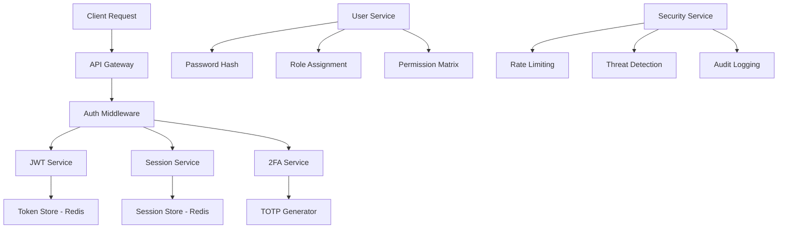

# Authentication Service

The Authentication Service is the cornerstone of NexVestXR V2's security architecture, providing enterprise-grade user authentication, authorization, and session management across all platform interfaces.

## 🔐 Service Overview

### Core Capabilities
- **Multi-Factor Authentication (MFA)**: TOTP-based 2FA with backup codes
- **JWT Token Management**: Secure access and refresh token handling
- **Session Management**: Redis-backed session store with concurrent session limits
- **Role-Based Access Control (RBAC)**: Granular permission management
- **Cross-Platform Integration**: Web, mobile, and API authentication
- **Security Monitoring**: Real-time threat detection and response

### Authentication Methods
```javascript
const authMethods = {
  email_password: {
    encryption: "bcrypt",
    saltRounds: 12,
    complexity: "enforced"
  },
  two_factor: {
    type: "TOTP",
    algorithm: "SHA1",
    backup_codes: 10
  },
  biometric: {
    mobile_only: true,
    types: ["fingerprint", "face_id"]
  },
  wallet_auth: {
    xumm: "XRPL signature verification",
    metamask: "Ethereum signature verification"
  }
};
```

## 🏗️ Architecture

### Service Components


### Data Flow
1. **Authentication Request**: Client submits credentials
2. **Credential Validation**: Password and 2FA verification
3. **Token Generation**: JWT access/refresh token creation
4. **Session Creation**: Redis session establishment
5. **Authorization Check**: Role and permission validation
6. **Response Generation**: Authenticated user context

## 🔑 JWT Implementation

### Token Structure
```javascript
// Access Token (15 minutes)
const accessToken = {
  header: {
    alg: "HS256",
    typ: "JWT"
  },
  payload: {
    sub: "user_id",
    iat: 1640995200,
    exp: 1640996100,
    roles: ["investor", "premium"],
    permissions: ["invest", "trade", "withdraw"],
    session_id: "sess_123456789"
  }
};

// Refresh Token (7 days)
const refreshToken = {
  header: {
    alg: "HS256",
    typ: "JWT"
  },
  payload: {
    sub: "user_id",
    iat: 1640995200,
    exp: 1641600000,
    type: "refresh",
    session_id: "sess_123456789"
  }
};
```

### Token Management
- **Access Token Expiry**: 15 minutes (short-lived)
- **Refresh Token Expiry**: 7 days (long-lived)
- **Automatic Renewal**: Silent refresh mechanism
- **Token Blacklisting**: Redis-based token revocation
- **Cross-Device Sync**: Session management across devices

## 👥 Role-Based Access Control

### User Roles
```javascript
const userRoles = {
  // Standard Users
  investor: {
    permissions: [
      "view_properties",
      "invest_funds", 
      "view_portfolio",
      "basic_trading"
    ],
    investment_limit: "AED 500,000"
  },
  
  premium_investor: {
    permissions: [
      "all_investor_permissions",
      "advanced_trading",
      "priority_access",
      "staking_rewards"
    ],
    investment_limit: "AED 2,000,000"
  },
  
  institutional_investor: {
    permissions: [
      "all_premium_permissions",
      "bulk_trading",
      "otc_access",
      "custom_agreements"
    ],
    investment_limit: "unlimited"
  },
  
  // Platform Roles
  developer: {
    permissions: [
      "create_properties",
      "manage_tokenization",
      "view_analytics",
      "developer_dashboard"
    ],
    tier: "tier1" // or "tier2"
  },
  
  admin: {
    permissions: [
      "platform_management",
      "user_management", 
      "financial_oversight",
      "compliance_monitoring"
    ],
    access_level: "full"
  }
};
```

### Permission Matrix
```javascript
const permissions = {
  // Investment Permissions
  invest_funds: ["investor", "premium_investor", "institutional_investor"],
  advanced_trading: ["premium_investor", "institutional_investor"],
  bulk_trading: ["institutional_investor"],
  
  // Property Permissions
  create_properties: ["developer", "admin"],
  approve_properties: ["admin"],
  
  // Administrative Permissions
  user_management: ["admin"],
  platform_settings: ["admin"],
  compliance_oversight: ["admin"]
};
```

## 🔒 Multi-Factor Authentication

### TOTP Implementation
```javascript
const totpConfig = {
  issuer: "NexVestXR",
  algorithm: "SHA1",
  digits: 6,
  step: 30, // 30-second window
  window: 1 // Allow 1 step tolerance
};

// TOTP Setup Flow
const setupTOTP = async (userId) => {
  const secret = speakeasy.generateSecret({
    name: `NexVestXR (${user.email})`,
    issuer: "NexVestXR",
    length: 32
  });
  
  // Store secret encrypted in database
  await storeEncryptedSecret(userId, secret.base32);
  
  // Return QR code for authenticator app
  return {
    qr_code: secret.otpauth_url,
    backup_codes: generateBackupCodes(userId)
  };
};
```

### Backup Codes
```javascript
const backupCodes = {
  generation: {
    count: 10,
    length: 8,
    format: "XXXX-XXXX"
  },
  usage: {
    single_use: true,
    regenerate_on_depletion: true,
    secure_storage: "encrypted"
  }
};
```

## 📱 Mobile Authentication

### Biometric Integration
```javascript
// React Native Biometric Setup
const biometricAuth = {
  ios: {
    touchId: true,
    faceId: true,
    fallback: "password"
  },
  android: {
    fingerprint: true,
    iris: false,
    fallback: "pin"
  }
};

// Biometric Authentication Flow
const authenticateWithBiometric = async () => {
  const biometricType = await TouchID.isSupported();
  
  if (biometricType) {
    const result = await TouchID.authenticate(
      'Authenticate to access your investment portfolio',
      {
        title: 'NexVestXR Authentication',
        imageColor: '#e00606',
        imageErrorColor: '#ff0000',
        sensorDescription: 'Touch sensor',
        sensorErrorDescription: 'Failed',
        cancelText: 'Cancel',
        fallbackLabel: 'Use Password',
        unifiedErrors: false,
        passcodeFallback: false
      }
    );
    
    return result;
  }
};
```

### Device Registration
```javascript
const deviceRegistration = {
  device_id: "generated_uuid",
  device_name: "iPhone 13 Pro",
  platform: "iOS 15.2",
  app_version: "2.0.0",
  biometric_capability: true,
  registration_date: "2025-01-15T10:00:00Z",
  last_used: "2025-01-20T15:30:00Z",
  status: "active"
};
```

## 🌐 Session Management

### Session Configuration
```javascript
const sessionConfig = {
  store: "redis",
  secret: process.env.SESSION_SECRET,
  resave: false,
  saveUninitialized: false,
  cookie: {
    secure: true, // HTTPS only
    httpOnly: true, // Prevent XSS
    maxAge: 24 * 60 * 60 * 1000, // 24 hours
    sameSite: 'lax'
  },
  rolling: true, // Extend session on activity
  genid: () => uuidv4()
};
```

### Concurrent Session Limits
```javascript
const sessionLimits = {
  free_user: 2,
  premium_user: 5,
  institutional_user: 10,
  developer: 3,
  admin: 5
};

// Session Management Logic
const manageUserSessions = async (userId, newSessionId) => {
  const activeSessions = await redis.smembers(`sessions:${userId}`);
  
  if (activeSessions.length >= getUserSessionLimit(userId)) {
    // Remove oldest session
    const oldestSession = await getOldestSession(userId);
    await terminateSession(oldestSession);
  }
  
  await redis.sadd(`sessions:${userId}`, newSessionId);
  await redis.expire(`sessions:${userId}`, 604800); // 7 days
};
```

## 🛡️ Security Features

### Rate Limiting
```javascript
const rateLimits = {
  login_attempts: {
    max: 5,
    window: 900, // 15 minutes
    block_duration: 3600 // 1 hour
  },
  token_refresh: {
    max: 10,
    window: 3600 // 1 hour
  },
  password_reset: {
    max: 3,
    window: 3600 // 1 hour
  }
};
```

### Threat Detection
```javascript
const threatDetection = {
  suspicious_login: {
    new_device: true,
    new_location: true,
    unusual_time: true,
    multiple_failures: true
  },
  
  actions: {
    require_2fa: true,
    send_alert: true,
    temporary_block: true,
    admin_notification: true
  }
};
```

### Password Security
```javascript
const passwordPolicy = {
  min_length: 8,
  max_length: 128,
  require_uppercase: true,
  require_lowercase: true,
  require_numbers: true,
  require_symbols: true,
  prevent_common_passwords: true,
  prevent_personal_info: true,
  history_check: 5 // Last 5 passwords
};
```

## 🔌 API Integration

### Authentication Endpoints
```javascript
// POST /api/auth/login
const loginEndpoint = {
  request: {
    email: "user@example.com",
    password: "securePassword123!",
    totp_code: "123456", // Optional 2FA code
    device_info: {
      device_id: "uuid",
      platform: "web|ios|android"
    }
  },
  response: {
    access_token: "jwt_access_token",
    refresh_token: "jwt_refresh_token",
    user: {
      id: "user_id",
      email: "user@example.com",
      roles: ["investor"],
      permissions: ["invest", "trade"]
    },
    expires_in: 900 // 15 minutes
  }
};

// POST /api/auth/refresh
const refreshEndpoint = {
  request: {
    refresh_token: "jwt_refresh_token"
  },
  response: {
    access_token: "new_jwt_access_token",
    expires_in: 900
  }
};

// DELETE /api/auth/logout
const logoutEndpoint = {
  request: {
    session_id: "optional_specific_session"
  },
  response: {
    message: "Successfully logged out"
  }
};
```

### Middleware Implementation
```javascript
const authMiddleware = async (req, res, next) => {
  try {
    const authHeader = req.headers.authorization;
    
    if (!authHeader || !authHeader.startsWith('Bearer ')) {
      return res.status(401).json({ error: 'No token provided' });
    }
    
    const token = authHeader.substring(7);
    
    // Check if token is blacklisted
    const isBlacklisted = await redis.get(`blacklist:${token}`);
    if (isBlacklisted) {
      return res.status(401).json({ error: 'Token is invalid' });
    }
    
    // Verify JWT token
    const decoded = jwt.verify(token, process.env.JWT_SECRET);
    
    // Validate session
    const sessionExists = await redis.get(`session:${decoded.session_id}`);
    if (!sessionExists) {
      return res.status(401).json({ error: 'Session expired' });
    }
    
    // Attach user context
    req.user = decoded;
    next();
    
  } catch (error) {
    return res.status(401).json({ error: 'Invalid token' });
  }
};
```

## 📊 Monitoring & Analytics

### Authentication Metrics
```javascript
const authMetrics = {
  login_success_rate: "percentage",
  login_failure_reasons: ["invalid_password", "2fa_failure", "account_locked"],
  session_duration: "average_minutes",
  concurrent_sessions: "count",
  device_distribution: ["web", "ios", "android"],
  geographic_distribution: "country_codes"
};
```

### Security Alerts
```javascript
const securityAlerts = {
  brute_force_attempt: {
    threshold: 10,
    time_window: 300,
    action: "block_ip"
  },
  
  suspicious_login: {
    new_device: "require_2fa",
    new_location: "send_email_alert",
    multiple_failures: "temporary_lockout"
  },
  
  token_anomalies: {
    expired_token_usage: "log_incident",
    token_reuse: "invalidate_all_tokens",
    malformed_token: "rate_limit_ip"
  }
};
```

## 🔧 Configuration

### Environment Variables
```bash
# JWT Configuration
JWT_SECRET=your-256-bit-secret-key
JWT_REFRESH_SECRET=your-256-bit-refresh-secret
JWT_ACCESS_EXPIRY=15m
JWT_REFRESH_EXPIRY=7d

# Session Configuration
SESSION_SECRET=your-session-secret
SESSION_STORE=redis
REDIS_URL=redis://localhost:6379

# Security Configuration
BCRYPT_ROUNDS=12
RATE_LIMIT_WINDOW=900
RATE_LIMIT_MAX=5

# 2FA Configuration
TOTP_ISSUER=NexVestXR
TOTP_WINDOW=1
BACKUP_CODES_COUNT=10

# Biometric Configuration (Mobile)
BIOMETRIC_ENABLED=true
BIOMETRIC_FALLBACK=password
```

### Service Dependencies
```yaml
services:
  - redis: "Session and token storage"
  - postgresql: "User credentials and roles"
  - email-service: "2FA setup and alerts"
  - sms-service: "SMS-based 2FA backup"
  - audit-service: "Security event logging"
```

## 🚀 Getting Started

### Integration Checklist
- [ ] Configure JWT secrets and expiry times
- [ ] Set up Redis for session storage
- [ ] Implement rate limiting middleware
- [ ] Configure 2FA TOTP settings
- [ ] Set up biometric authentication (mobile)
- [ ] Configure security monitoring
- [ ] Implement audit logging
- [ ] Test authentication flows

### Quick Implementation
```javascript
// Express.js Integration
const express = require('express');
const { authMiddleware, requirePermission } = require('./auth-service');

const app = express();

// Public endpoint
app.post('/api/auth/login', loginHandler);

// Protected endpoint
app.get('/api/user/profile', authMiddleware, getUserProfile);

// Permission-based endpoint
app.post('/api/properties', 
  authMiddleware, 
  requirePermission('create_properties'), 
  createProperty
);
```

---

*Authentication Service - Enterprise-grade security for NexVestXR V2 platform*