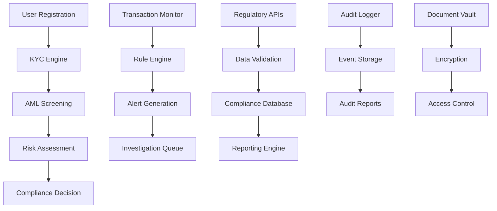

# Compliance Services

The Compliance Services ensure that the NexVestXR V2 platform adheres to all regulatory requirements across UAE and Indian markets, providing automated compliance monitoring, reporting, and enforcement mechanisms.

## ⚖️ Service Overview

### Core Capabilities
- **Multi-Jurisdictional Compliance**: UAE, India, and international regulatory frameworks
- **Automated KYC/AML**: Identity verification and anti-money laundering checks
- **Regulatory Reporting**: Automated compliance report generation and submission
- **Transaction Monitoring**: Real-time transaction screening and alert generation
- **Documentation Management**: Secure storage and verification of compliance documents
- **Audit Trail**: Comprehensive logging for regulatory audits
- **Risk Assessment**: Continuous risk scoring and mitigation

### Compliance Architecture


## 🏗️ Compliance Framework

### KYC (Know Your Customer) Engine
```javascript
const kycEngine = {
  // KYC Levels
  kycLevels: {
    basic: {
      requirements: [
        "email_verification",
        "phone_verification", 
        "basic_identity_document"
      ],
      investment_limit: {
        AED: 50000,
        USD: 13600,
        INR: 1000000
      },
      verification_time: "24_hours"
    },
    
    standard: {
      requirements: [
        "government_issued_id",
        "proof_of_address",
        "selfie_verification",
        "source_of_funds"
      ],
      investment_limit: {
        AED: 500000,
        USD: 136000,
        INR: 10000000
      },
      verification_time: "72_hours"
    },
    
    enhanced: {
      requirements: [
        "enhanced_due_diligence",
        "bank_statements",
        "wealth_verification",
        "business_documentation",
        "pep_screening"
      ],
      investment_limit: {
        AED: 2000000,
        USD: 544000,
        INR: 40000000
      },
      verification_time: "7_days"
    },
    
    institutional: {
      requirements: [
        "corporate_documents",
        "board_resolutions",
        "beneficial_ownership",
        "regulatory_licenses",
        "financial_statements"
      ],
      investment_limit: "unlimited",
      verification_time: "14_days"
    }
  },
  
  // KYC Processing
  processKYC: async (userId, kycData) => {
    const {
      level,
      documents,
      personal_info,
      address_info,
      financial_info
    } = kycData;
    
    const kycProcess = {
      id: generateKYCId(),
      user_id: userId,
      level: level,
      status: "in_progress",
      submitted_at: new Date(),
      steps_completed: [],
      steps_remaining: [...kycEngine.kycLevels[level].requirements],
      verification_results: {}
    };
    
    // Document Verification
    for (const document of documents) {
      const verificationResult = await verifyDocument(document);
      kycProcess.verification_results[document.type] = verificationResult;
      
      if (verificationResult.status === "verified") {
        kycProcess.steps_completed.push(document.type);
        kycProcess.steps_remaining = kycProcess.steps_remaining.filter(step => step !== document.type);
      }
    }
    
    // Identity Verification
    if (personal_info.identity_document) {
      const identityResult = await verifyIdentity(personal_info);
      kycProcess.verification_results.identity = identityResult;
      
      if (identityResult.status === "verified") {
        kycProcess.steps_completed.push("identity_verification");
      }
    }
    
    // Address Verification
    if (address_info.proof_of_address) {
      const addressResult = await verifyAddress(address_info);
      kycProcess.verification_results.address = addressResult;
      
      if (addressResult.status === "verified") {
        kycProcess.steps_completed.push("address_verification");
      }
    }
    
    // PEP and Sanctions Screening
    const screeningResult = await performScreening(personal_info);
    kycProcess.verification_results.screening = screeningResult;
    
    // Determine final status
    if (kycProcess.steps_remaining.length === 0) {
      kycProcess.status = "approved";
      await updateUserKYCStatus(userId, level, "approved");
    } else if (screeningResult.risk_level === "high") {
      kycProcess.status = "rejected";
      await updateUserKYCStatus(userId, level, "rejected");
    } else {
      kycProcess.status = "pending_documents";
    }
    
    // Store KYC process
    await storeKYCProcess(kycProcess);
    
    return kycProcess;
  }
};
```

### AML (Anti-Money Laundering) Engine
```javascript
const amlEngine = {
  // Transaction Monitoring Rules
  monitoringRules: {
    large_transactions: {
      threshold_usd: 10000,
      threshold_aed: 36700,
      threshold_inr: 830000,
      action: "flag_for_review"
    },
    
    velocity_checks: {
      daily_limit_multiplier: 3,
      weekly_pattern_analysis: true,
      monthly_volume_threshold: 50000,
      action: "enhanced_monitoring"
    },
    
    suspicious_patterns: {
      round_number_transactions: true,
      just_below_threshold: true,
      structured_transactions: true,
      action: "investigate"
    },
    
    geographic_risks: {
      high_risk_countries: ["Country1", "Country2"],
      sanctions_list_check: true,
      pep_monitoring: true,
      action: "enhanced_due_diligence"
    }
  },
  
  // Transaction Screening
  screenTransaction: async (transaction) => {
    const {
      user_id,
      amount,
      currency,
      destination,
      source,
      transaction_type
    } = transaction;
    
    const screeningResult = {
      transaction_id: transaction.id,
      risk_score: 0,
      flags: [],
      actions_required: [],
      status: "clear"
    };
    
    // Convert amount to USD for standardized checking
    const usdAmount = await convertToUSD(amount, currency);
    
    // Large transaction check
    if (usdAmount >= amlEngine.monitoringRules.large_transactions.threshold_usd) {
      screeningResult.risk_score += 30;
      screeningResult.flags.push("large_transaction");
      screeningResult.actions_required.push("manual_review");
    }
    
    // Velocity checks
    const userTransactionHistory = await getUserTransactionHistory(user_id, "30_days");
    const velocityCheck = analyzeTransactionVelocity(userTransactionHistory, transaction);
    
    if (velocityCheck.suspicious) {
      screeningResult.risk_score += velocityCheck.risk_points;
      screeningResult.flags.push("velocity_anomaly");
      screeningResult.actions_required.push("enhanced_monitoring");
    }
    
    // Pattern analysis
    const patternAnalysis = analyzeTransactionPatterns(userTransactionHistory, transaction);
    if (patternAnalysis.suspicious_patterns.length > 0) {
      screeningResult.risk_score += 25;
      screeningResult.flags.push(...patternAnalysis.suspicious_patterns);
      screeningResult.actions_required.push("investigate");
    }
    
    // Geographic risk assessment
    const userProfile = await getUserProfile(user_id);
    const geoRisk = assessGeographicRisk(userProfile.country, destination);
    
    if (geoRisk.high_risk) {
      screeningResult.risk_score += geoRisk.risk_points;
      screeningResult.flags.push("geographic_risk");
      screeningResult.actions_required.push("enhanced_due_diligence");
    }
    
    // Sanctions and PEP screening
    const sanctionsCheck = await checkSanctionsList(userProfile);
    if (sanctionsCheck.match) {
      screeningResult.risk_score += 100;
      screeningResult.flags.push("sanctions_match");
      screeningResult.actions_required.push("block_transaction");
    }
    
    // Determine final status
    if (screeningResult.risk_score >= 80) {
      screeningResult.status = "blocked";
    } else if (screeningResult.risk_score >= 50) {
      screeningResult.status = "review_required";
    } else if (screeningResult.risk_score >= 20) {
      screeningResult.status = "monitor";
    }
    
    // Log screening result
    await logAMLScreening(screeningResult);
    
    return screeningResult;
  }
};
```

### Regulatory Reporting Engine
```javascript
const reportingEngine = {
  // Report Types
  reportTypes: {
    uae: {
      amlcft_unit: {
        frequency: "monthly",
        format: "xml",
        requirements: ["suspicious_transactions", "large_transactions", "cross_border"]
      },
      
      central_bank: {
        frequency: "quarterly", 
        format: "excel",
        requirements: ["regulatory_capital", "liquidity_ratios", "risk_metrics"]
      },
      
      dfsa: {
        frequency: "monthly",
        format: "pdf", 
        requirements: ["client_money", "regulatory_returns", "incident_reports"]
      }
    },
    
    india: {
      fiu_india: {
        frequency: "monthly",
        format: "xml",
        requirements: ["cash_transactions", "suspicious_transactions", "cross_border"]
      },
      
      sebi: {
        frequency: "quarterly",
        format: "excel",
        requirements: ["portfolio_disclosure", "risk_management", "compliance_certificate"]
      },
      
      rbi: {
        frequency: "monthly",
        format: "xml",
        requirements: ["foreign_exchange", "nri_transactions", "compliance_report"]
      }
    }
  },
  
  // Report Generation
  generateReport: async (reportType, jurisdiction, period) => {
    const reportConfig = reportingEngine.reportTypes[jurisdiction][reportType];
    
    const reportData = {
      report_id: generateReportId(),
      report_type: reportType,
      jurisdiction: jurisdiction,
      period: period,
      generated_at: new Date(),
      status: "generating"
    };
    
    try {
      // Collect required data
      const data = {};
      
      for (const requirement of reportConfig.requirements) {
        switch (requirement) {
          case "suspicious_transactions":
            data.suspicious_transactions = await getSuspiciousTransactions(period);
            break;
          case "large_transactions":
            data.large_transactions = await getLargeTransactions(period);
            break;
          case "cross_border":
            data.cross_border_transactions = await getCrossBorderTransactions(period);
            break;
          case "regulatory_capital":
            data.regulatory_capital = await calculateRegulatoryCapital(period);
            break;
        }
      }
      
      // Generate report based on format
      let report;
      switch (reportConfig.format) {
        case "xml":
          report = await generateXMLReport(data, reportType);
          break;
        case "excel":
          report = await generateExcelReport(data, reportType);
          break;
        case "pdf":
          report = await generatePDFReport(data, reportType);
          break;
      }
      
      // Store report
      reportData.file_path = await storeReport(report, reportType, period);
      reportData.status = "completed";
      
      // Auto-submit if configured
      if (shouldAutoSubmit(reportType, jurisdiction)) {
        const submissionResult = await submitReport(report, reportType, jurisdiction);
        reportData.submission_status = submissionResult.status;
        reportData.submission_reference = submissionResult.reference;
      }
      
    } catch (error) {
      reportData.status = "failed";
      reportData.error = error.message;
    }
    
    await storeReportMetadata(reportData);
    
    return reportData;
  }
};
```

### Risk Assessment Engine
```javascript
const riskAssessment = {
  // Risk Factors
  riskFactors: {
    customer_risk: {
      country_of_residence: {
        low_risk: ["UAE", "USA", "UK", "Canada", "Australia"],
        medium_risk: ["India", "China", "Brazil", "Russia"],
        high_risk: ["High-risk jurisdictions per FATF"]
      },
      
      occupation: {
        low_risk: ["employee", "teacher", "engineer"],
        medium_risk: ["business_owner", "consultant", "trader"],
        high_risk: ["pep", "high_net_worth", "crypto_trader"]
      },
      
      income_source: {
        low_risk: ["salary", "pension", "inheritance"],
        medium_risk: ["business_income", "investments", "trading"],
        high_risk: ["unknown", "complex_structures", "offshore"]
      }
    },
    
    transaction_risk: {
      amount: {
        low_risk: "< $10,000",
        medium_risk: "$10,000 - $100,000", 
        high_risk: "> $100,000"
      },
      
      frequency: {
        low_risk: "< 5 per month",
        medium_risk: "5-20 per month",
        high_risk: "> 20 per month"
      },
      
      destination: {
        low_risk: ["domestic", "low_risk_countries"],
        medium_risk: ["medium_risk_countries"],
        high_risk: ["high_risk_countries", "sanctions_countries"]
      }
    },
    
    product_risk: {
      property_tokens: {
        risk_level: "medium",
        factors: ["liquidity", "volatility", "regulatory_status"]
      },
      
      cross_border: {
        risk_level: "high",
        factors: ["exchange_controls", "regulatory_differences", "settlement_risk"]
      }
    }
  },
  
  // Risk Calculation
  calculateRiskScore: async (userId, transactionData) => {
    const userProfile = await getUserProfile(userId);
    const riskScore = {
      customer_risk: 0,
      transaction_risk: 0,
      product_risk: 0,
      total_risk: 0,
      risk_level: "low"
    };
    
    // Customer Risk Assessment
    const customerRisk = assessCustomerRisk(userProfile);
    riskScore.customer_risk = customerRisk.score;
    
    // Transaction Risk Assessment
    if (transactionData) {
      const transactionRisk = assessTransactionRisk(transactionData);
      riskScore.transaction_risk = transactionRisk.score;
    }
    
    // Product Risk Assessment
    const productRisk = assessProductRisk(transactionData?.product_type);
    riskScore.product_risk = productRisk.score;
    
    // Calculate total risk
    riskScore.total_risk = (
      riskScore.customer_risk * 0.4 +
      riskScore.transaction_risk * 0.4 +
      riskScore.product_risk * 0.2
    );
    
    // Determine risk level
    if (riskScore.total_risk >= 70) {
      riskScore.risk_level = "high";
    } else if (riskScore.total_risk >= 40) {
      riskScore.risk_level = "medium";
    } else {
      riskScore.risk_level = "low";
    }
    
    // Store risk assessment
    await storeRiskAssessment(userId, riskScore);
    
    return riskScore;
  }
};
```

## 📄 Document Management & Audit

### Compliance Document Management
```javascript
const documentManagement = {
  // Document Categories
  documentCategories: {
    kyc_documents: [
      "passport", "national_id", "driving_license",
      "utility_bill", "bank_statement", "salary_certificate"
    ],
    
    corporate_documents: [
      "certificate_of_incorporation", "memorandum_of_association",
      "board_resolution", "power_of_attorney", "financial_statements"
    ],
    
    compliance_certificates: [
      "aml_certificate", "regulatory_license", "audit_report",
      "compliance_attestation", "risk_assessment"
    ]
  },
  
  // Document Storage & Retrieval
  storeComplianceDocument: async (documentData) => {
    const {
      user_id,
      document_type,
      document_file,
      metadata
    } = documentData;
    
    // Encrypt document
    const encryptedDocument = await encryptDocument(document_file);
    
    // Generate document hash
    const documentHash = generateDocumentHash(document_file);
    
    // Store in secure vault
    const storageResult = await storeInSecureVault(encryptedDocument);
    
    // Create document record
    const documentRecord = {
      id: generateDocumentId(),
      user_id: user_id,
      document_type: document_type,
      document_hash: documentHash,
      storage_location: storageResult.location,
      encryption_key_id: encryptedDocument.key_id,
      metadata: metadata,
      uploaded_at: new Date(),
      retention_period: calculateRetentionPeriod(document_type),
      access_log: []
    };
    
    await storeDocumentRecord(documentRecord);
    
    return documentRecord;
  },
  
  // Audit Trail Management
  auditTrail: {
    logEvent: async (eventData) => {
      const {
        user_id,
        event_type,
        event_description,
        ip_address,
        user_agent,
        additional_data
      } = eventData;
      
      const auditEvent = {
        id: generateAuditId(),
        user_id: user_id,
        event_type: event_type,
        event_description: event_description,
        timestamp: new Date(),
        ip_address: ip_address,
        user_agent: user_agent,
        session_id: await getCurrentSessionId(user_id),
        additional_data: additional_data,
        compliance_relevant: isComplianceRelevant(event_type)
      };
      
      await storeAuditEvent(auditEvent);
      
      // Trigger alerts for high-risk events
      if (isHighRiskEvent(event_type)) {
        await triggerComplianceAlert(auditEvent);
      }
      
      return auditEvent;
    },
    
    generateAuditReport: async (period, filters) => {
      const auditEvents = await getAuditEvents(period, filters);
      
      const report = {
        period: period,
        total_events: auditEvents.length,
        event_breakdown: groupEventsByType(auditEvents),
        compliance_events: auditEvents.filter(e => e.compliance_relevant),
        high_risk_events: auditEvents.filter(e => isHighRiskEvent(e.event_type)),
        user_activity: aggregateUserActivity(auditEvents),
        geographic_analysis: analyzeGeographicPatterns(auditEvents),
        generated_at: new Date()
      };
      
      return report;
    }
  }
};
```

## 🚨 Compliance Monitoring & Alerts

### Real-Time Monitoring
```javascript
const complianceMonitoring = {
  // Monitoring Rules
  monitoringRules: {
    transaction_monitoring: {
      large_transaction: { threshold: 10000, action: "flag" },
      velocity_anomaly: { multiplier: 3, action: "review" },
      unusual_pattern: { confidence: 0.8, action: "investigate" }
    },
    
    user_behavior: {
      login_anomaly: { geographic_change: true, action: "alert" },
      document_fraud: { ai_detection: true, action: "block" },
      identity_mismatch: { biometric_check: true, action: "freeze" }
    },
    
    regulatory_compliance: {
      kyc_expiry: { advance_notice: "30_days", action: "notify" },
      license_renewal: { advance_notice: "60_days", action: "escalate" },
      reporting_deadline: { advance_notice: "7_days", action: "urgent" }
    }
  },
  
  // Alert Management
  alertManagement: {
    generateAlert: async (alertType, data) => {
      const alert = {
        id: generateAlertId(),
        type: alertType,
        severity: determineAlertSeverity(alertType),
        data: data,
        created_at: new Date(),
        status: "open",
        assigned_to: await getDefaultAssignee(alertType),
        investigation_notes: [],
        resolution: null
      };
      
      // Store alert
      await storeAlert(alert);
      
      // Notify compliance team
      await notifyComplianceTeam(alert);
      
      // Auto-escalate high severity alerts
      if (alert.severity === "high") {
        await escalateAlert(alert.id);
      }
      
      return alert;
    },
    
    processAlert: async (alertId, action, notes) => {
      const alert = await getAlert(alertId);
      
      switch (action) {
        case "investigate":
          alert.status = "investigating";
          alert.investigation_notes.push({
            timestamp: new Date(),
            investigator: await getCurrentUser(),
            notes: notes
          });
          break;
          
        case "resolve":
          alert.status = "resolved";
          alert.resolution = {
            timestamp: new Date(),
            resolver: await getCurrentUser(),
            resolution_notes: notes,
            action_taken: action
          };
          break;
          
        case "escalate":
          alert.status = "escalated";
          alert.assigned_to = await getEscalationAssignee(alert.type);
          await notifyEscalationTeam(alert);
          break;
      }
      
      await updateAlert(alert);
      
      return alert;
    }
  }
};
```

## 🔧 Configuration & API

### Compliance Configuration
```bash
# KYC Configuration
KYC_BASIC_LIMIT_USD=13600
KYC_STANDARD_LIMIT_USD=136000
KYC_ENHANCED_LIMIT_USD=544000

# AML Configuration
AML_LARGE_TRANSACTION_THRESHOLD=10000
AML_VELOCITY_MULTIPLIER=3
AML_SANCTIONS_LIST_UPDATE_FREQUENCY=daily

# Reporting Configuration
UAE_AMLCFT_ENDPOINT=https://api.amlcft.ae
INDIA_FIU_ENDPOINT=https://fiuindia.gov.in/api
AUTO_SUBMIT_REPORTS=true

# Document Management
DOCUMENT_ENCRYPTION_ALGORITHM=AES-256-GCM
DOCUMENT_RETENTION_PERIOD_YEARS=7
AUDIT_LOG_RETENTION_YEARS=10
```

### Compliance API Endpoints
```javascript
const complianceAPIEndpoints = {
  // KYC Management
  "POST /api/compliance/kyc/submit": "Submit KYC application",
  "GET /api/compliance/kyc/:userId/status": "Get KYC status",
  "PUT /api/compliance/kyc/:userId/approve": "Approve KYC application",
  "PUT /api/compliance/kyc/:userId/reject": "Reject KYC application",
  
  // AML Screening
  "POST /api/compliance/aml/screen-transaction": "Screen transaction for AML",
  "GET /api/compliance/aml/alerts": "Get AML alerts",
  "PUT /api/compliance/aml/alerts/:alertId": "Update AML alert",
  
  // Reporting
  "POST /api/compliance/reports/generate": "Generate compliance report",
  "GET /api/compliance/reports": "Get compliance reports",
  "POST /api/compliance/reports/:reportId/submit": "Submit report to regulator",
  
  // Document Management
  "POST /api/compliance/documents/upload": "Upload compliance document",
  "GET /api/compliance/documents/:userId": "Get user documents",
  "GET /api/compliance/audit-trail/:userId": "Get user audit trail",
  
  // Risk Assessment
  "GET /api/compliance/risk-score/:userId": "Get user risk score",
  "POST /api/compliance/risk-assessment": "Perform risk assessment"
};
```

---

*Compliance Services - Comprehensive regulatory compliance framework for NexVestXR V2 platform*