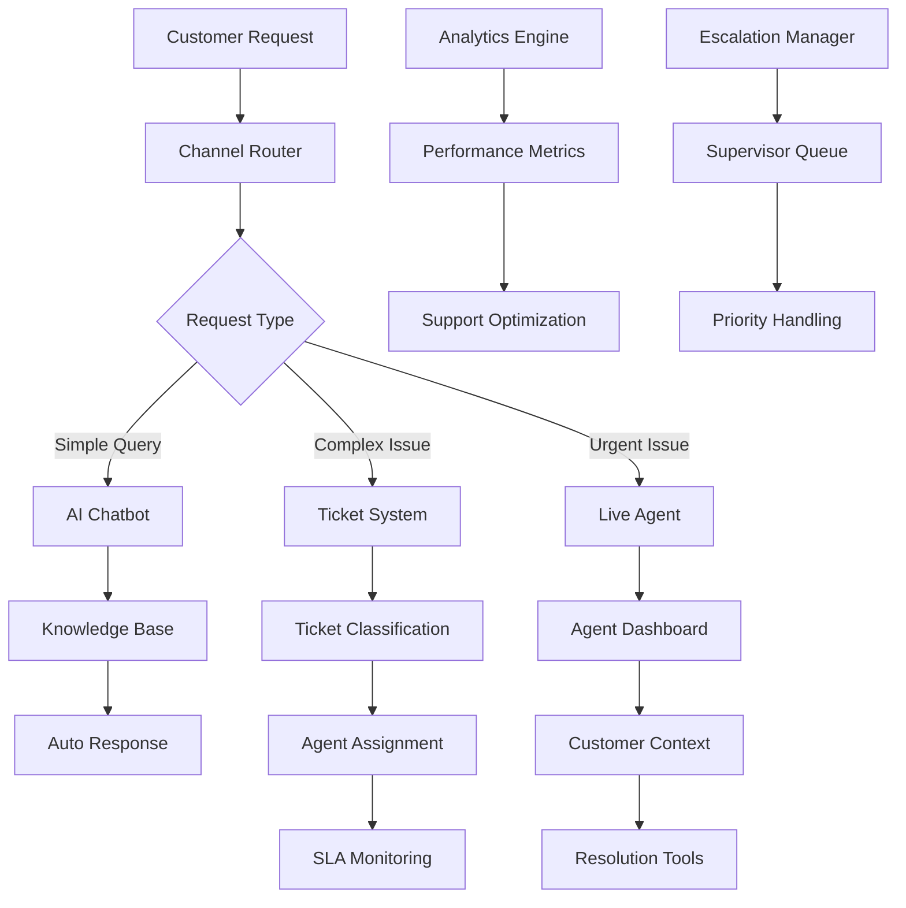

# Customer Support & Ticketing Services

The Customer Support & Ticketing Services provide comprehensive in-app customer service infrastructure, enabling multi-channel support, intelligent ticket routing, real-time chat, and automated issue resolution for the NexVestXR V2 platform.

## 🎧 Service Overview

### Core Capabilities
- **Multi-Channel Support**: In-app chat, email, phone, video calls, and social media
- **Intelligent Ticket Routing**: AI-powered categorization and assignment
- **Real-Time Chat System**: Live chat with support agents and AI chatbots
- **Knowledge Base Integration**: Self-service help center with searchable articles
- **Escalation Management**: Automated escalation based on priority and SLA
- **Performance Analytics**: Support metrics, agent performance, and customer satisfaction
- **Multi-Language Support**: Arabic, English, and regional language support

### Support Architecture


## 🏗️ Ticketing System

### Ticket Management Engine
```javascript
const ticketingSystem = {
  // Ticket Categories
  ticketCategories: {
    investment_support: {
      subcategories: [
        "property_investment_help",
        "token_purchase_issues",
        "portfolio_questions",
        "dividend_inquiries",
        "staking_support"
      ],
      priority: "medium",
      sla: "4_hours",
      escalation_tier: "investment_specialist"
    },
    
    technical_support: {
      subcategories: [
        "app_not_working",
        "login_issues",
        "payment_failures", 
        "wallet_connection_problems",
        "trading_platform_issues"
      ],
      priority: "high",
      sla: "2_hours",
      escalation_tier: "technical_specialist"
    },
    
    account_support: {
      subcategories: [
        "kyc_verification",
        "account_security",
        "profile_updates",
        "document_upload_help",
        "2fa_assistance"
      ],
      priority: "medium",
      sla: "6_hours",
      escalation_tier: "account_specialist"
    },
    
    compliance_support: {
      subcategories: [
        "regulatory_questions",
        "tax_documentation",
        "aml_inquiries",
        "reporting_help",
        "legal_clarifications"
      ],
      priority: "high",
      sla: "4_hours",
      escalation_tier: "compliance_specialist"
    },
    
    billing_support: {
      subcategories: [
        "payment_issues",
        "refund_requests",
        "billing_disputes",
        "subscription_help",
        "fee_clarifications"
      ],
      priority: "high",
      sla: "3_hours",
      escalation_tier: "billing_specialist"
    }
  },
  
  // Ticket Creation and Processing
  createTicket: async (ticketData) => {
    const {
      user_id,
      channel,
      subject,
      description,
      attachments,
      priority_override,
      language
    } = ticketData;
    
    // AI-powered categorization
    const classification = await classifyTicket(subject, description);
    
    // Determine priority and SLA
    const category = ticketingSystem.ticketCategories[classification.category];
    const priority = priority_override || category.priority;
    const sla = calculateSLA(priority, category.sla);
    
    // Create ticket
    const ticket = {
      id: generateTicketId(),
      user_id: user_id,
      subject: subject,
      description: description,
      category: classification.category,
      subcategory: classification.subcategory,
      priority: priority,
      status: "open",
      channel: channel,
      language: language,
      sla_deadline: sla.deadline,
      created_at: new Date(),
      updated_at: new Date(),
      assigned_agent: null,
      tags: classification.tags,
      attachments: attachments || [],
      conversation_history: []
    };
    
    // Store ticket
    await storeTicket(ticket);
    
    // Auto-assign agent
    const assignment = await autoAssignAgent(ticket);
    if (assignment.agent) {
      ticket.assigned_agent = assignment.agent.id;
      await updateTicket(ticket.id, { assigned_agent: assignment.agent.id });
      await notifyAgentNewAssignment(assignment.agent.id, ticket);
    }
    
    // Send confirmation to customer
    await sendTicketConfirmation(user_id, ticket, channel);
    
    // Check for immediate auto-resolution
    const autoResolution = await attemptAutoResolution(ticket);
    if (autoResolution.resolved) {
      await closeTicket(ticket.id, autoResolution.solution, "auto_resolved");
    }
    
    return ticket;
  },
  
  // Intelligent Agent Assignment
  agentAssignment: {
    autoAssignAgent: async (ticket) => {
      // Get available agents for category
      const availableAgents = await getAvailableAgents(ticket.category, ticket.language);
      
      if (availableAgents.length === 0) {
        // No agents available, queue ticket
        await queueTicket(ticket.id);
        return { agent: null, queued: true };
      }
      
      // Score agents based on multiple factors
      const agentScores = await Promise.all(availableAgents.map(async (agent) => {
        const score = await calculateAgentScore(agent, ticket);
        return { agent, score };
      }));
      
      // Sort by score and assign to best agent
      const bestAgent = agentScores.sort((a, b) => b.score - a.score)[0];
      
      return { agent: bestAgent.agent, queued: false };
    },
    
    calculateAgentScore: async (agent, ticket) => {
      let score = 0;
      
      // Specialization match
      if (agent.specializations.includes(ticket.category)) {
        score += 40;
      }
      
      // Language capability
      if (agent.languages.includes(ticket.language)) {
        score += 20;
      }
      
      // Current workload (inverse)
      const workload = await getAgentWorkload(agent.id);
      score += Math.max(0, 30 - workload.active_tickets);
      
      // Performance rating
      const performance = await getAgentPerformance(agent.id);
      score += performance.rating * 5; // Rating out of 10
      
      // Online status
      if (agent.status === 'online') {
        score += 10;
      }
      
      return score;
    }
  }
};
```

### Real-Time Chat System
```javascript
const chatSystem = {
  // Chat Configuration
  chatConfig: {
    channels: {
      web_chat: {
        enabled: true,
        auto_response: true,
        queue_position: true,
        file_upload: true,
        typing_indicators: true
      },
      
      mobile_chat: {
        enabled: true,
        push_notifications: true,
        offline_messages: true,
        voice_messages: true,
        screen_sharing: false
      },
      
      video_chat: {
        enabled: true,
        screen_sharing: true,
        recording: true,
        max_duration: "30_minutes"
      }
    },
    
    operating_hours: {
      timezone: "UTC+4", // UAE time
      weekdays: "08:00-20:00",
      weekends: "10:00-18:00",
      holidays: "limited_hours"
    }
  },
  
  // Real-Time Chat Implementation
  initializeChat: async (userId, chatType = 'web_chat') => {
    // Check if user has existing active chat
    const existingChat = await getActiveChat(userId);
    if (existingChat) {
      return existingChat;
    }
    
    // Create new chat session
    const chatSession = {
      id: generateChatId(),
      user_id: userId,
      chat_type: chatType,
      status: 'waiting',
      created_at: new Date(),
      agent_id: null,
      queue_position: await getChatQueuePosition(),
      context: await getUserContext(userId),
      messages: []
    };
    
    await storeChatSession(chatSession);
    
    // Try to assign agent immediately
    const agentAssignment = await findAvailableAgent(chatType);
    
    if (agentAssignment.available) {
      chatSession.agent_id = agentAssignment.agent.id;
      chatSession.status = 'active';
      await updateChatSession(chatSession.id, {
        agent_id: agentAssignment.agent.id,
        status: 'active',
        queue_position: 0
      });
      
      // Notify both parties
      await notifyUserChatStarted(userId, agentAssignment.agent);
      await notifyAgentNewChat(agentAssignment.agent.id, chatSession);
    } else {
      // Add to queue with estimated wait time
      const waitTime = await estimateWaitTime();
      await notifyUserQueued(userId, waitTime, chatSession.queue_position);
    }
    
    return chatSession;
  },
  
  // Message Handling
  messageHandler: {
    sendMessage: async (chatId, senderId, message, messageType = 'text') => {
      const chatSession = await getChatSession(chatId);
      
      if (!chatSession) {
        throw new Error('Chat session not found');
      }
      
      const messageObj = {
        id: generateMessageId(),
        chat_id: chatId,
        sender_id: senderId,
        sender_type: senderId === chatSession.user_id ? 'user' : 'agent',
        message: message,
        message_type: messageType,
        timestamp: new Date(),
        read: false,
        metadata: {}
      };
      
      // Store message
      await storeMessage(messageObj);
      
      // Real-time delivery via WebSocket
      await deliverMessageRealTime(chatSession, messageObj);
      
      // Update chat session
      await updateChatLastActivity(chatId);
      
      // Trigger auto-responses if needed
      if (messageObj.sender_type === 'user') {
        await checkAutoResponse(chatSession, messageObj);
      }
      
      return messageObj;
    },
    
    checkAutoResponse: async (chatSession, userMessage) => {
      // Check if agent is typing (don't auto-respond)
      const agentTyping = await checkAgentTyping(chatSession.agent_id);
      if (agentTyping) return;
      
      // AI-powered auto-response
      const autoResponse = await generateAutoResponse(userMessage.message, chatSession.context);
      
      if (autoResponse.confidence > 0.8 && autoResponse.can_resolve) {
        await chatSystem.messageHandler.sendMessage(
          chatSession.id,
          'system',
          autoResponse.message,
          'auto_response'
        );
        
        // Check if issue is resolved
        if (autoResponse.resolution_provided) {
          await markChatResolved(chatSession.id, autoResponse.resolution);
        }
      }
    }
  },
  
  // AI Chatbot Integration
  aiChatbot: {
    processUserQuery: async (query, userContext) => {
      // Natural language processing
      const intent = await identifyIntent(query);
      const entities = await extractEntities(query);
      
      // Knowledge base search
      const kbResults = await searchKnowledgeBase(intent, entities);
      
      // Generate response
      const response = await generateBotResponse(intent, entities, kbResults, userContext);
      
      return {
        response: response.message,
        confidence: response.confidence,
        suggested_actions: response.actions,
        escalate_to_human: response.confidence < 0.7,
        knowledge_base_articles: kbResults.slice(0, 3)
      };
    },
    
    // Common Intents
    intentHandlers: {
      check_investment_status: async (entities, userContext) => {
        const investments = await getUserInvestments(userContext.user_id);
        return {
          message: `You have ${investments.length} active investments with a total value of ${investments.total_value}. Would you like to see detailed information about any specific investment?`,
          confidence: 0.95,
          actions: ['view_portfolio', 'investment_details']
        };
      },
      
      kyc_status_inquiry: async (entities, userContext) => {
        const kycStatus = await getKYCStatus(userContext.user_id);
        return {
          message: `Your KYC verification status is: ${kycStatus.status}. ${kycStatus.status === 'pending' ? 'We typically process applications within 24-48 hours.' : ''}`,
          confidence: 0.98,
          actions: kycStatus.status === 'pending' ? ['check_documents'] : ['view_limits']
        };
      },
      
      payment_issues: async (entities, userContext) => {
        const recentTransactions = await getRecentTransactions(userContext.user_id, 7);
        const failedTransactions = recentTransactions.filter(t => t.status === 'failed');
        
        if (failedTransactions.length > 0) {
          return {
            message: `I see you have ${failedTransactions.length} failed transactions. The most common causes are insufficient funds or bank restrictions. Would you like me to help you resolve this?`,
            confidence: 0.9,
            actions: ['retry_payment', 'contact_bank', 'try_different_method']
          };
        } else {
          return {
            message: "I don't see any recent payment issues. Could you describe what specific problem you're experiencing?",
            confidence: 0.8,
            actions: ['describe_issue', 'contact_agent']
          };
        }
      }
    }
  }
};
```

## 📚 Knowledge Base System

### Self-Service Help Center
```javascript
const knowledgeBase = {
  // Article Categories
  articleCategories: {
    getting_started: {
      name: "Getting Started",
      description: "Basic platform orientation and first steps",
      articles: [
        "how_to_register_account",
        "completing_kyc_verification", 
        "making_first_investment",
        "understanding_dual_tokens",
        "mobile_app_setup"
      ],
      languages: ["en", "ar"]
    },
    
    investment_guide: {
      name: "Investment Guide",
      description: "Investment processes and strategies",
      articles: [
        "xera_vs_propx_tokens",
        "property_selection_guide",
        "risk_assessment",
        "portfolio_diversification",
        "expected_returns"
      ],
      languages: ["en", "ar"]
    },
    
    trading_help: {
      name: "Trading Help", 
      description: "Trading platform and features",
      articles: [
        "placing_buy_sell_orders",
        "understanding_order_types",
        "trading_fees_structure",
        "market_data_interpretation",
        "liquidity_pools"
      ],
      languages: ["en", "ar"]
    },
    
    troubleshooting: {
      name: "Troubleshooting",
      description: "Common issues and solutions",
      articles: [
        "login_problems",
        "payment_failures",
        "app_crashes",
        "wallet_connection_issues",
        "verification_delays"
      ],
      languages: ["en", "ar"]
    }
  },
  
  // Article Management
  articleManagement: {
    createArticle: async (articleData) => {
      const {
        title,
        content,
        category,
        language,
        tags,
        author,
        status
      } = articleData;
      
      const article = {
        id: generateArticleId(),
        title: title,
        content: content,
        category: category,
        language: language,
        tags: tags,
        author: author,
        status: status || 'draft',
        created_at: new Date(),
        updated_at: new Date(),
        views: 0,
        helpful_votes: 0,
        unhelpful_votes: 0,
        search_keywords: await extractSearchKeywords(title, content)
      };
      
      await storeArticle(article);
      
      // Index for search
      await indexArticleForSearch(article);
      
      return article;
    },
    
    searchArticles: async (query, language = 'en', filters = {}) => {
      // Elasticsearch-powered search
      const searchResults = await searchArticleIndex({
        query: query,
        language: language,
        category: filters.category,
        tags: filters.tags,
        size: 20
      });
      
      // Rank results by relevance and popularity
      const rankedResults = await rankSearchResults(searchResults, query);
      
      return {
        total_results: rankedResults.length,
        articles: rankedResults,
        suggested_searches: await getSuggestedSearches(query),
        related_categories: await getRelatedCategories(query)
      };
    }
  },
  
  // Smart Suggestions
  smartSuggestions: {
    getContextualHelp: async (userId, currentPage, userAction) => {
      // Analyze user context
      const userProfile = await getUserProfile(userId);
      const userHistory = await getUserActionHistory(userId);
      
      // Get contextual articles
      const suggestions = await getContextualArticles(currentPage, userAction, userProfile);
      
      // Personalize based on user level
      const personalizedSuggestions = await personalizeContent(suggestions, userProfile);
      
      return {
        immediate_help: personalizedSuggestions.slice(0, 3),
        related_articles: personalizedSuggestions.slice(3, 8),
        video_tutorials: await getRelatedVideos(currentPage),
        quick_actions: await getQuickActions(currentPage, userProfile)
      };
    }
  }
};
```

## 📊 Support Analytics & Performance

### Performance Monitoring
```javascript
const supportAnalytics = {
  // Key Performance Indicators
  kpiTracking: {
    calculateSupportMetrics: async (timeframe) => {
      const tickets = await getTicketsInTimeframe(timeframe);
      const chats = await getChatsInTimeframe(timeframe);
      
      return {
        // Ticket Metrics
        total_tickets: tickets.length,
        resolved_tickets: tickets.filter(t => t.status === 'resolved').length,
        average_resolution_time: await calculateAverageResolutionTime(tickets),
        first_response_time: await calculateFirstResponseTime(tickets),
        sla_compliance: await calculateSLACompliance(tickets),
        
        // Chat Metrics
        total_chats: chats.length,
        average_chat_duration: await calculateAverageChatDuration(chats),
        chat_abandonment_rate: await calculateChatAbandonmentRate(chats),
        average_wait_time: await calculateAverageWaitTime(chats),
        
        // Customer Satisfaction
        csat_score: await calculateCSATScore(timeframe),
        nps_score: await calculateNPSScore(timeframe),
        
        // Agent Performance
        agent_utilization: await calculateAgentUtilization(timeframe),
        agent_productivity: await calculateAgentProductivity(timeframe)
      };
    },
    
    generatePerformanceReport: async (reportType, timeframe) => {
      const metrics = await supportAnalytics.kpiTracking.calculateSupportMetrics(timeframe);
      
      switch (reportType) {
        case 'executive':
          return {
            summary: await generateExecutiveSummary(metrics),
            key_insights: await generateKeyInsights(metrics),
            recommendations: await generateRecommendations(metrics),
            trend_analysis: await analyzeTrends(metrics, timeframe)
          };
          
        case 'operational':
          return {
            detailed_metrics: metrics,
            agent_breakdown: await getAgentPerformanceBreakdown(timeframe),
            queue_analysis: await analyzeQueuePerformance(timeframe),
            capacity_planning: await generateCapacityRecommendations(metrics)
          };
          
        case 'customer_insights':
          return {
            satisfaction_analysis: await analyzeCustomerSatisfaction(timeframe),
            common_issues: await identifyCommonIssues(timeframe),
            user_journey_analysis: await analyzeUserJourneys(timeframe),
            feedback_themes: await analyzeFeedbackThemes(timeframe)
          };
      }
    }
  },
  
  // Real-Time Dashboards
  realTimeDashboard: {
    getLiveSupportStatus: async () => {
      return {
        // Current Queue Status
        tickets_in_queue: await getQueuedTicketsCount(),
        average_wait_time: await getCurrentAverageWaitTime(),
        longest_wait_time: await getLongestWaitTime(),
        
        // Agent Status
        agents_online: await getOnlineAgentsCount(),
        agents_available: await getAvailableAgentsCount(),
        agents_busy: await getBusyAgentsCount(),
        
        // Active Conversations
        active_chats: await getActiveChatCount(),
        pending_responses: await getPendingResponseCount(),
        escalated_issues: await getEscalatedIssueCount(),
        
        // System Health
        response_time: await getCurrentResponseTime(),
        system_status: await getSystemHealthStatus(),
        integration_status: await getIntegrationStatus()
      };
    }
  }
};
```

### Customer Feedback System
```javascript
const feedbackSystem = {
  // Feedback Collection
  feedbackCollection: {
    collectTicketFeedback: async (ticketId, feedback) => {
      const ticket = await getTicket(ticketId);
      
      const feedbackRecord = {
        id: generateFeedbackId(),
        ticket_id: ticketId,
        user_id: ticket.user_id,
        agent_id: ticket.assigned_agent,
        rating: feedback.rating, // 1-5 scale
        category_ratings: {
          response_time: feedback.response_time_rating,
          agent_helpfulness: feedback.agent_helpfulness_rating,
          issue_resolution: feedback.resolution_rating,
          overall_experience: feedback.overall_rating
        },
        comments: feedback.comments,
        would_recommend: feedback.would_recommend,
        improvement_suggestions: feedback.suggestions,
        timestamp: new Date()
      };
      
      await storeFeedback(feedbackRecord);
      
      // Update agent performance metrics
      await updateAgentMetrics(ticket.assigned_agent, feedbackRecord);
      
      // Trigger improvement actions if needed
      if (feedback.rating <= 2) {
        await triggerImprovementWorkflow(feedbackRecord);
      }
      
      return feedbackRecord;
    },
    
    collectChatFeedback: async (chatId, feedback) => {
      const chat = await getChatSession(chatId);
      
      const feedbackRecord = {
        id: generateFeedbackId(),
        chat_id: chatId,
        user_id: chat.user_id,
        agent_id: chat.agent_id,
        rating: feedback.rating,
        wait_time_satisfaction: feedback.wait_time_rating,
        agent_performance: feedback.agent_rating,
        issue_resolved: feedback.resolved,
        comments: feedback.comments,
        timestamp: new Date()
      };
      
      await storeFeedback(feedbackRecord);
      
      return feedbackRecord;
    }
  },
  
  // Feedback Analysis
  feedbackAnalysis: {
    analyzeFeedbackTrends: async (timeframe) => {
      const feedback = await getFeedbackInTimeframe(timeframe);
      
      return {
        overall_satisfaction: calculateAverageRating(feedback),
        rating_distribution: calculateRatingDistribution(feedback),
        trending_issues: identifyTrendingIssues(feedback),
        improvement_areas: identifyImprovementAreas(feedback),
        positive_feedback_themes: extractPositiveThemes(feedback),
        negative_feedback_themes: extractNegativeThemes(feedback)
      };
    }
  }
};
```

## 🌍 Multi-Language Support

### Localization Management
```javascript
const localizationSupport = {
  // Supported Languages
  supportedLanguages: {
    primary: {
      en: {
        name: "English",
        native_name: "English", 
        code: "en-US",
        rtl: false,
        agent_availability: "24/7"
      },
      ar: {
        name: "Arabic",
        native_name: "العربية",
        code: "ar-AE",
        rtl: true,
        agent_availability: "08:00-20:00 UTC+4"
      }
    },
    
    secondary: {
      hi: {
        name: "Hindi",
        native_name: "हिन्दी",
        code: "hi-IN",
        rtl: false,
        agent_availability: "09:00-18:00 UTC+5:30"
      },
      ur: {
        name: "Urdu", 
        native_name: "اردو",
        code: "ur-PK",
        rtl: true,
        agent_availability: "Limited hours"
      }
    }
  },
  
  // Language Detection and Routing
  languageRouting: {
    detectUserLanguage: async (userId, request) => {
      // Priority order: User preference > Browser setting > Geolocation
      const userProfile = await getUserProfile(userId);
      
      if (userProfile.preferred_language) {
        return userProfile.preferred_language;
      }
      
      // Browser language detection
      const browserLanguage = request.headers['accept-language'];
      const detectedLanguage = parseAcceptLanguage(browserLanguage);
      
      // Fallback to location-based detection
      if (!detectedLanguage) {
        const userLocation = await getUserLocation(userId);
        return getDefaultLanguageForCountry(userLocation.country);
      }
      
      return detectedLanguage;
    },
    
    routeToLanguageSupport: async (ticketId, language) => {
      const agents = await getAgentsByLanguage(language);
      
      if (agents.length === 0) {
        // No native language agents, use translation service
        await enableTranslationService(ticketId, language);
        return await assignBestAvailableAgent(ticketId);
      }
      
      return await assignLanguageSpecificAgent(ticketId, agents);
    }
  },
  
  // Real-Time Translation
  translationService: {
    translateMessage: async (message, fromLanguage, toLanguage) => {
      // Use multiple translation services for accuracy
      const translations = await Promise.all([
        translateWithGoogle(message, fromLanguage, toLanguage),
        translateWithAzure(message, fromLanguage, toLanguage),
        translateWithAWS(message, fromLanguage, toLanguage)
      ]);
      
      // Choose best translation based on confidence scores
      const bestTranslation = selectBestTranslation(translations);
      
      return {
        translated_text: bestTranslation.text,
        confidence: bestTranslation.confidence,
        original_text: message,
        from_language: fromLanguage,
        to_language: toLanguage,
        translation_service: bestTranslation.service
      };
    }
  }
};
```

## 🔧 Configuration & Integration

### Support Service Configuration
```bash
# Customer Support Configuration
SUPPORT_SYSTEM_ENABLED=true
CHAT_SYSTEM_ENABLED=true
KNOWLEDGE_BASE_ENABLED=true
AI_CHATBOT_ENABLED=true

# Operating Hours (UTC+4 for UAE)
SUPPORT_WEEKDAY_HOURS=08:00-20:00
SUPPORT_WEEKEND_HOURS=10:00-18:00
EMERGENCY_SUPPORT_24_7=true

# SLA Configuration
STANDARD_SLA_HOURS=4
PRIORITY_SLA_HOURS=2
URGENT_SLA_HOURS=1
ESCALATION_THRESHOLD_HOURS=6

# Chat Configuration
MAX_CONCURRENT_CHATS_PER_AGENT=3
CHAT_TIMEOUT_MINUTES=30
QUEUE_POSITION_UPDATES=true
ESTIMATED_WAIT_TIME=true

# AI Chatbot Configuration
CHATBOT_CONFIDENCE_THRESHOLD=0.7
AUTO_ESCALATION_ENABLED=true
KNOWLEDGE_BASE_SEARCH_ENABLED=true
INTENT_CLASSIFICATION_ENABLED=true

# Notification Configuration
TICKET_NOTIFICATIONS_ENABLED=true
SLA_WARNING_NOTIFICATIONS=true
ESCALATION_NOTIFICATIONS=true
CUSTOMER_SATISFACTION_SURVEYS=true

# Integration Configuration
SLACK_INTEGRATION_ENABLED=true
TEAMS_INTEGRATION_ENABLED=true
SALESFORCE_INTEGRATION_ENABLED=false
ZENDESK_MIGRATION_ENABLED=false
```

### Support API Endpoints
```javascript
const supportAPIEndpoints = {
  // Ticket Management
  "POST /api/support/tickets": "Create new support ticket",
  "GET /api/support/tickets/{ticketId}": "Get ticket details",
  "PUT /api/support/tickets/{ticketId}": "Update ticket",
  "POST /api/support/tickets/{ticketId}/messages": "Add message to ticket",
  "GET /api/support/tickets/user/{userId}": "Get user's tickets",
  
  // Chat System
  "POST /api/support/chat/initiate": "Start new chat session",
  "GET /api/support/chat/{chatId}": "Get chat session details",
  "POST /api/support/chat/{chatId}/message": "Send chat message",
  "PUT /api/support/chat/{chatId}/status": "Update chat status",
  "GET /api/support/chat/queue": "Get current queue status",
  
  // Knowledge Base
  "GET /api/support/kb/articles": "Search knowledge base articles",
  "GET /api/support/kb/articles/{articleId}": "Get specific article",
  "GET /api/support/kb/categories": "Get article categories",
  "POST /api/support/kb/articles/{articleId}/feedback": "Submit article feedback",
  
  // AI Chatbot
  "POST /api/support/chatbot/query": "Send query to AI chatbot",
  "GET /api/support/chatbot/suggestions": "Get suggested responses",
  
  // Feedback
  "POST /api/support/feedback/ticket": "Submit ticket feedback",
  "POST /api/support/feedback/chat": "Submit chat feedback",
  "GET /api/support/feedback/analytics": "Get feedback analytics",
  
  // Agent Dashboard
  "GET /api/support/agent/dashboard": "Get agent dashboard data",
  "GET /api/support/agent/tickets": "Get assigned tickets",
  "PUT /api/support/agent/status": "Update agent status",
  "GET /api/support/analytics/performance": "Get support performance metrics"
};
```

---

*Customer Support & Ticketing Services - Comprehensive in-app customer service infrastructure for NexVestXR V2*