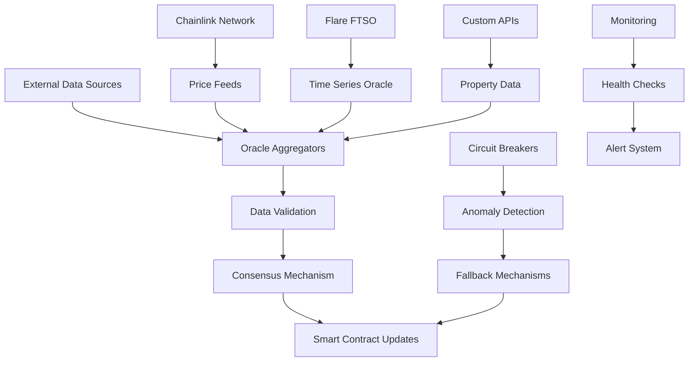

# Oracle Services

The Oracle Services provide reliable, real-time external data feeds to the NexVestXR V2 platform, enabling accurate property valuations, market data integration, and regulatory compliance through decentralized and trusted data sources.

## 🔮 Service Overview

### Core Capabilities
- **Price Feed Oracles**: Real-time cryptocurrency and fiat currency exchange rates
- **Property Valuation Oracles**: Market-based property pricing and valuation data
- **Market Data Oracles**: Real estate market trends and analytics
- **Regulatory Oracles**: Compliance data from RERA, DLD, and other authorities
- **Multi-Chain Integration**: Chainlink, Flare FTSO, and custom oracle networks
- **Data Verification**: Multiple source validation and consensus mechanisms

### Oracle Architecture


## 🏗️ Oracle Infrastructure

### Price Feed Oracles
```javascript
const priceFeedOracles = {
  // Supported Price Pairs
  pricePairs: {
    crypto: [
      "BTC/USD", "ETH/USD", "XRP/USD", "FLR/USD",
      "XERA/USD", "PROPX/USD"
    ],
    fiat: [
      "USD/AED", "EUR/AED", "GBP/AED", "INR/USD",
      "SAR/AED", "QAR/AED", "KWD/AED"
    ],
    commodities: [
      "GOLD/USD", "SILVER/USD", "OIL/USD"
    ]
  },
  
  // Oracle Sources
  sources: {
    chainlink: {
      networks: ["polygon", "ethereum", "arbitrum"],
      update_frequency: "heartbeat_based",
      deviation_threshold: "0.5%",
      reliability: "99.9%"
    },
    
    flare_ftso: {
      networks: ["flare", "songbird"],
      update_frequency: "3_minutes",
      price_providers: 100,
      reliability: "99.5%"
    },
    
    custom_apis: {
      sources: ["coinbase", "binance", "coingecko", "exchangerates_api"],
      update_frequency: "5_minutes",
      aggregation: "weighted_average",
      reliability: "99.0%"
    }
  },
  
  // Price Aggregation
  aggregatePrice: async (symbol) => {
    const prices = [];
    
    // Fetch from Chainlink
    try {
      const chainlinkPrice = await getChainlinkPrice(symbol);
      prices.push({
        source: "chainlink",
        price: chainlinkPrice.price,
        timestamp: chainlinkPrice.timestamp,
        reliability: 0.4 // 40% weight
      });
    } catch (error) {
      console.log(`Chainlink price fetch failed for ${symbol}: ${error.message}`);
    }
    
    // Fetch from Flare FTSO
    try {
      const flarePrice = await getFlarePrice(symbol);
      prices.push({
        source: "flare_ftso",
        price: flarePrice.price,
        timestamp: flarePrice.timestamp,
        reliability: 0.3 // 30% weight
      });
    } catch (error) {
      console.log(`Flare FTSO price fetch failed for ${symbol}: ${error.message}`);
    }
    
    // Fetch from External APIs
    try {
      const apiPrices = await getExternalAPIPrices(symbol);
      for (const apiPrice of apiPrices) {
        prices.push({
          source: apiPrice.source,
          price: apiPrice.price,
          timestamp: apiPrice.timestamp,
          reliability: 0.3 / apiPrices.length // Split remaining 30%
        });
      }
    } catch (error) {
      console.log(`External API price fetch failed for ${symbol}: ${error.message}`);
    }
    
    // Calculate weighted average
    if (prices.length === 0) {
      throw new Error(`No price data available for ${symbol}`);
    }
    
    const totalWeight = prices.reduce((sum, p) => sum + p.reliability, 0);
    const weightedPrice = prices.reduce((sum, p) => sum + (p.price * p.reliability), 0) / totalWeight;
    
    // Detect anomalies
    const priceDeviation = calculatePriceDeviation(prices);
    if (priceDeviation > 0.05) { // 5% deviation threshold
      await triggerAnomalyAlert(symbol, prices, priceDeviation);
    }
    
    return {
      symbol: symbol,
      price: weightedPrice,
      sources: prices.length,
      confidence: calculateConfidence(prices),
      deviation: priceDeviation,
      timestamp: new Date(),
      next_update: new Date(Date.now() + 300000) // 5 minutes
    };
  }
};
```

### Property Valuation Oracles
```javascript
const propertyOracles = {
  // Valuation Data Sources
  valuationSources: {
    mls_data: {
      description: "Multiple Listing Service data",
      coverage: ["UAE", "India"],
      update_frequency: "daily",
      reliability: "high"
    },
    
    government_records: {
      description: "Official property transaction records",
      sources: ["DLD", "RERA", "Sub_Registrar"],
      update_frequency: "real_time",
      reliability: "highest"
    },
    
    market_analytics: {
      description: "Professional real estate analytics",
      providers: ["CoreLogic", "Colliers", "JLL"],
      update_frequency: "weekly",
      reliability: "high"
    },
    
    satellite_imagery: {
      description: "Property condition and development tracking",
      providers: ["Google_Earth", "Planet_Labs"],
      update_frequency: "monthly",
      reliability: "medium"
    }
  },
  
  // Property Valuation Engine
  getPropertyValuation: async (propertyId) => {
    const property = await getPropertyDetails(propertyId);
    const valuationData = {};
    
    // Fetch comparable sales
    const comparables = await getComparableSales(property.location, property.type, property.size);
    valuationData.comparable_sales = {
      count: comparables.length,
      average_price_psf: calculateAveragePrice(comparables),
      price_range: calculatePriceRange(comparables),
      last_updated: new Date()
    };
    
    // Fetch market trends
    const marketTrends = await getMarketTrends(property.location, "12_months");
    valuationData.market_trends = {
      price_appreciation: marketTrends.price_change,
      demand_score: marketTrends.demand_score,
      supply_score: marketTrends.supply_score,
      forecast_6m: marketTrends.forecast_6m
    };
    
    // Fetch development status (for under-construction properties)
    if (property.status === "under_construction") {
      const developmentStatus = await getDevelopmentStatus(propertyId);
      valuationData.development_status = {
        completion_percentage: developmentStatus.completion,
        timeline_adherence: developmentStatus.on_schedule,
        quality_score: developmentStatus.quality_rating
      };
    }
    
    // Calculate final valuation
    const baseValuation = property.size * valuationData.comparable_sales.average_price_psf;
    const adjustments = calculateValuationAdjustments(property, valuationData);
    const finalValuation = baseValuation * adjustments.total_adjustment;
    
    return {
      property_id: propertyId,
      estimated_value: finalValuation,
      confidence_level: calculateValuationConfidence(valuationData),
      valuation_breakdown: {
        base_value: baseValuation,
        location_adjustment: adjustments.location,
        condition_adjustment: adjustments.condition,
        market_adjustment: adjustments.market,
        development_adjustment: adjustments.development
      },
      data_sources: Object.keys(valuationData),
      valuation_date: new Date(),
      next_valuation: new Date(Date.now() + 30 * 24 * 60 * 60 * 1000) // 30 days
    };
  }
};
```

### Regulatory Compliance Oracles
```javascript
const complianceOracles = {
  // RERA Integration (Dubai)
  reraOracle: {
    endpoints: {
      property_status: "https://api.rera.dubai.gov.ae/properties/status",
      developer_verification: "https://api.rera.dubai.gov.ae/developers/verify",
      project_approvals: "https://api.rera.dubai.gov.ae/projects/approvals",
      sales_permits: "https://api.rera.dubai.gov.ae/permits/sales"
    },
    
    fetchRERAData: async (dataType, identifier) => {
      const endpoint = complianceOracles.reraOracle.endpoints[dataType];
      
      try {
        const response = await fetch(`${endpoint}/${identifier}`, {
          headers: {
            'Authorization': `Bearer ${process.env.RERA_API_KEY}`,
            'Content-Type': 'application/json'
          }
        });
        
        if (!response.ok) {
          throw new Error(`RERA API error: ${response.statusText}`);
        }
        
        const data = await response.json();
        
        return {
          data: data,
          source: "rera_dubai",
          timestamp: new Date(),
          validity: data.validity_period,
          compliance_status: data.status
        };
      } catch (error) {
        console.error(`RERA data fetch failed: ${error.message}`);
        throw error;
      }
    }
  },
  
  // DLD Integration (Dubai Land Department)
  dldOracle: {
    endpoints: {
      title_verification: "https://api.dld.dubai.gov.ae/titles/verify",
      ownership_records: "https://api.dld.dubai.gov.ae/ownership/records",
      transaction_history: "https://api.dld.dubai.gov.ae/transactions/history",
      property_details: "https://api.dld.dubai.gov.ae/properties/details"
    },
    
    fetchDLDData: async (dataType, identifier) => {
      const endpoint = complianceOracles.dldOracle.endpoints[dataType];
      
      try {
        const response = await fetch(`${endpoint}/${identifier}`, {
          headers: {
            'Authorization': `Bearer ${process.env.DLD_API_KEY}`,
            'Content-Type': 'application/json'
          }
        });
        
        const data = await response.json();
        
        return {
          data: data,
          source: "dld_dubai",
          timestamp: new Date(),
          verification_status: data.verified,
          registration_number: data.registration_number
        };
      } catch (error) {
        console.error(`DLD data fetch failed: ${error.message}`);
        throw error;
      }
    }
  },
  
  // Multi-Jurisdictional Compliance
  complianceAggregator: {
    checkCompliance: async (propertyId, jurisdiction) => {
      const complianceData = {};
      
      switch (jurisdiction) {
        case 'UAE':
          complianceData.rera = await complianceOracles.reraOracle.fetchRERAData('property_status', propertyId);
          complianceData.dld = await complianceOracles.dldOracle.fetchDLDData('title_verification', propertyId);
          break;
          
        case 'India':
          complianceData.sebi = await fetchSEBICompliance(propertyId);
          complianceData.rera_india = await fetchRERAIndiaCompliance(propertyId);
          break;
      }
      
      // Aggregate compliance score
      const complianceScore = calculateComplianceScore(complianceData);
      
      return {
        property_id: propertyId,
        jurisdiction: jurisdiction,
        compliance_score: complianceScore,
        compliance_details: complianceData,
        last_checked: new Date(),
        next_check: new Date(Date.now() + 24 * 60 * 60 * 1000), // Daily
        status: complianceScore > 0.8 ? 'compliant' : 'non_compliant'
      };
    }
  }
};
```

## 🔧 Oracle Management

### Health Monitoring & Circuit Breakers
```javascript
const oracleManagement = {
  // Health Monitoring
  healthMonitoring: {
    monitorOracles: async () => {
      const oracleHealth = {};
      
      // Check price feed oracles
      for (const pair of priceFeedOracles.pricePairs.crypto) {
        const health = await checkOracleHealth('price_feed', pair);
        oracleHealth[`price_${pair}`] = health;
      }
      
      // Check property oracles
      const propertyOracleHealth = await checkOracleHealth('property', 'valuation');
      oracleHealth.property_valuation = propertyOracleHealth;
      
      // Check compliance oracles
      const complianceHealth = await checkOracleHealth('compliance', 'rera_dld');
      oracleHealth.compliance = complianceHealth;
      
      return oracleHealth;
    },
    
    checkOracleHealth: async (type, identifier) => {
      const startTime = Date.now();
      let status = 'healthy';
      let latency = 0;
      let lastUpdate = null;
      let error = null;
      
      try {
        switch (type) {
          case 'price_feed':
            const priceData = await priceFeedOracles.aggregatePrice(identifier);
            lastUpdate = priceData.timestamp;
            break;
            
          case 'property':
            const propertyData = await propertyOracles.getPropertyValuation('test_property');
            lastUpdate = propertyData.valuation_date;
            break;
            
          case 'compliance':
            const complianceData = await complianceOracles.complianceAggregator.checkCompliance('test_property', 'UAE');
            lastUpdate = complianceData.last_checked;
            break;
        }
        
        latency = Date.now() - startTime;
        
        // Check if data is stale
        const stalenessThreshold = getStalenessThreshold(type);
        if (Date.now() - lastUpdate.getTime() > stalenessThreshold) {
          status = 'stale';
        }
        
        // Check latency
        if (latency > 10000) { // 10 seconds
          status = 'slow';
        }
        
      } catch (err) {
        status = 'failed';
        error = err.message;
        latency = Date.now() - startTime;
      }
      
      return {
        oracle_type: type,
        identifier: identifier,
        status: status,
        latency_ms: latency,
        last_update: lastUpdate,
        error: error,
        check_time: new Date()
      };
    }
  },
  
  // Circuit Breaker Implementation
  circuitBreaker: {
    state: {}, // Track circuit breaker states
    
    executeWithCircuitBreaker: async (oracleFunction, oracleId, fallbackFunction) => {
      const circuitState = oracleManagement.circuitBreaker.state[oracleId] || {
        status: 'closed',
        failureCount: 0,
        lastFailureTime: null,
        halfOpenTime: null
      };
      
      // Check circuit breaker state
      if (circuitState.status === 'open') {
        const timeSinceFailure = Date.now() - circuitState.lastFailureTime;
        const cooldownPeriod = 60000; // 1 minute
        
        if (timeSinceFailure > cooldownPeriod) {
          circuitState.status = 'half_open';
          circuitState.halfOpenTime = Date.now();
        } else {
          // Circuit is open, use fallback
          console.log(`Circuit breaker open for ${oracleId}, using fallback`);
          return await fallbackFunction();
        }
      }
      
      try {
        const result = await oracleFunction();
        
        // Success - reset circuit breaker
        circuitState.status = 'closed';
        circuitState.failureCount = 0;
        circuitState.lastFailureTime = null;
        
        oracleManagement.circuitBreaker.state[oracleId] = circuitState;
        
        return result;
        
      } catch (error) {
        circuitState.failureCount++;
        circuitState.lastFailureTime = Date.now();
        
        // Open circuit if failure threshold exceeded
        const failureThreshold = 5;
        if (circuitState.failureCount >= failureThreshold) {
          circuitState.status = 'open';
          console.log(`Circuit breaker opened for ${oracleId} due to repeated failures`);
        }
        
        oracleManagement.circuitBreaker.state[oracleId] = circuitState;
        
        // Use fallback function
        return await fallbackFunction();
      }
    }
  }
};
```

### Data Quality & Validation
```javascript
const dataQuality = {
  // Data Validation Rules
  validationRules: {
    price_data: {
      min_sources: 2,
      max_deviation: 0.05, // 5%
      staleness_threshold: 300000, // 5 minutes
      value_range: { min: 0, max: 1000000 }
    },
    
    property_data: {
      required_fields: ['location', 'size', 'type', 'value'],
      value_range: { min: 100000, max: 100000000 },
      location_validation: true,
      size_validation: true
    },
    
    compliance_data: {
      required_fields: ['status', 'registration_number', 'validity'],
      status_values: ['valid', 'expired', 'pending', 'revoked'],
      certificate_validation: true
    }
  },
  
  // Data Validation Engine
  validateData: async (dataType, data) => {
    const rules = dataQuality.validationRules[dataType];
    const validationResult = {
      valid: true,
      errors: [],
      warnings: [],
      quality_score: 1.0
    };
    
    switch (dataType) {
      case 'price_data':
        // Check minimum sources
        if (data.sources < rules.min_sources) {
          validationResult.errors.push(`Insufficient data sources: ${data.sources} < ${rules.min_sources}`);
          validationResult.valid = false;
        }
        
        // Check deviation
        if (data.deviation > rules.max_deviation) {
          validationResult.warnings.push(`High price deviation: ${data.deviation * 100}%`);
          validationResult.quality_score *= 0.8;
        }
        
        // Check staleness
        const age = Date.now() - data.timestamp.getTime();
        if (age > rules.staleness_threshold) {
          validationResult.errors.push(`Data is stale: ${age}ms old`);
          validationResult.valid = false;
        }
        
        // Check value range
        if (data.price < rules.value_range.min || data.price > rules.value_range.max) {
          validationResult.errors.push(`Price out of range: ${data.price}`);
          validationResult.valid = false;
        }
        
        break;
        
      case 'property_data':
        // Check required fields
        for (const field of rules.required_fields) {
          if (!data[field]) {
            validationResult.errors.push(`Missing required field: ${field}`);
            validationResult.valid = false;
          }
        }
        
        // Validate location
        if (rules.location_validation && data.location) {
          const locationValid = await validateLocation(data.location);
          if (!locationValid) {
            validationResult.errors.push(`Invalid location: ${data.location}`);
            validationResult.valid = false;
          }
        }
        
        break;
        
      case 'compliance_data':
        // Validate status
        if (!rules.status_values.includes(data.status)) {
          validationResult.errors.push(`Invalid status: ${data.status}`);
          validationResult.valid = false;
        }
        
        // Validate certificate
        if (rules.certificate_validation && data.registration_number) {
          const certValid = await validateCertificate(data.registration_number);
          if (!certValid) {
            validationResult.warnings.push(`Certificate validation failed: ${data.registration_number}`);
            validationResult.quality_score *= 0.9;
          }
        }
        
        break;
    }
    
    return validationResult;
  }
};
```

## 📊 Oracle Analytics

### Performance Metrics
```javascript
const oracleAnalytics = {
  // Performance Tracking
  trackPerformance: async (timeframe) => {
    const metrics = {};
    
    // Price feed performance
    metrics.price_feeds = await analyzePriceFeedPerformance(timeframe);
    
    // Property oracle performance
    metrics.property_oracles = await analyzePropertyOraclePerformance(timeframe);
    
    // Compliance oracle performance
    metrics.compliance_oracles = await analyzeComplianceOraclePerformance(timeframe);
    
    // Overall system performance
    metrics.system_performance = {
      overall_uptime: calculateOverallUptime(metrics),
      average_latency: calculateAverageLatency(metrics),
      data_quality_score: calculateDataQualityScore(metrics),
      cost_efficiency: calculateCostEfficiency(metrics)
    };
    
    return metrics;
  },
  
  // Anomaly Detection
  detectAnomalies: async (dataType, data, historicalData) => {
    const anomalies = [];
    
    // Statistical anomaly detection
    const zScore = calculateZScore(data.value, historicalData);
    if (Math.abs(zScore) > 3) {
      anomalies.push({
        type: 'statistical_outlier',
        severity: 'high',
        z_score: zScore,
        description: `Value is ${Math.abs(zScore).toFixed(2)} standard deviations from mean`
      });
    }
    
    // Trend anomaly detection
    const trendAnomaly = detectTrendAnomaly(data.value, historicalData);
    if (trendAnomaly.detected) {
      anomalies.push({
        type: 'trend_anomaly',
        severity: trendAnomaly.severity,
        description: trendAnomaly.description
      });
    }
    
    // Volatility anomaly detection
    const volatilityAnomaly = detectVolatilityAnomaly(data.value, historicalData);
    if (volatilityAnomaly.detected) {
      anomalies.push({
        type: 'volatility_anomaly',
        severity: volatilityAnomaly.severity,
        description: volatilityAnomaly.description
      });
    }
    
    return {
      anomalies_detected: anomalies.length > 0,
      anomaly_count: anomalies.length,
      anomalies: anomalies,
      risk_score: calculateRiskScore(anomalies)
    };
  }
};
```

## 🔧 Configuration & API

### Oracle Configuration
```bash
# Chainlink Configuration
CHAINLINK_NODE_URL=https://your-chainlink-node.com
CHAINLINK_JOB_IDS=price_feed_job_id,property_job_id

# Flare Configuration
FLARE_RPC_URL=https://flare-api.flare.network/ext/bc/C/rpc
FTSO_PRICE_PROVIDER=0x1234...

# External API Configuration
COINGECKO_API_KEY=your_coingecko_key
EXCHANGERATES_API_KEY=your_exchangerates_key

# Compliance API Configuration
RERA_API_KEY=your_rera_api_key
DLD_API_KEY=your_dld_api_key

# Circuit Breaker Configuration
FAILURE_THRESHOLD=5
COOLDOWN_PERIOD_MS=60000
STALENESS_THRESHOLD_MS=300000
```

### Oracle API Endpoints
```javascript
const oracleAPIEndpoints = {
  // Price Data
  "GET /api/oracles/price/:symbol": "Get current price for symbol",
  "GET /api/oracles/price/:symbol/history": "Get price history",
  "GET /api/oracles/price/supported": "Get supported price pairs",
  
  // Property Data
  "GET /api/oracles/property/:propertyId/valuation": "Get property valuation",
  "GET /api/oracles/property/:propertyId/market-data": "Get market data",
  "POST /api/oracles/property/bulk-valuation": "Bulk property valuation",
  
  // Compliance Data
  "GET /api/oracles/compliance/:propertyId": "Get compliance status",
  "GET /api/oracles/compliance/rera/:developerId": "Get RERA status",
  "GET /api/oracles/compliance/dld/:titleDeedId": "Get DLD verification",
  
  // Oracle Health
  "GET /api/oracles/health": "Get overall oracle health",
  "GET /api/oracles/health/:oracleType": "Get specific oracle health",
  "GET /api/oracles/performance": "Get performance metrics"
};
```

---

*Oracle Services - Reliable external data integration for NexVestXR V2 platform*