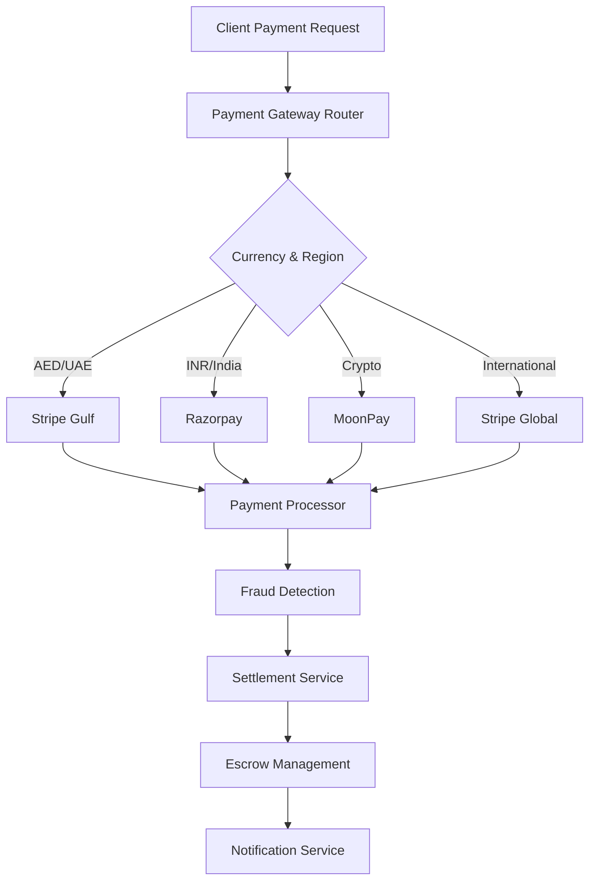

# Payment Processing Service

The Payment Processing Service handles all financial transactions across the NexVestXR V2 platform, supporting multiple payment gateways, currencies, and compliance requirements for both UAE and Indian markets.

## 💰 Service Overview

### Core Capabilities
- **Multi-Gateway Support**: Stripe, Razorpay, MoonPay integration
- **Multi-Currency Processing**: AED, USD, EUR, INR, and 8+ currencies
- **Crypto Payments**: Direct cryptocurrency deposits and withdrawals
- **Escrow Management**: Secure fund holding during property transactions
- **Settlement Service**: Automated transaction settlement and reconciliation
- **Compliance**: PCI DSS Level 1 certification and KYC/AML integration

### Payment Flow Architecture


## 🏗️ Architecture Components

### Payment Gateway Integration
```javascript
const paymentGateways = {
  stripe: {
    regions: ["global", "uae", "europe"],
    currencies: ["AED", "USD", "EUR", "GBP"],
    methods: ["card", "bank_transfer", "apple_pay", "google_pay"],
    features: ["subscriptions", "installments", "recurring"]
  },
  
  razorpay: {
    regions: ["india"],
    currencies: ["INR", "USD"],
    methods: ["card", "netbanking", "upi", "wallet"],
    features: ["emi", "after_delivery", "recurring"]
  },
  
  moonpay: {
    regions: ["global"],
    currencies: ["BTC", "ETH", "USDC", "USDT"],
    methods: ["card", "bank_transfer"],
    features: ["kyc_integrated", "compliance_automated"]
  }
};
```

### Transaction Types
```javascript
const transactionTypes = {
  // Investment Transactions
  property_investment: {
    minimum_amount: {
      AED: 25000,
      USD: 6800,
      INR: 50000
    },
    processing_fee: "2.5%",
    settlement_time: "T+1"
  },
  
  // Trading Transactions
  token_purchase: {
    minimum_amount: {
      AED: 1000,
      USD: 270,
      INR: 2000
    },
    processing_fee: "1.5%",
    settlement_time: "immediate"
  },
  
  // Withdrawal Transactions
  fund_withdrawal: {
    minimum_amount: {
      AED: 500,
      USD: 135,
      INR: 1000
    },
    processing_fee: "1.0%",
    settlement_time: "T+2"
  },
  
  // Staking Transactions
  staking_deposit: {
    minimum_amount: {
      XERA: 1000,
      PROPX: 100
    },
    processing_fee: "0.5%",
    settlement_time: "immediate"
  }
};
```

## 💳 Payment Gateway Implementation

### Stripe Integration
```javascript
const stripeConfig = {
  // UAE Configuration
  uae: {
    publishable_key: process.env.STRIPE_UAE_PK,
    secret_key: process.env.STRIPE_UAE_SK,
    webhook_secret: process.env.STRIPE_UAE_WEBHOOK,
    currency: "AED",
    country: "AE"
  },
  
  // Global Configuration
  global: {
    publishable_key: process.env.STRIPE_GLOBAL_PK,
    secret_key: process.env.STRIPE_GLOBAL_SK,
    webhook_secret: process.env.STRIPE_GLOBAL_WEBHOOK,
    currencies: ["USD", "EUR", "GBP"],
    countries: ["US", "GB", "EU"]
  }
};

// Payment Intent Creation
const createPaymentIntent = async (paymentData) => {
  const stripe = getStripeInstance(paymentData.currency);
  
  const paymentIntent = await stripe.paymentIntents.create({
    amount: paymentData.amount * 100, // Convert to cents
    currency: paymentData.currency.toLowerCase(),
    customer: paymentData.customer_id,
    metadata: {
      property_id: paymentData.property_id,
      investment_type: paymentData.type,
      user_id: paymentData.user_id
    },
    automatic_payment_methods: {
      enabled: true
    }
  });
  
  return {
    client_secret: paymentIntent.client_secret,
    payment_intent_id: paymentIntent.id
  };
};
```

### Razorpay Integration
```javascript
const razorpayConfig = {
  key_id: process.env.RAZORPAY_KEY_ID,
  key_secret: process.env.RAZORPAY_KEY_SECRET,
  currency: "INR",
  receipt_prefix: "NVXR_",
  webhook_secret: process.env.RAZORPAY_WEBHOOK_SECRET
};

// Order Creation
const createRazorpayOrder = async (orderData) => {
  const instance = new Razorpay(razorpayConfig);
  
  const order = await instance.orders.create({
    amount: orderData.amount * 100, // Paise conversion
    currency: "INR",
    receipt: `${razorpayConfig.receipt_prefix}${Date.now()}`,
    notes: {
      property_id: orderData.property_id,
      user_id: orderData.user_id,
      investment_type: orderData.type
    }
  });
  
  return {
    order_id: order.id,
    amount: order.amount,
    currency: order.currency
  };
};
```

### MoonPay Integration
```javascript
const moonpayConfig = {
  api_key: process.env.MOONPAY_API_KEY,
  secret_key: process.env.MOONPAY_SECRET_KEY,
  base_url: "https://api.moonpay.com",
  supported_currencies: ["BTC", "ETH", "USDC", "USDT"],
  webhook_secret: process.env.MOONPAY_WEBHOOK_SECRET
};

// Crypto Purchase Transaction
const createCryptoTransaction = async (cryptoData) => {
  const signature = generateMoonPaySignature(cryptoData);
  
  const transaction = await fetch(`${moonpayConfig.base_url}/v1/transactions`, {
    method: 'POST',
    headers: {
      'Authorization': `Api-Key ${moonpayConfig.api_key}`,
      'Content-Type': 'application/json'
    },
    body: JSON.stringify({
      baseCurrencyAmount: cryptoData.amount,
      baseCurrencyCode: cryptoData.fiat_currency,
      currencyCode: cryptoData.crypto_currency,
      walletAddress: cryptoData.wallet_address,
      externalCustomerId: cryptoData.user_id,
      externalTransactionId: cryptoData.transaction_id
    })
  });
  
  return transaction.json();
};
```

## 🔒 Security & Compliance

### PCI DSS Implementation
```javascript
const pciCompliance = {
  // Data Encryption
  encryption: {
    algorithm: "AES-256-GCM",
    key_rotation: "monthly",
    at_rest: true,
    in_transit: true
  },
  
  // Data Tokenization
  tokenization: {
    card_numbers: "tokenized",
    bank_accounts: "tokenized",
    sensitive_data: "encrypted_vault"
  },
  
  // Access Controls
  access_control: {
    principle: "least_privilege",
    mfa_required: true,
    session_timeout: 900, // 15 minutes
    audit_logging: true
  },
  
  // Network Security
  network_security: {
    firewall: "enabled",
    intrusion_detection: "active",
    vulnerability_scanning: "weekly",
    penetration_testing: "quarterly"
  }
};
```

### Anti-Fraud System
```javascript
const fraudDetection = {
  // Risk Scoring
  risk_factors: {
    new_customer: 2,
    high_amount: 3,
    unusual_location: 4,
    multiple_cards: 2,
    velocity_check: 5
  },
  
  // Thresholds
  thresholds: {
    low_risk: 0-30,
    medium_risk: 31-60,
    high_risk: 61-80,
    block: 81-100
  },
  
  // Actions
  actions: {
    low_risk: "approve",
    medium_risk: "manual_review",
    high_risk: "additional_verification",
    block: "decline_transaction"
  }
};

// Fraud Check Implementation
const performFraudCheck = async (transaction) => {
  let riskScore = 0;
  
  // Check customer history
  if (await isNewCustomer(transaction.user_id)) {
    riskScore += fraudDetection.risk_factors.new_customer;
  }
  
  // Check transaction amount
  if (isHighValueTransaction(transaction.amount)) {
    riskScore += fraudDetection.risk_factors.high_amount;
  }
  
  // Check location
  if (await isUnusualLocation(transaction.user_id, transaction.ip_address)) {
    riskScore += fraudDetection.risk_factors.unusual_location;
  }
  
  // Check velocity
  const velocity = await checkTransactionVelocity(transaction.user_id);
  if (velocity.is_high) {
    riskScore += fraudDetection.risk_factors.velocity_check;
  }
  
  return determineAction(riskScore);
};
```

## 🌍 Multi-Currency Support

### Currency Exchange Service
```javascript
const currencyService = {
  // Supported Currencies
  supported_currencies: [
    "AED", "USD", "EUR", "GBP", "INR", 
    "SAR", "QAR", "KWD", "BTC", "ETH"
  ],
  
  // Exchange Rate Providers
  rate_providers: {
    primary: "xe.com",
    backup: "fixer.io",
    crypto: "coingecko.com",
    update_frequency: 300 // 5 minutes
  },
  
  // Conversion Logic
  convert: async (amount, fromCurrency, toCurrency) => {
    const rate = await getExchangeRate(fromCurrency, toCurrency);
    const convertedAmount = amount * rate.rate;
    
    return {
      original_amount: amount,
      original_currency: fromCurrency,
      converted_amount: convertedAmount,
      converted_currency: toCurrency,
      exchange_rate: rate.rate,
      rate_timestamp: rate.timestamp,
      fee: calculateConversionFee(amount, fromCurrency, toCurrency)
    };
  }
};
```

### Regional Payment Methods
```javascript
const regionalMethods = {
  // UAE Payment Methods
  uae: {
    cards: ["visa", "mastercard", "amex"],
    digital_wallets: ["apple_pay", "google_pay", "samsung_pay"],
    bank_transfers: ["adcb", "enbd", "fab", "hsbc"],
    local_methods: ["souq_pay", "tabby", "postpay"]
  },
  
  // India Payment Methods
  india: {
    cards: ["visa", "mastercard", "rupay"],
    digital_wallets: ["paytm", "phonepe", "gpay"],
    bank_transfers: ["neft", "rtgs", "imps"],
    local_methods: ["upi", "netbanking", "emi"]
  },
  
  // International Payment Methods
  international: {
    cards: ["visa", "mastercard", "amex"],
    digital_wallets: ["apple_pay", "google_pay", "paypal"],
    bank_transfers: ["sepa", "ach", "wire"],
    crypto: ["bitcoin", "ethereum", "usdc"]
  }
};
```

## ⚡ Settlement & Reconciliation

### Settlement Service
```javascript
const settlementService = {
  // Settlement Schedules
  schedules: {
    instant: ["crypto", "digital_wallets"],
    same_day: ["cards", "upi"],
    next_day: ["bank_transfers"],
    two_day: ["international_wires"]
  },
  
  // Settlement Process
  processSettlement: async (transaction) => {
    // Validate transaction
    const validation = await validateTransaction(transaction);
    if (!validation.valid) {
      throw new Error(validation.error);
    }
    
    // Check settlement schedule
    const schedule = getSettlementSchedule(transaction.payment_method);
    
    // Create settlement record
    const settlement = await createSettlementRecord({
      transaction_id: transaction.id,
      amount: transaction.amount,
      currency: transaction.currency,
      settlement_date: calculateSettlementDate(schedule),
      status: "pending"
    });
    
    // Queue for processing
    await queueSettlement(settlement);
    
    return settlement;
  }
};
```

### Reconciliation Service
```javascript
const reconciliationService = {
  // Daily Reconciliation
  daily_reconciliation: async (date) => {
    const transactions = await getTransactionsByDate(date);
    const gatewayReports = await fetchGatewayReports(date);
    
    const reconciliation = {
      date: date,
      total_transactions: transactions.length,
      total_amount: transactions.reduce((sum, t) => sum + t.amount, 0),
      discrepancies: [],
      status: "pending"
    };
    
    // Match transactions with gateway reports
    for (const transaction of transactions) {
      const gatewayRecord = findGatewayRecord(transaction, gatewayReports);
      
      if (!gatewayRecord) {
        reconciliation.discrepancies.push({
          type: "missing_gateway_record",
          transaction_id: transaction.id,
          amount: transaction.amount
        });
      } else if (gatewayRecord.amount !== transaction.amount) {
        reconciliation.discrepancies.push({
          type: "amount_mismatch",
          transaction_id: transaction.id,
          our_amount: transaction.amount,
          gateway_amount: gatewayRecord.amount
        });
      }
    }
    
    reconciliation.status = reconciliation.discrepancies.length === 0 ? "matched" : "discrepancies";
    
    return reconciliation;
  }
};
```

## 🔔 Webhook Management

### Webhook Processing
```javascript
const webhookHandlers = {
  // Stripe Webhooks
  stripe: {
    payment_intent_succeeded: async (event) => {
      const paymentIntent = event.data.object;
      
      await updateTransactionStatus(paymentIntent.metadata.transaction_id, "completed");
      await creditUserAccount(paymentIntent.metadata.user_id, paymentIntent.amount);
      await sendPaymentConfirmation(paymentIntent.metadata.user_id);
    },
    
    payment_intent_payment_failed: async (event) => {
      const paymentIntent = event.data.object;
      
      await updateTransactionStatus(paymentIntent.metadata.transaction_id, "failed");
      await sendPaymentFailureNotification(paymentIntent.metadata.user_id);
    }
  },
  
  // Razorpay Webhooks
  razorpay: {
    payment_captured: async (event) => {
      const payment = event.payload.payment.entity;
      
      await updateTransactionStatus(payment.order_id, "completed");
      await creditUserAccount(payment.notes.user_id, payment.amount);
      await sendPaymentConfirmation(payment.notes.user_id);
    },
    
    payment_failed: async (event) => {
      const payment = event.payload.payment.entity;
      
      await updateTransactionStatus(payment.order_id, "failed");
      await sendPaymentFailureNotification(payment.notes.user_id);
    }
  }
};

// Webhook Verification
const verifyWebhook = (payload, signature, secret) => {
  const expectedSignature = crypto
    .createHmac('sha256', secret)
    .update(payload)
    .digest('hex');
    
  return crypto.timingSafeEqual(
    Buffer.from(signature, 'hex'),
    Buffer.from(expectedSignature, 'hex')
  );
};
```

## 📊 Analytics & Reporting

### Transaction Analytics
```javascript
const transactionAnalytics = {
  // Real-time Metrics
  realtime_metrics: {
    transaction_volume: "total_volume_24h",
    success_rate: "successful_transactions_percentage",
    average_amount: "mean_transaction_amount",
    gateway_performance: "gateway_success_rates"
  },
  
  // Financial Reports
  financial_reports: {
    daily_revenue: "sum_processing_fees_daily",
    monthly_volume: "total_volume_monthly",
    currency_breakdown: "volume_by_currency",
    method_popularity: "transactions_by_payment_method"
  },
  
  // Compliance Reports
  compliance_reports: {
    kyc_completion: "kyc_verification_rates",
    large_transactions: "transactions_above_threshold",
    suspicious_activity: "flagged_transactions",
    regulatory_filing: "required_regulatory_reports"
  }
};
```

### Performance Monitoring
```javascript
const performanceMonitoring = {
  // Response Time Tracking
  response_times: {
    payment_initiation: "< 2 seconds",
    payment_confirmation: "< 5 seconds",
    webhook_processing: "< 1 second",
    settlement_processing: "< 30 seconds"
  },
  
  // Error Rate Monitoring
  error_rates: {
    payment_failures: "< 2%",
    webhook_failures: "< 0.5%",
    timeout_errors: "< 1%",
    system_errors: "< 0.1%"
  },
  
  // Alerts Configuration
  alerts: {
    high_error_rate: "error_rate > 5% for 5 minutes",
    slow_response: "response_time > 10 seconds",
    payment_anomaly: "unusual_transaction_pattern",
    system_downtime: "service_unavailable"
  }
};
```

## 🔧 Configuration & Setup

### Environment Variables
```bash
# Stripe Configuration
STRIPE_UAE_PK=pk_live_...
STRIPE_UAE_SK=sk_live_...
STRIPE_GLOBAL_PK=pk_live_...
STRIPE_GLOBAL_SK=sk_live_...

# Razorpay Configuration
RAZORPAY_KEY_ID=rzp_live_...
RAZORPAY_KEY_SECRET=your_secret

# MoonPay Configuration
MOONPAY_API_KEY=pk_live_...
MOONPAY_SECRET_KEY=sk_live_...

# Database
PAYMENT_DB_URL=postgresql://...
REDIS_URL=redis://...

# Security
PAYMENT_ENCRYPTION_KEY=your_256_bit_key
WEBHOOK_SECRET=your_webhook_secret

# Compliance
PCI_DSS_ENABLED=true
FRAUD_DETECTION_ENABLED=true
```

### Service Dependencies
```yaml
services:
  - postgresql: "Transaction and payment data"
  - redis: "Session and cache management"
  - elasticsearch: "Transaction search and analytics"
  - rabbitmq: "Async payment processing"
  - prometheus: "Metrics collection"
  - grafana: "Performance monitoring"
```

## 🚀 API Reference

### Payment Endpoints
```javascript
// POST /api/payments/create
const createPayment = {
  request: {
    amount: 25000,
    currency: "AED",
    payment_method: "card",
    property_id: "prop_123",
    user_id: "user_456"
  },
  response: {
    payment_id: "pay_789",
    client_secret: "pi_1234_secret_5678",
    status: "requires_payment_method",
    amount: 25000,
    currency: "AED"
  }
};

// POST /api/payments/confirm
const confirmPayment = {
  request: {
    payment_id: "pay_789",
    payment_method_id: "pm_1234"
  },
  response: {
    payment_id: "pay_789",
    status: "succeeded",
    amount: 25000,
    currency: "AED",
    transaction_id: "txn_abc123"
  }
};

// GET /api/payments/status/:payment_id
const paymentStatus = {
  response: {
    payment_id: "pay_789",
    status: "succeeded",
    amount: 25000,
    currency: "AED",
    created: "2025-01-15T10:00:00Z",
    completed: "2025-01-15T10:02:30Z"
  }
};
```

---

*Payment Processing Service - Secure, compliant, multi-currency payment infrastructure for NexVestXR V2*