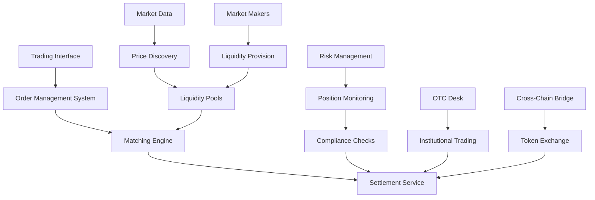

# Trading & Exchange Services

The Trading & Exchange Services provide professional-grade trading infrastructure for property tokens, enabling liquidity, price discovery, and efficient market operations across the NexVestXR V2 platform.

## 📊 Service Overview

### Core Capabilities
- **Professional Trading Interface**: Advanced order types and trading tools
- **Market Making**: Automated liquidity provision for property tokens
- **Order Management**: Real-time order processing and matching engine
- **Price Discovery**: Dynamic pricing based on supply/demand mechanics
- **Liquidity Pool Management**: Deep liquidity for major property tokens
- **Cross-Chain Trading**: Seamless XERA/PROPX token exchange
- **Institutional Features**: OTC desk, bulk trading, and custom agreements

### Trading Architecture


## 🏗️ Trading Infrastructure

### Order Management System
```javascript
const orderManagement = {
  // Order Types
  orderTypes: {
    market: {
      description: "Execute immediately at best available price",
      execution: "immediate",
      price_protection: "none",
      use_case: "immediate_liquidity"
    },
    
    limit: {
      description: "Execute only at specified price or better",
      execution: "conditional",
      price_protection: "full",
      use_case: "price_target_entry_exit"
    },
    
    stop_loss: {
      description: "Market order triggered when price reaches stop level",
      execution: "triggered",
      price_protection: "stop_level",
      use_case: "risk_management"
    },
    
    take_profit: {
      description: "Limit order to lock in profits",
      execution: "triggered",
      price_protection: "profit_level",
      use_case: "profit_taking"
    },
    
    oco: {
      description: "One-Cancels-Other order combination",
      execution: "conditional",
      price_protection: "dual_level",
      use_case: "bracket_trading"
    },
    
    trailing_stop: {
      description: "Dynamic stop order that follows price movement",
      execution: "dynamic",
      price_protection: "trailing_percentage",
      use_case: "trend_following"
    }
  },
  
  // Order Processing
  createOrder: async (orderData) => {
    const {
      user_id,
      token_address,
      order_type,
      side, // 'buy' or 'sell'
      quantity,
      price,
      time_in_force, // 'GTC', 'IOC', 'FOK', 'DAY'
      stop_price,
      trailing_amount,
      metadata
    } = orderData;
    
    // Validate order parameters
    const validation = await validateOrder(orderData);
    if (!validation.valid) {
      throw new Error(validation.error);
    }
    
    // Check user permissions and limits
    const userLimits = await getUserTradingLimits(user_id);
    if (quantity * price > userLimits.max_order_value) {
      throw new Error("Order exceeds maximum allowed value");
    }
    
    // Create order object
    const order = {
      id: generateOrderId(),
      user_id: user_id,
      token_address: token_address,
      order_type: order_type,
      side: side,
      quantity: quantity,
      price: price,
      stop_price: stop_price,
      trailing_amount: trailing_amount,
      time_in_force: time_in_force,
      status: "pending",
      filled_quantity: 0,
      remaining_quantity: quantity,
      average_fill_price: 0,
      created_at: new Date(),
      updated_at: new Date(),
      expires_at: calculateExpiryTime(time_in_force),
      metadata: metadata
    };
    
    // Submit to matching engine
    const matchResult = await submitToMatchingEngine(order);
    
    return {
      order: order,
      match_result: matchResult
    };
  }
};
```

### Matching Engine
```javascript
const matchingEngine = {
  // Order Book Management
  orderBook: {
    structure: {
      bids: "price_priority_queue", // Highest price first
      asks: "price_priority_queue", // Lowest price first
      time_priority: "fifo_within_price_level"
    },
    
    // Order Matching Logic
    matchOrder: async (incomingOrder) => {
      const orderBook = await getOrderBook(incomingOrder.token_address);
      const matches = [];
      let remainingQuantity = incomingOrder.quantity;
      
      // Determine matching side
      const matchingSide = incomingOrder.side === 'buy' ? 'asks' : 'bids';
      const oppositeOrders = orderBook[matchingSide];
      
      // Process matches
      for (const existingOrder of oppositeOrders) {
        if (remainingQuantity <= 0) break;
        
        // Check price compatibility
        const priceMatch = checkPriceMatch(incomingOrder, existingOrder);
        if (!priceMatch) break;
        
        // Calculate fill quantity
        const fillQuantity = Math.min(remainingQuantity, existingOrder.remaining_quantity);
        const fillPrice = existingOrder.price; // Price improvement for taker
        
        // Create trade
        const trade = {
          id: generateTradeId(),
          token_address: incomingOrder.token_address,
          maker_order_id: existingOrder.id,
          taker_order_id: incomingOrder.id,
          quantity: fillQuantity,
          price: fillPrice,
          timestamp: new Date(),
          trade_value: fillQuantity * fillPrice
        };
        
        matches.push(trade);
        
        // Update order quantities
        remainingQuantity -= fillQuantity;
        existingOrder.remaining_quantity -= fillQuantity;
        existingOrder.filled_quantity += fillQuantity;
        
        // Remove fully filled orders
        if (existingOrder.remaining_quantity === 0) {
          await removeFromOrderBook(existingOrder);
        }
      }
      
      // Update incoming order
      incomingOrder.filled_quantity = incomingOrder.quantity - remainingQuantity;
      incomingOrder.remaining_quantity = remainingQuantity;
      
      // Add to order book if not fully filled
      if (remainingQuantity > 0 && incomingOrder.order_type !== 'market') {
        await addToOrderBook(incomingOrder);
      }
      
      return {
        trades: matches,
        order_status: remainingQuantity > 0 ? 'partially_filled' : 'filled',
        remaining_quantity: remainingQuantity
      };
    }
  },
  
  // Price Discovery
  priceDiscovery: {
    calculateMidPrice: (orderBook) => {
      const bestBid = orderBook.bids[0]?.price || 0;
      const bestAsk = orderBook.asks[0]?.price || Infinity;
      
      if (bestBid === 0 || bestAsk === Infinity) {
        return null; // No valid market
      }
      
      return (bestBid + bestAsk) / 2;
    },
    
    calculateSpread: (orderBook) => {
      const bestBid = orderBook.bids[0]?.price || 0;
      const bestAsk = orderBook.asks[0]?.price || Infinity;
      
      if (bestBid === 0 || bestAsk === Infinity) {
        return null;
      }
      
      const spread = bestAsk - bestBid;
      const spreadPercentage = (spread / ((bestBid + bestAsk) / 2)) * 100;
      
      return {
        absolute_spread: spread,
        percentage_spread: spreadPercentage
      };
    }
  }
};
```

## 💧 Liquidity Management

### Market Making System
```javascript
const marketMaking = {
  // Automated Market Maker (AMM)
  amm: {
    liquidityPools: {
      xera_usd: {
        reserve_xera: 1000000,
        reserve_usd: 500000,
        total_shares: 707107, // sqrt(reserve_xera * reserve_usd)
        fee_rate: 0.003, // 0.3%
        slippage_tolerance: 0.02 // 2%
      },
      
      propx_aed: {
        reserve_propx: 50000,
        reserve_aed: 2500000,
        total_shares: 353553,
        fee_rate: 0.005, // 0.5%
        slippage_tolerance: 0.03 // 3%
      }
    },
    
    // Liquidity Provision
    addLiquidity: async (poolId, tokenA_amount, tokenB_amount, user_id) => {
      const pool = marketMaking.amm.liquidityPools[poolId];
      
      // Calculate optimal ratio
      const ratio = pool.reserve_usd / pool.reserve_xera;
      const optimal_tokenB = tokenA_amount * ratio;
      
      if (Math.abs(tokenB_amount - optimal_tokenB) / optimal_tokenB > 0.02) {
        throw new Error("Token ratio not optimal for liquidity provision");
      }
      
      // Calculate shares to mint
      const shareA = (tokenA_amount / pool.reserve_xera) * pool.total_shares;
      const shareB = (tokenB_amount / pool.reserve_usd) * pool.total_shares;
      const shares_to_mint = Math.min(shareA, shareB);
      
      // Update pool reserves
      pool.reserve_xera += tokenA_amount;
      pool.reserve_usd += tokenB_amount;
      pool.total_shares += shares_to_mint;
      
      // Record liquidity provision
      const liquidityPosition = {
        id: generateLiquidityId(),
        user_id: user_id,
        pool_id: poolId,
        shares: shares_to_mint,
        token_a_amount: tokenA_amount,
        token_b_amount: tokenB_amount,
        entry_price: ratio,
        timestamp: new Date()
      };
      
      await recordLiquidityPosition(liquidityPosition);
      
      return liquidityPosition;
    },
    
    // Swap Execution
    executeSwap: async (poolId, tokenIn, amountIn, tokenOut, minimumAmountOut) => {
      const pool = marketMaking.amm.liquidityPools[poolId];
      
      // Calculate output amount using constant product formula
      // (x + Δx)(y - Δy) = xy
      const reserveIn = tokenIn === 'xera' ? pool.reserve_xera : pool.reserve_usd;
      const reserveOut = tokenOut === 'xera' ? pool.reserve_xera : pool.reserve_usd;
      
      const amountInWithFee = amountIn * (1 - pool.fee_rate);
      const amountOut = (reserveOut * amountInWithFee) / (reserveIn + amountInWithFee);
      
      if (amountOut < minimumAmountOut) {
        throw new Error("Slippage exceeds tolerance");
      }
      
      // Update reserves
      if (tokenIn === 'xera') {
        pool.reserve_xera += amountIn;
        pool.reserve_usd -= amountOut;
      } else {
        pool.reserve_usd += amountIn;
        pool.reserve_xera -= amountOut;
      }
      
      return {
        amount_in: amountIn,
        amount_out: amountOut,
        price_impact: calculatePriceImpact(amountIn, amountOut, reserveIn, reserveOut),
        fee_paid: amountIn * pool.fee_rate
      };
    }
  },
  
  // Professional Market Making
  professionalMM: {
    strategies: {
      spread_capture: {
        description: "Provide liquidity on both sides with profitable spread",
        bid_offset: -0.002, // 0.2% below mid price
        ask_offset: 0.002,  // 0.2% above mid price
        order_size: "adaptive_based_on_volume",
        refresh_frequency: "every_trade"
      },
      
      inventory_management: {
        description: "Manage token inventory to maintain market neutral position",
        max_inventory_percentage: 0.1, // 10% of total position
        rebalance_threshold: 0.05, // 5% deviation
        hedge_instruments: ["futures", "options", "cross_chain_arb"]
      },
      
      volatility_adjustment: {
        description: "Adjust spreads based on market volatility",
        base_spread: 0.002, // 0.2%
        volatility_multiplier: 2.0,
        max_spread: 0.01, // 1%
        measurement_window: "1_hour"
      }
    }
  }
};
```

### Cross-Chain Trading
```javascript
const crossChainTrading = {
  // Cross-Chain Arbitrage
  arbitrage: {
    detectOpportunities: async () => {
      const xrplPrice = await getXERAPrice('xrpl');
      const flarePrice = await getXERAPrice('flare');
      const bridgeFee = 0.005; // 0.5%
      
      const priceDiscrepancy = Math.abs(xrplPrice - flarePrice) / Math.min(xrplPrice, flarePrice);
      
      if (priceDiscrepancy > bridgeFee + 0.002) { // 0.2% profit margin
        return {
          opportunity: true,
          profit_percentage: priceDiscrepancy - bridgeFee,
          direction: xrplPrice > flarePrice ? 'xrpl_to_flare' : 'flare_to_xrpl',
          recommended_amount: calculateOptimalArbitrageSize(xrplPrice, flarePrice)
        };
      }
      
      return { opportunity: false };
    },
    
    executeArbitrage: async (arbitrageData) => {
      const {
        direction,
        amount,
        expected_profit
      } = arbitrageData;
      
      if (direction === 'xrpl_to_flare') {
        // Buy on XRPL, bridge to Flare, sell on Flare
        const xrplBuy = await executeMarketOrder('xrpl', 'buy', amount);
        const bridgeResult = await initiateBridge('xera', 'xrpl', 'flare', amount);
        const flareSell = await executeMarketOrder('flare', 'sell', amount);
        
        return {
          xrpl_purchase: xrplBuy,
          bridge_transaction: bridgeResult,
          flare_sale: flareSell,
          actual_profit: calculateActualProfit([xrplBuy, bridgeResult, flareSell])
        };
      }
      
      // Reverse direction logic
    }
  },
  
  // Unified Order Book
  unifiedOrderBook: {
    aggregateOrderBooks: async (tokenSymbol) => {
      const xrplOrderBook = await getOrderBook('xrpl', tokenSymbol);
      const flareOrderBook = await getOrderBook('flare', tokenSymbol);
      const polygonOrderBook = await getOrderBook('polygon', tokenSymbol);
      
      // Merge and sort by price
      const combinedBids = [...xrplOrderBook.bids, ...flareOrderBook.bids, ...polygonOrderBook.bids]
        .sort((a, b) => b.price - a.price);
        
      const combinedAsks = [...xrplOrderBook.asks, ...flareOrderBook.asks, ...polygonOrderBook.asks]
        .sort((a, b) => a.price - b.price);
      
      return {
        bids: combinedBids,
        asks: combinedAsks,
        total_bid_volume: combinedBids.reduce((sum, order) => sum + order.quantity, 0),
        total_ask_volume: combinedAsks.reduce((sum, order) => sum + order.quantity, 0),
        best_bid: combinedBids[0],
        best_ask: combinedAsks[0],
        spread: combinedAsks[0].price - combinedBids[0].price
      };
    }
  }
};
```

## 🏢 Institutional Trading Features

### OTC (Over-The-Counter) Desk
```javascript
const otcDesk = {
  // Large Block Trading
  blockTrading: {
    minimumOrderValue: {
      USD: 100000,
      AED: 367000,
      INR: 8300000
    },
    
    createOTCOrder: async (otcRequest) => {
      const {
        user_id,
        token_address,
        side,
        quantity,
        target_price,
        time_limit,
        settlement_preference
      } = otcRequest;
      
      // Validate institutional user
      const userProfile = await getUserProfile(user_id);
      if (userProfile.tier !== 'institutional') {
        throw new Error("OTC trading requires institutional tier");
      }
      
      // Create OTC order
      const otcOrder = {
        id: generateOTCOrderId(),
        user_id: user_id,
        token_address: token_address,
        side: side,
        quantity: quantity,
        target_price: target_price,
        market_price: await getCurrentPrice(token_address),
        status: "seeking_counterparty",
        time_limit: time_limit,
        settlement_preference: settlement_preference,
        created_at: new Date(),
        expires_at: new Date(Date.now() + time_limit * 60 * 60 * 1000)
      };
      
      // Notify potential counterparties
      await notifyOTCCounterparties(otcOrder);
      
      return otcOrder;
    },
    
    // Counterparty Matching
    matchCounterparties: async (otcOrderId) => {
      const otcOrder = await getOTCOrder(otcOrderId);
      const potentialCounterparties = await findPotentialCounterparties(otcOrder);
      
      const matches = [];
      
      for (const counterparty of potentialCounterparties) {
        const compatibility = await assessCompatibility(otcOrder, counterparty);
        
        if (compatibility.score > 0.8) {
          matches.push({
            counterparty_id: counterparty.user_id,
            compatibility_score: compatibility.score,
            proposed_price: compatibility.proposed_price,
            proposed_quantity: compatibility.proposed_quantity,
            settlement_terms: compatibility.settlement_terms
          });
        }
      }
      
      return matches.sort((a, b) => b.compatibility_score - a.compatibility_score);
    }
  },
  
  // Custom Agreements
  customAgreements: {
    createAgreement: async (agreementData) => {
      const {
        parties,
        token_details,
        pricing_mechanism,
        settlement_terms,
        special_conditions,
        regulatory_requirements
      } = agreementData;
      
      const agreement = {
        id: generateAgreementId(),
        parties: parties,
        token_details: token_details,
        pricing: pricing_mechanism,
        settlement: settlement_terms,
        conditions: special_conditions,
        regulatory: regulatory_requirements,
        status: "draft",
        created_at: new Date(),
        legal_review_required: true
      };
      
      // Submit for legal review
      await submitForLegalReview(agreement);
      
      return agreement;
    },
    
    executeAgreement: async (agreementId, executionData) => {
      const agreement = await getAgreement(agreementId);
      
      if (agreement.status !== "approved") {
        throw new Error("Agreement not approved for execution");
      }
      
      // Execute custom settlement logic
      const execution = await executeCustomSettlement(agreement, executionData);
      
      return execution;
    }
  }
};
```

## 📊 Trading Analytics

### Real-Time Market Data
```javascript
const marketData = {
  // Price Feeds
  priceFeeds: {
    sources: [
      "internal_orderbook",
      "external_exchanges", 
      "oracle_networks",
      "amm_pools"
    ],
    
    aggregatePrice: async (tokenAddress) => {
      const internalPrice = await getInternalPrice(tokenAddress);
      const externalPrices = await getExternalPrices(tokenAddress);
      const oraclePrice = await getOraclePrice(tokenAddress);
      
      // Weighted average based on liquidity
      const prices = [
        { price: internalPrice.price, weight: internalPrice.liquidity },
        ...externalPrices.map(p => ({ price: p.price, weight: p.liquidity })),
        { price: oraclePrice.price, weight: oraclePrice.confidence * 1000000 }
      ];
      
      const totalWeight = prices.reduce((sum, p) => sum + p.weight, 0);
      const weightedPrice = prices.reduce((sum, p) => sum + (p.price * p.weight), 0) / totalWeight;
      
      return {
        aggregated_price: weightedPrice,
        confidence: calculatePriceConfidence(prices),
        last_updated: new Date(),
        sources_count: prices.length
      };
    }
  },
  
  // Trading Volume Analytics
  volumeAnalytics: {
    calculateVolume: async (tokenAddress, timeframe) => {
      const trades = await getTrades(tokenAddress, timeframe);
      
      const volume = {
        total_volume: trades.reduce((sum, trade) => sum + trade.volume, 0),
        trade_count: trades.length,
        average_trade_size: trades.reduce((sum, trade) => sum + trade.volume, 0) / trades.length,
        volume_by_hour: groupTradesByHour(trades),
        price_volume_correlation: calculatePriceVolumeCorrelation(trades),
        liquidity_score: calculateLiquidityScore(trades)
      };
      
      return volume;
    }
  },
  
  // Market Depth Analysis
  depthAnalysis: {
    analyzeDepth: async (tokenAddress) => {
      const orderBook = await getOrderBook(tokenAddress);
      
      const depth = {
        bid_depth: calculateDepth(orderBook.bids),
        ask_depth: calculateDepth(orderBook.asks),
        total_depth: calculateTotalDepth(orderBook),
        depth_imbalance: calculateDepthImbalance(orderBook),
        support_resistance: identifySupportResistance(orderBook),
        market_impact: calculateMarketImpact(orderBook)
      };
      
      return depth;
    }
  }
};
```

### Performance Metrics
```javascript
const performanceMetrics = {
  // Trading Performance
  userPerformance: {
    calculatePnL: async (userId, timeframe) => {
      const trades = await getUserTrades(userId, timeframe);
      const currentPositions = await getUserPositions(userId);
      
      let realizedPnL = 0;
      let unrealizedPnL = 0;
      
      // Calculate realized P&L from closed trades
      for (const trade of trades) {
        if (trade.status === 'closed') {
          realizedPnL += trade.pnl;
        }
      }
      
      // Calculate unrealized P&L from open positions
      for (const position of currentPositions) {
        const currentPrice = await getCurrentPrice(position.token_address);
        const unrealized = (currentPrice - position.average_price) * position.quantity;
        unrealizedPnL += unrealized;
      }
      
      return {
        realized_pnl: realizedPnL,
        unrealized_pnl: unrealizedPnL,
        total_pnl: realizedPnL + unrealizedPnL,
        roi_percentage: ((realizedPnL + unrealizedPnL) / calculateInitialInvestment(trades)) * 100,
        sharpe_ratio: calculateSharpeRatio(trades),
        max_drawdown: calculateMaxDrawdown(trades),
        win_rate: calculateWinRate(trades)
      };
    }
  },
  
  // Market Performance
  marketPerformance: {
    calculateMarketMetrics: async (tokenAddress, timeframe) => {
      const priceHistory = await getPriceHistory(tokenAddress, timeframe);
      const volumeHistory = await getVolumeHistory(tokenAddress, timeframe);
      
      return {
        price_change: {
          absolute: priceHistory[priceHistory.length - 1] - priceHistory[0],
          percentage: ((priceHistory[priceHistory.length - 1] - priceHistory[0]) / priceHistory[0]) * 100
        },
        volatility: calculateVolatility(priceHistory),
        average_volume: volumeHistory.reduce((sum, v) => sum + v, 0) / volumeHistory.length,
        liquidity_score: calculateLiquidityScore(volumeHistory),
        market_cap: await calculateMarketCap(tokenAddress),
        trading_activity: calculateTradingActivity(volumeHistory)
      };
    }
  }
};
```

## 🔧 Configuration & API

### Trading Configuration
```bash
# Trading Engine Configuration
MATCHING_ENGINE_TYPE=fifo_price_time_priority
ORDER_BOOK_DEPTH=100
MAX_ORDER_SIZE=1000000
MIN_ORDER_SIZE=1

# Market Making Configuration
AMM_FEE_RATE=0.003
SLIPPAGE_TOLERANCE=0.02
LIQUIDITY_REWARD_RATE=0.1

# OTC Configuration
OTC_MINIMUM_ORDER_VALUE=100000
OTC_SETTLEMENT_TIME=24_hours
INSTITUTIONAL_TIER_REQUIRED=true

# Risk Management
MAX_POSITION_SIZE=0.1
CIRCUIT_BREAKER_THRESHOLD=0.15
MARGIN_REQUIREMENT=0.2
```

### Trading API Endpoints
```javascript
const tradingAPIEndpoints = {
  // Order Management
  "POST /api/trading/orders": "Create new trading order",
  "GET /api/trading/orders/:orderId": "Get order details",
  "DELETE /api/trading/orders/:orderId": "Cancel pending order",
  "GET /api/trading/orders/user/:userId": "Get user's trading orders",
  
  // Market Data
  "GET /api/trading/orderbook/:tokenAddress": "Get current order book",
  "GET /api/trading/trades/:tokenAddress": "Get recent trades",
  "GET /api/trading/price/:tokenAddress": "Get current price",
  "GET /api/trading/volume/:tokenAddress": "Get trading volume",
  
  // Liquidity
  "POST /api/trading/liquidity/add": "Add liquidity to pool",
  "POST /api/trading/liquidity/remove": "Remove liquidity from pool",
  "GET /api/trading/liquidity/pools": "Get all liquidity pools",
  "POST /api/trading/swap": "Execute token swap",
  
  // OTC Trading
  "POST /api/trading/otc/orders": "Create OTC order",
  "GET /api/trading/otc/matches/:orderId": "Get OTC matches",
  "POST /api/trading/otc/execute": "Execute OTC trade",
  
  // Analytics
  "GET /api/trading/analytics/performance/:userId": "Get user performance",
  "GET /api/trading/analytics/market/:tokenAddress": "Get market analytics"
};
```

---

*Trading & Exchange Services - Professional-grade trading infrastructure for NexVestXR V2 property tokens*